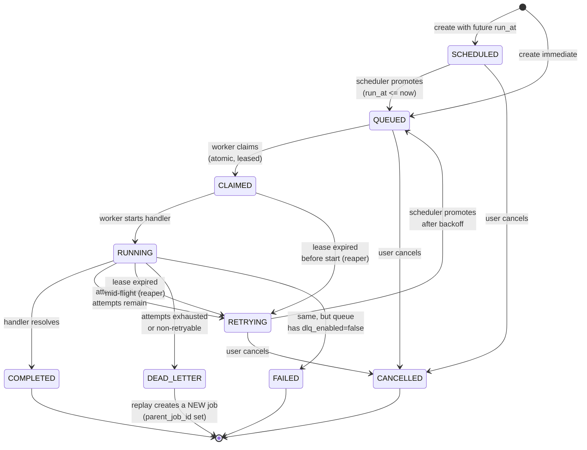
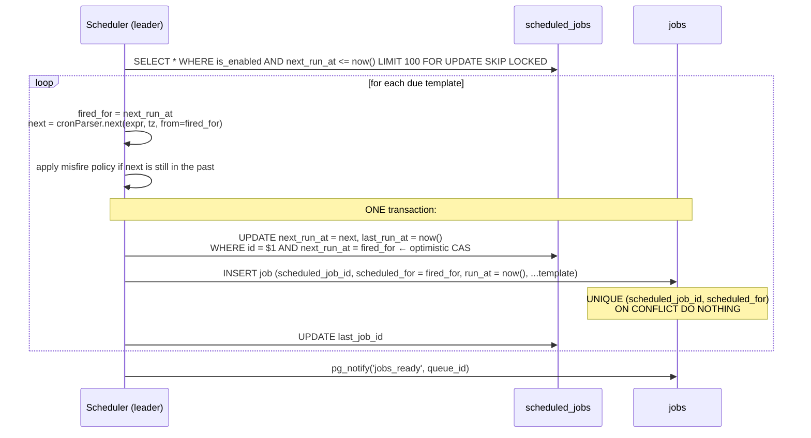
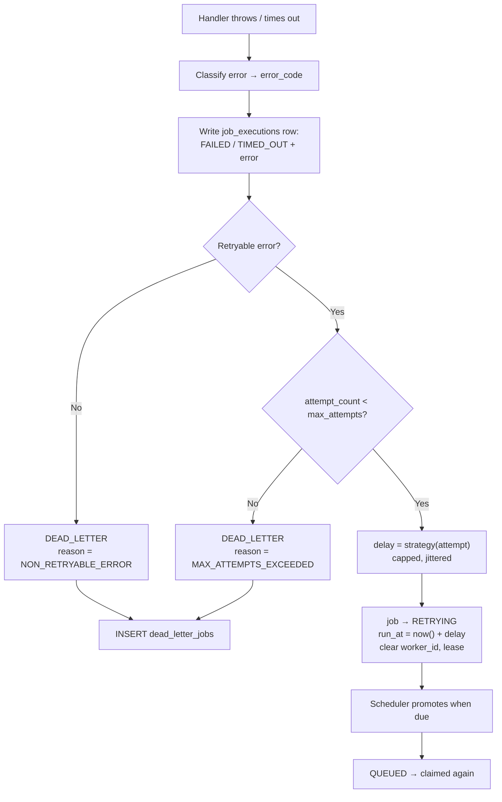
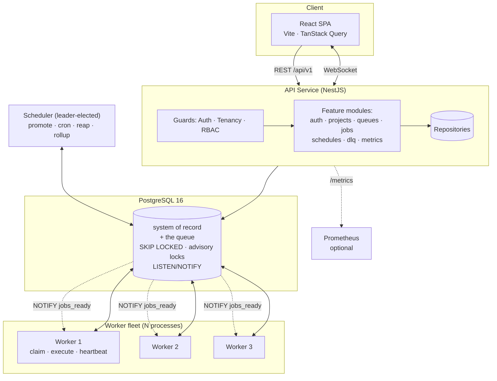
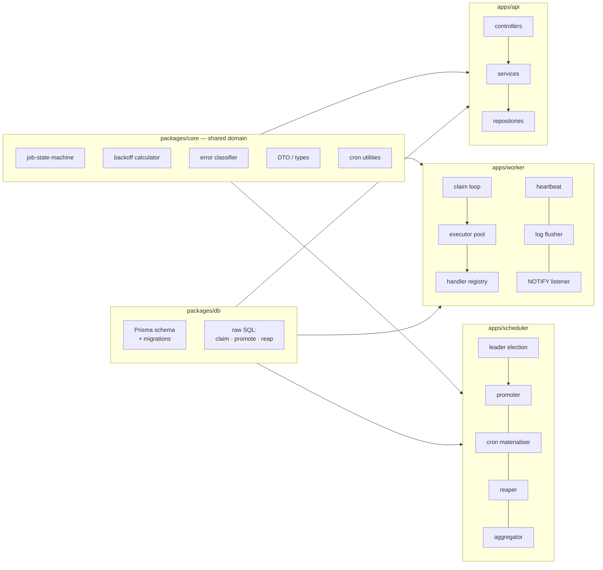
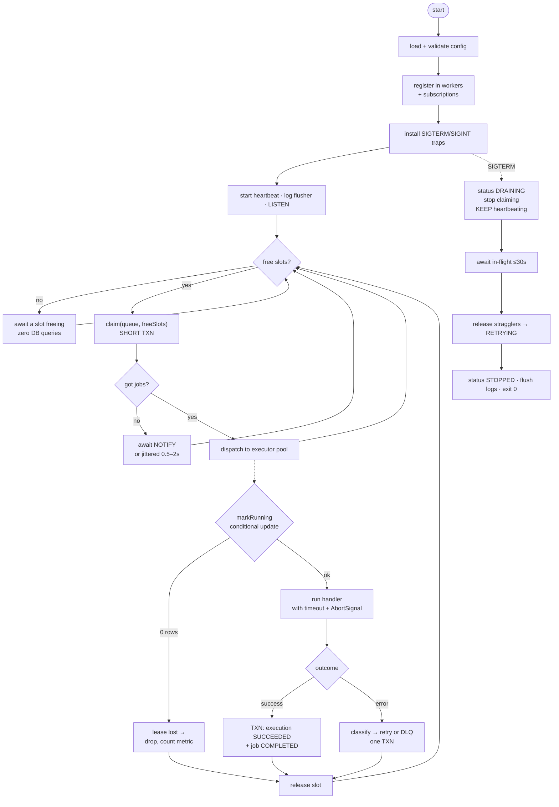
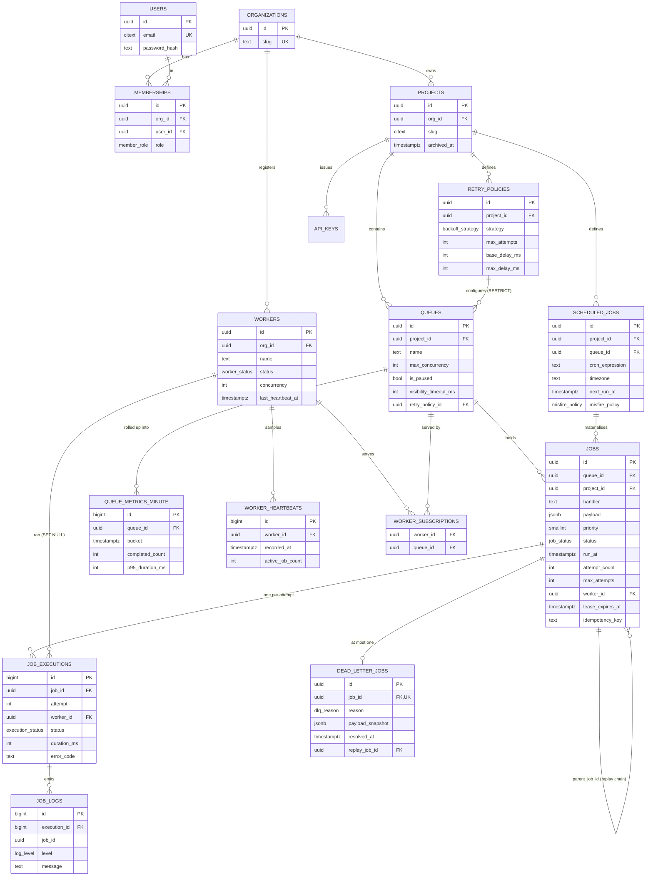

# Distributed Job Scheduler — Architecture & Design Decisions

**Author:** _(your name)_ · **Date:** 2026-08-20 · **Status:** Design, pre-implementation

---

## 0. The system in simple terms

Before any diagrams, here is the whole system in plain language.

A **job** is a unit of work someone wants done *later*, *reliably*, and *not right now in the middle of a web request*. Resize this image. Call this webhook. Send this report.

The platform has four moving parts:

| Part | Plain-language job |
|---|---|
| **API server** | Takes orders. "Please run this, at this time, with this priority." Writes them down. Answers questions about them. |
| **Database** | The single source of truth *and* the queue itself. Every job, every attempt, every log line lives here. |
| **Worker** | A separate program you run several copies of. Each copy repeatedly asks the database "give me work I'm allowed to run", runs it, and reports back. |
| **Scheduler** | One privileged loop doing the things exactly one process must do: make future jobs eligible, fire cron schedules, clean up after workers that died. |

The thing that makes this a *distributed systems* problem rather than a CRUD app is one sentence:

> **Multiple workers read from the same list at the same time, and any of them can die at any moment.**

Everything hard in this document flows from that sentence:

- Two workers must never run the same job → **atomic claiming** (Part 7)
- A dead worker must not strand its jobs forever → **leases + heartbeats + a reaper** (Parts 13–14)
- A job that fails must come back later, not immediately → **backoff scheduling, not sleeping** (Part 11)
- A job that can never succeed must stop consuming capacity → **dead letter queue** (Part 12)
- A retried job must not double-charge someone → **idempotency** (Part 16)

If you internalize one architectural idea from this document, make it this one:

> **The database is the queue. Workers hold *short* transactions to *claim* work, and hold *no* transaction while *doing* work.**

Every reliability property below is a consequence of that rule.

### What we are deliberately NOT building

No Kafka. No RabbitMQ. No Redis in the core path. No Kubernetes. No microservices.

PostgreSQL 16 gives us `FOR UPDATE SKIP LOCKED` (a real work-queue primitive), advisory locks (leader election), `LISTEN/NOTIFY` (push wake-ups), `jsonb` (flexible payloads), and partial indexes (a hot claim path that stays fast as the table grows). Adding a broker would mean maintaining consistency between two systems — the classic dual-write problem — in exchange for throughput we will never reach. It would be a downgrade, and Part 29 says so explicitly.

---

## Part 1 — Requirement decomposition

### A. Must-have (the submission is incomplete without these)

| # | Feature | Why it is non-negotiable |
|---|---|---|
| A1 | Auth (register/login/JWT) + Organizations → Projects → Queues hierarchy | Explicit requirement; also the tenancy boundary every query filters on |
| A2 | Queue CRUD + config: default priority, max concurrency, retry policy, pause/resume | Explicit requirement |
| A3 | Job creation: immediate, delayed, scheduled, cron, batch | Explicit requirement |
| A4 | **Atomic claim** — no double execution under concurrent workers | Explicit requirement; the single highest-value correctness property |
| A5 | Separate worker process, runnable as N instances, concurrent execution | Explicit requirement — workers must be a *deployable*, not a thread pool inside the API |
| A6 | Heartbeats + dead-worker detection + **job recovery from dead workers** | Explicit requirement, and the recovery half is what most submissions miss |
| A7 | Graceful shutdown (SIGTERM) | Explicit requirement |
| A8 | Full lifecycle state machine with legal-transition enforcement | Explicit requirement |
| A9 | Retry with fixed / linear / exponential backoff | Explicit requirement |
| A10 | Dead Letter Queue + manual replay | Explicit requirement |
| A11 | `job_executions` — one row per attempt, with worker, timing, error | Explicit requirement ("retry history", "worker assignment", "metrics") |
| A12 | Structured job logs viewable per execution | Explicit requirement |
| A13 | REST API: validation, auth, pagination, filtering, structured errors | Explicit requirement, 5 marks + feeds Backend's 20 |
| A14 | Dashboard: queue health, job explorer, worker monitor, DLQ replay, throughput chart | Explicit requirement, 10 marks |
| A15 | `docker compose up` runs everything on one machine, including 3 workers | Rules 14/15 of the brief; also the first thing an evaluator does |

### B. Important engineering features (not spelled out, but where the marks live)

| # | Feature | Earns |
|---|---|---|
| B1 | **Lease / visibility timeout** on claimed jobs + reaper loop | Reliability (15) |
| B2 | **Partial index** on the claim path, with the `ORDER BY` baked into the index | DB Design (20) |
| B3 | Retry policy **snapshotted onto the job** at creation, not read live from the queue | DB Design — editing a queue must not retroactively rewrite in-flight jobs |
| B4 | Attempt counter incremented **at claim**, not at success — poison-pill protection | Reliability |
| B5 | Idempotency keys on job creation (unique partial index) | Backend (20); answers two required failure scenarios |
| B6 | Per-queue concurrency enforced **inside the claim transaction** | Reliability — the naive version silently over-admits |
| B7 | Jitter on exponential backoff | Reliability — prevents retry thundering herd |
| B8 | Scheduler leader election via `pg_try_advisory_lock` | Reliability; also satisfies the "distributed locking" bonus for free |
| B9 | Cron materialization guarded by `UNIQUE (scheduled_job_id, scheduled_for)` | Reliability — duplicate firing becomes structurally impossible |
| B10 | `LISTEN/NOTIFY` wake-up with jittered polling fallback | Architecture — sub-second latency, zero extra infrastructure |
| B11 | Pre-aggregated `queue_metrics_minute` rollups instead of counting `jobs` per dashboard load | DB Design + Architecture |
| B12 | Structured JSON logging with request/job correlation ids | Observability |
| B13 | `/health`, `/ready`, `/metrics` (Prometheus format) | Observability |
| B14 | Testcontainers race-condition test proving exactly-once claiming | Testing (5) — but it is the *evidence* for Reliability's 15 |

### C. Nice-to-have (only after A and B are stable)

- **C1** Job cancellation (`QUEUED`/`SCHEDULED` → `CANCELLED`; cooperative cancel for `RUNNING`)
- **C2** Bulk DLQ actions (replay everything matching a filter)
- **C3** Payload search via `jsonb` GIN index
- **C4** Queue retention / auto-purge of terminal jobs
- **C5** Priority aging to prevent low-priority starvation
- **C6** CSV export of a filtered job list

### D. Bonus features — implement two or three, not eight

| Bonus | Verdict |
|---|---|
| **Distributed locking** | ✅ **Build** — needed for the scheduler anyway. Free marks. |
| **WebSocket live updates** | ✅ **Build** — the dashboard is 10 marks and this is what makes the demo land. |
| **AI failure summaries** | ✅ **Build** — ~3 hours; clusters DLQ errors into a human sentence; on-brand for an AI company. |
| **Event-driven execution** | ✅ Already covered by B10 — `LISTEN/NOTIFY` *is* event-driven execution. Say so in the doc. |
| RBAC | 🟡 If time — schema already supports it, ~3 hours for owner/admin/member/viewer |
| Rate limiting | 🟡 If time — genuine work; adds Redis or a token-bucket table |
| Workflow dependencies (DAGs) | ⚠️ **Skip** — multi-day feature, very easy to leave subtly broken |
| Queue sharding | ❌ **Skip** — invisible at demo scale; cover it in the doc as "how I'd scale next" |

### How to leave things out without losing marks

Do not silently omit. Add a **"Deliberately out of scope"** section listing sharding, DAGs, multi-region, and a real handler ecosystem — each with two sentences on what you would do and why it did not earn its place in a two-week build. An evaluator reads "I chose not to build X because Y" as judgment. They read an unexplained absence as a gap.

---

## Part 2 — Tech stack

### Option A — TypeScript everywhere (NestJS + Prisma + React)

**Strengths.** One language across API, worker, and web means a shared `packages/core` holding the job state machine, retry maths, and DTO types — imported by all three. That is a real architectural benefit, not a preference: the frontend cannot drift from the backend contract because it imports the same types. NestJS's module/provider system maps directly onto "modular architecture" (20 marks). `class-validator` + `@nestjs/swagger` produce validation *and* OpenAPI docs from the same decorators, covering two deliverables at once. Node's async I/O model suits an I/O-bound worker.

**Honest weakness.** Node is single-threaded. A CPU-bound handler blocks the event loop and stalls every other job on that worker. Mitigation: demo handlers are I/O-bound by design, per-job timeouts bound the damage, and the docs state that CPU-heavy handlers would need `worker_threads` or a separate process pool. Naming this weakness is worth more than pretending it does not exist.

### Option B — Python (FastAPI + SQLAlchemy + React)

**Strengths.** Pydantic validation and automatic OpenAPI are best-in-class. SQLAlchemy Core gives precise control over the claim query. `croniter` is mature.

**Weaknesses.** Two languages means duplicated types across the API/UI boundary. Async SQLAlchemy still has sharp edges around session lifecycle in long-lived worker loops — precisely where a mistake becomes a held-open transaction, the one thing this architecture must never do. The GIL makes real concurrency inside one worker awkward.

### Option C (considered, rejected) — Go

Technically the best fit: real goroutines, trivial graceful shutdown, excellent `pgx`. Rejected because writing your first significant Go under deadline is a schedule risk, and the frontend still needs TypeScript.

### ✅ Final stack

| Layer | Choice | Why |
|---|---|---|
| Language | TypeScript 5.x, Node 22 LTS, `strict` | Shared domain package across all three services |
| API | **NestJS 11** | DI + modules = the modular architecture being graded; Swagger and validation from the same decorators |
| ORM / migrations | **Prisma 6** | Best-in-class migrations and typed client; `$queryRaw` for the claim path where hand-written SQL is mandatory |
| Database | **PostgreSQL 16** | `SKIP LOCKED`, advisory locks, `LISTEN/NOTIFY`, `jsonb`, partial indexes, `timestamptz`. This choice makes the design possible |
| Worker | Standalone Node process on **NestJS standalone application context** | Reuses DI, config, logging — no HTTP server. Same codebase, different entrypoint |
| Scheduler | Same binary, `ROLE=scheduler`, leader-elected by advisory lock | One less deployable; correctness enforced by the lock, not by deployment discipline |
| Broker | **None — Postgres is the broker** | See 29.1. A broker adds a dual-write consistency problem to buy throughput we will never need |
| Cache | **None in core** | Live counters cached 3s in-process. Redis appears only if rate limiting is built |
| Auth | JWT access (15 min) + rotating refresh in httpOnly cookie; **argon2id**; hashed API keys for programmatic access | See 29.6 |
| Cron | `cron-parser` | IANA-timezone-aware next-fire computation, DST included |
| Frontend | React 19 + Vite + **TanStack Query** + Tailwind + shadcn/ui + Recharts | TanStack Query gives polling, caching, background refetch for free — most of "live dashboard" without WebSockets |
| Realtime | Polling first (`refetchInterval`), Socket.IO upgrade if time | Ship the working version, then upgrade the experience |
| Logging | **pino** structured JSON + `AsyncLocalStorage` correlation ids | Ties an API request → job → every execution |
| Metrics | `prom-client` at `/metrics` + in-DB minute rollups | Prometheus for ops, DB rollups for dashboard charts |
| Testing | **Vitest** + Supertest + **Testcontainers** (real Postgres) + Playwright smoke | Concurrency cannot be tested against a mock. Testcontainers is non-negotiable |
| Local run | Docker Compose: `postgres`, `api`, `scheduler`, `worker ×3`, `web`, seed script | Proves multi-worker behaviour on one laptop |

---

## Part 3 — High-level architecture

### 3.1 The shape: modular monolith + separate worker fleet

Three deployables, one codebase, one database.

```
                          ┌───────────────────────────┐
                          │   Browser  (React SPA)    │
                          │  Vite · TanStack Query    │
                          └───────────┬───────────────┘
                            REST + WS │  (JWT in memory,
                                      │   refresh in cookie)
┌─────────────────────────────────────▼─────────────────────────────────────┐
│                        API SERVICE   (NestJS, HTTP)                        │
│                                                                            │
│  ┌──────────┐ ┌──────────┐ ┌──────────┐ ┌──────────┐ ┌──────────────────┐  │
│  │  Auth    │ │ Projects │ │  Queues  │ │   Jobs   │ │   DLQ / Metrics  │  │
│  │  module  │ │  module  │ │  module  │ │  module  │ │     modules      │  │
│  └──────────┘ └──────────┘ └──────────┘ └──────────┘ └──────────────────┘  │
│  cross-cutting: ValidationPipe · AuthGuard · TenancyGuard · ExceptionFilter │
│                 pino logger · correlation-id interceptor · Swagger          │
└──────────────────────────────┬─────────────────────────────────────────────┘
                               │ SQL (short transactions only)
                               │
        ┌──────────────────────▼────────────────────────┐
        │             PostgreSQL 16                     │
        │   system of record  +  the queue itself       │
        │                                               │
        │   SKIP LOCKED · advisory locks · LISTEN/NOTIFY│
        │   jsonb payloads · partial indexes            │
        └───▲──────────────▲──────────────▲─────────────┘
            │              │              │
   claim /  │       claim /│       claim /│      NOTIFY 'jobs_ready:<queue_id>'
   report   │       report │       report │      ─────────────────────────────►
            │              │              │      (all workers LISTEN)
    ┌───────┴────┐  ┌──────┴─────┐  ┌─────┴──────┐        ┌────────────────────┐
    │  Worker 1  │  │  Worker 2  │  │  Worker 3  │        │  SCHEDULER          │
    │            │  │            │  │            │        │  (leader-elected    │
    │ poll loop  │  │ poll loop  │  │ poll loop  │        │   via advisory lock)│
    │ exec pool  │  │ exec pool  │  │ exec pool  │        │                     │
    │ heartbeat  │  │ heartbeat  │  │ heartbeat  │        │ · promote due jobs  │
    │ lease renew│  │ lease renew│  │ lease renew│        │ · fire cron         │
    └────────────┘  └────────────┘  └────────────┘        │ · reap dead leases  │
                                                          │ · mark dead workers │
                                                          │ · roll up metrics   │
                                                          └─────────────────────┘
```

**Why a modular monolith and not microservices.** The API modules share one database and one transaction boundary. Splitting them into services would mean distributed transactions to create a job and its audit trail atomically — strictly worse, for zero benefit at this scale. But the **worker is genuinely separate**, because it has a different scaling axis (add workers, not API capacity), a different failure mode (a crashing handler must not take down the API), and a different lifecycle (graceful drain vs. instant restart). That is the one split the problem actually justifies, and the assignment demands it.

### 3.2 Component responsibilities

| Component | Owns | Explicitly does NOT |
|---|---|---|
| **React SPA** | Rendering, filter state, optimistic UI, auth token in memory | Any business logic, any polling of the DB |
| **API service** | Auth, tenancy enforcement, validation, job/queue/schedule CRUD, read models, DLQ replay, metrics endpoints, WS fan-out | Execute jobs. Ever. The API must stay fast and stateless |
| **Auth layer** | Password hashing (argon2id), JWT issue/verify, refresh rotation, API-key verification, RBAC checks | Store plaintext secrets; issue long-lived access tokens |
| **PostgreSQL** | Every fact in the system + the queue ordering + the locking primitives | — |
| **Scheduler** | Time-driven transitions: `SCHEDULED`→`QUEUED`, cron materialisation, lease reaping, dead-worker marking, metric rollups | Execute jobs; be required for correctness of claiming |
| **Worker** | Claim, execute, report, heartbeat, drain | Decide *what* the retry policy is (it reads the snapshot on the job) |
| **Job executor** | The handler registry, timeout enforcement, log capture, error classification | Know about SQL |
| **Observability** | pino logs, `/metrics`, `/health`, `/ready`, job-scoped logs | — |

### 3.3 Why the scheduler is a separate role but the same binary

Three of the scheduler's jobs (promotion, cron firing, reaping) are **globally singular** — running two copies causes duplicate cron jobs and double-reaping. Options were: (a) a separate deployable, relying on deployment discipline to run exactly one; (b) leader election among all processes.

We choose **(b)**: every process can *attempt* `pg_try_advisory_lock(SCHEDULER_LOCK_ID)` at startup; whichever wins runs the scheduler loops, the rest run worker loops only. Correctness no longer depends on anyone remembering to run exactly one scheduler. If the leader dies, its session ends, Postgres releases the advisory lock automatically, and the next process to retry (every 5s) becomes leader. **Failover is free and requires no extra infrastructure** — this is the "distributed locking" bonus, delivered as load-bearing architecture rather than a bolt-on.

### 3.4 The wake-up path (event-driven, without a broker)

Pure polling wastes queries and adds latency equal to half the poll interval. Pure push loses jobs if a `NOTIFY` fires while a worker is reconnecting. We use both:

```
Job created / promoted  ──►  pg_notify('jobs_ready', queue_id)   [after COMMIT]
                                        │
        ┌───────────────────────────────┴────────────────────────┐
        ▼                                                        ▼
Worker holds a dedicated LISTEN connection             Worker also runs a
  → wakes immediately, attempts a claim                  fallback timer:
                                                         500ms–2s jittered
```

`NOTIFY` is the **latency optimisation**; the poll timer is the **correctness guarantee**. If every notification were lost, the system would still be correct — just slower. That is the right way round, and it is worth one sentence in the design doc.

Critical detail: `pg_notify` must fire **after** the transaction commits, otherwise a woken worker queries before the row is visible and finds nothing. In Postgres, `NOTIFY` inside a transaction is already deferred to commit — so calling it inside the same transaction as the insert is correct *and* transactional (a rolled-back insert sends no notification).

---

## Part 4 — Database architecture

### 4.0 Conventions

- **PKs:** `uuid` (`gen_random_uuid()`) for entities exposed in URLs and created by clients — non-guessable, safe to generate client-side for idempotent retries. **`bigserial`** for append-only high-volume internal tables (`job_executions`, `job_logs`, `worker_heartbeats`, `queue_metrics_minute`) — 8 bytes instead of 16, which matters when the table has millions of rows and several indexes.
- **Time:** every timestamp is `timestamptz`, stored UTC. Never `timestamp`. Cron display timezone is stored separately as an IANA string.
- **Money/enums:** native Postgres `ENUM` types for statuses — 4 bytes, type-safe at the DB level, and illegal values become impossible rather than merely discouraged.
- **Soft delete:** only on `projects` (`archived_at`). Everything else hard-deletes with explicit cascade rules, because a job graveyard nobody queries is just bloat.
- **Every table** gets `created_at`; mutable tables get `updated_at` maintained by a trigger.

### 4.1 Enum types

```sql
CREATE TYPE job_status AS ENUM (
  'SCHEDULED',   -- future run_at, not yet eligible
  'QUEUED',      -- eligible now, awaiting a worker
  'CLAIMED',     -- leased by a worker, not yet started
  'RUNNING',     -- handler executing
  'RETRYING',    -- attempt failed, backoff timer running (a specialisation of SCHEDULED)
  'COMPLETED',   -- terminal, success
  'FAILED',      -- terminal, failure, no DLQ record (queue has dlq_enabled = false)
  'DEAD_LETTER', -- terminal, failure, DLQ record exists
  'CANCELLED'    -- terminal, cancelled by a user
);

CREATE TYPE execution_status AS ENUM (
  'RUNNING','SUCCEEDED','FAILED','TIMED_OUT','ABANDONED','CANCELLED'
);
CREATE TYPE backoff_strategy AS ENUM ('FIXED','LINEAR','EXPONENTIAL');
CREATE TYPE worker_status    AS ENUM ('STARTING','ACTIVE','DRAINING','STOPPED','DEAD');
CREATE TYPE log_level        AS ENUM ('DEBUG','INFO','WARN','ERROR');
CREATE TYPE member_role      AS ENUM ('OWNER','ADMIN','MEMBER','VIEWER');
CREATE TYPE dlq_reason       AS ENUM (
  'MAX_ATTEMPTS_EXCEEDED','NON_RETRYABLE_ERROR','TIMEOUT','LEASE_EXPIRED','CANCELLED_BY_SYSTEM'
);
CREATE TYPE misfire_policy   AS ENUM ('SKIP','FIRE_ONCE','BACKFILL');
CREATE TYPE dlq_resolution   AS ENUM ('REPLAYED','DISCARDED');
```

> **Design note — where did "Failed" go?**
> The brief lists `Failed` in the lifecycle. In this model, **attempts fail; jobs die.** A failed attempt is `job_executions.status = 'FAILED'`; the *job* moves to `RETRYING` (transient) or to `DEAD_LETTER` / `FAILED` (terminal). This split is the whole reason `job_executions` exists as a separate table, and it makes "show me the retry history" a single indexed query instead of an audit-log reconstruction. `FAILED` survives as a job status for queues that opt out of the DLQ.

### 4.2 Table-by-table

#### `organizations` — tenancy root

| Column | Type | Null | Notes |
|---|---|---|---|
| `id` | `uuid` PK | no | `gen_random_uuid()` |
| `name` | `text` | no | |
| `slug` | `citext` | no | **UNIQUE** — used in URLs |
| `created_at` / `updated_at` | `timestamptz` | no | |

**Purpose:** the top of the ownership chain. Every other business row is reachable from exactly one org, which makes tenant isolation a single join away and makes "delete an org" a well-defined cascade.

---

#### `users`

| Column | Type | Null | Notes |
|---|---|---|---|
| `id` | `uuid` PK | no | |
| `email` | `citext` | no | **UNIQUE** — `citext` so `A@x.com` and `a@x.com` cannot both register |
| `password_hash` | `text` | no | argon2id; never selected by default |
| `name` | `text` | no | |
| `is_active` | `boolean` | no | default `true` |
| `last_login_at` | `timestamptz` | yes | |
| `created_at` / `updated_at` | `timestamptz` | no | |

**Normalisation note:** users are *not* owned by an organization. A user can belong to several orgs — hence `memberships`. Putting `org_id` on `users` would be a denormalisation that makes multi-org membership impossible later.

---

#### `memberships` — user ↔ org, with role

| Column | Type | Null | Notes |
|---|---|---|---|
| `id` | `uuid` PK | no | |
| `org_id` | `uuid` FK → `organizations(id)` **ON DELETE CASCADE** | no | |
| `user_id` | `uuid` FK → `users(id)` **ON DELETE CASCADE** | no | |
| `role` | `member_role` | no | default `MEMBER` |
| `created_at` | `timestamptz` | no | |

**Constraints:** `UNIQUE (org_id, user_id)` — one membership per user per org.
**Indexes:** `(user_id)` — every authenticated request resolves "which orgs is this user in".
**Why this table is necessary:** it is the join table for a genuine many-to-many, and it is where RBAC lives if you build that bonus. Without it, RBAC requires a migration.

---

#### `projects`

| Column | Type | Null | Notes |
|---|---|---|---|
| `id` | `uuid` PK | no | |
| `org_id` | `uuid` FK → `organizations(id)` **ON DELETE CASCADE** | no | |
| `name` | `text` | no | |
| `slug` | `citext` | no | |
| `description` | `text` | yes | |
| `created_by` | `uuid` FK → `users(id)` **ON DELETE SET NULL** | yes | keep the project if the creator is deleted |
| `archived_at` | `timestamptz` | yes | soft delete |
| `created_at` / `updated_at` | `timestamptz` | no | |

**Constraints:** `UNIQUE (org_id, slug)` — slugs are unique per tenant, not globally.
**Cascade rationale:** `org → project` cascades because a project has no meaning without its org. `created_by` uses `SET NULL` because provenance is nice-to-have but must not block user deletion.

---

#### `api_keys` — programmatic access

| Column | Type | Null | Notes |
|---|---|---|---|
| `id` | `uuid` PK | no | |
| `project_id` | `uuid` FK → `projects(id)` **ON DELETE CASCADE** | no | |
| `name` | `text` | no | |
| `key_prefix` | `text` | no | first 8 chars, shown in the UI for identification |
| `key_hash` | `text` | no | SHA-256 of the full key; the plaintext is shown once |
| `scopes` | `text[]` | no | e.g. `{jobs:write,jobs:read}` |
| `last_used_at` | `timestamptz` | yes | |
| `expires_at` / `revoked_at` | `timestamptz` | yes | |
| `created_by` | `uuid` FK → `users(id)` SET NULL | yes | |

**Why necessary (not scope creep):** jobs are submitted by *services*, not browsers. A backend enqueuing work cannot hold a 15-minute JWT. Without API keys the whole product is unusable outside the dashboard, and the demo load-generator has no legitimate way to authenticate.
**Indexes:** `UNIQUE (key_hash)`, plus `(project_id)`.

---

#### `retry_policies` — reusable named policies

| Column | Type | Null | Notes |
|---|---|---|---|
| `id` | `uuid` PK | no | |
| `project_id` | `uuid` FK → `projects(id)` **ON DELETE CASCADE** | no | |
| `name` | `text` | no | |
| `strategy` | `backoff_strategy` | no | `FIXED` / `LINEAR` / `EXPONENTIAL` |
| `max_attempts` | `int` | no | `CHECK (max_attempts BETWEEN 1 AND 50)` |
| `base_delay_ms` | `int` | no | `CHECK (base_delay_ms >= 0)` |
| `max_delay_ms` | `int` | no | cap for exponential; `CHECK (max_delay_ms >= base_delay_ms)` |
| `jitter_pct` | `smallint` | no | default `10`; `CHECK (0..100)` |
| `retry_on_error_codes` | `text[]` | yes | `NULL` = retry everything retryable |
| `is_default` | `boolean` | no | default `false` |

**Constraints:** `UNIQUE (project_id, name)`; partial unique `(project_id) WHERE is_default` — at most one default per project, enforced by the database rather than by application vigilance.
**Normalisation decision:** policies are a separate table (3NF) because several queues share one policy and editing it in one place is the point. But see the `jobs` table — the *values* are copied onto each job at creation. That deliberate denormalisation is explained there.

---

#### `queues`

| Column | Type | Null | Notes |
|---|---|---|---|
| `id` | `uuid` PK | no | |
| `project_id` | `uuid` FK → `projects(id)` **ON DELETE CASCADE** | no | |
| `name` | `text` | no | |
| `description` | `text` | yes | |
| `default_priority` | `smallint` | no | default `100`, `CHECK (0..255)` |
| `max_concurrency` | `int` | yes | `NULL` = unlimited; `CHECK (max_concurrency > 0)` |
| `retry_policy_id` | `uuid` FK → `retry_policies(id)` **ON DELETE RESTRICT** | no | |
| `visibility_timeout_ms` | `int` | no | default `60000` — the lease duration |
| `default_job_timeout_ms` | `int` | no | default `30000` |
| `rate_limit_per_sec` | `int` | yes | reserved for the rate-limit bonus |
| `is_paused` | `boolean` | no | default `false` |
| `paused_at` | `timestamptz` | yes | |
| `paused_by` | `uuid` FK → `users(id)` SET NULL | yes | |
| `dlq_enabled` | `boolean` | no | default `true` |
| `retention_days` | `int` | yes | auto-purge terminal jobs older than this |
| `created_at` / `updated_at` | `timestamptz` | no | |

**Constraints:** `UNIQUE (project_id, name)`.
**Cascade rationale:** `ON DELETE RESTRICT` on `retry_policy_id` — deleting a policy that queues depend on must fail loudly rather than silently leave queues in an undefined state.

> **Deliberate omission: there are no counter columns on `queues`.**
> `total_jobs`, `completed_count` etc. look convenient and are a performance trap: every job completion would `UPDATE queues SET completed_count = completed_count + 1`, taking a row lock on **one row per queue**. Under 3 workers × 10 concurrent jobs that single row becomes the serialisation point for the entire queue — you would have built a global mutex by accident. Instead: live counts come from indexed `COUNT(*)` on `jobs` (cached 3s in the API), and historical counts come from `queue_metrics_minute`. **This is one of the strongest DB-design points you can make in the write-up.**

---

#### `jobs` — the central table

See Part 5 for the field-by-field rationale. Schema:

```sql
CREATE TABLE jobs (
  id                 uuid PRIMARY KEY DEFAULT gen_random_uuid(),
  queue_id           uuid NOT NULL REFERENCES queues(id)         ON DELETE CASCADE,
  project_id         uuid NOT NULL REFERENCES projects(id)       ON DELETE CASCADE,
  scheduled_job_id   uuid          REFERENCES scheduled_jobs(id) ON DELETE SET NULL,
  parent_job_id      uuid          REFERENCES jobs(id)           ON DELETE SET NULL,
  batch_id           uuid,

  handler            text     NOT NULL,
  payload            jsonb    NOT NULL DEFAULT '{}'::jsonb,
  idempotency_key    text,

  priority           smallint NOT NULL DEFAULT 100,
  status             job_status NOT NULL DEFAULT 'QUEUED',
  run_at             timestamptz NOT NULL DEFAULT now(),
  scheduled_for      timestamptz,

  attempt_count      int NOT NULL DEFAULT 0,
  max_attempts       int NOT NULL,
  backoff_strategy   backoff_strategy NOT NULL,
  backoff_base_ms    int NOT NULL,
  backoff_max_ms     int NOT NULL,
  backoff_jitter_pct smallint NOT NULL DEFAULT 10,
  timeout_ms         int NOT NULL DEFAULT 30000,

  worker_id          uuid REFERENCES workers(id) ON DELETE SET NULL,
  lease_expires_at   timestamptz,
  claimed_at         timestamptz,
  started_at         timestamptz,
  finished_at        timestamptz,

  last_error_code    text,
  last_error_message text,
  result             jsonb,

  created_by         uuid REFERENCES users(id) ON DELETE SET NULL,
  created_at         timestamptz NOT NULL DEFAULT now(),
  updated_at         timestamptz NOT NULL DEFAULT now(),

  CONSTRAINT chk_priority     CHECK (priority BETWEEN 0 AND 255),
  CONSTRAINT chk_attempts     CHECK (attempt_count >= 0 AND attempt_count <= max_attempts + 1),
  CONSTRAINT chk_lease        CHECK (status NOT IN ('CLAIMED','RUNNING') OR lease_expires_at IS NOT NULL),
  CONSTRAINT chk_worker       CHECK (status NOT IN ('CLAIMED','RUNNING') OR worker_id IS NOT NULL)
);
```

**The two `CHECK`s at the bottom are load-bearing.** They make "a running job with no lease" and "a running job with no worker" unrepresentable. A bug that would otherwise produce a silently stranded job now produces a loud constraint violation in your tests.

**Indexes on `jobs`** (this is the highest-value part of the whole schema):

```sql
-- 1. THE CLAIM INDEX. Every worker hits this many times per second.
CREATE INDEX idx_jobs_claim
  ON jobs (queue_id, priority DESC, run_at ASC, id ASC)
  WHERE status = 'QUEUED';

-- 2. Promotion scan: SCHEDULED/RETRYING jobs whose time has come.
CREATE INDEX idx_jobs_promote
  ON jobs (run_at)
  WHERE status IN ('SCHEDULED','RETRYING');

-- 3. Reaper scan: in-flight jobs whose lease has expired.
CREATE INDEX idx_jobs_lease
  ON jobs (lease_expires_at)
  WHERE status IN ('CLAIMED','RUNNING');

-- 4. Job explorer (the dashboard's main list).
CREATE INDEX idx_jobs_explorer ON jobs (project_id, status, created_at DESC);
CREATE INDEX idx_jobs_queue_created ON jobs (queue_id, created_at DESC);

-- 5. Idempotency: at most one live job per key per queue.
CREATE UNIQUE INDEX uq_jobs_idem
  ON jobs (queue_id, idempotency_key)
  WHERE idempotency_key IS NOT NULL;

-- 6. Cron exactly-once materialisation.
CREATE UNIQUE INDEX uq_jobs_sched_slot
  ON jobs (scheduled_job_id, scheduled_for)
  WHERE scheduled_job_id IS NOT NULL;

-- 7. Batch lookups.
CREATE INDEX idx_jobs_batch ON jobs (batch_id) WHERE batch_id IS NOT NULL;
```

**Why index #1 is shaped exactly that way — the single most important paragraph in this document:**

1. **It is partial (`WHERE status = 'QUEUED'`).** After a week of running, 99% of rows are `COMPLETED`. A full index would carry all of them; this one carries only the tiny working set of ready jobs. The claim query's cost therefore depends on *queue depth*, not on *table size* — the index stays a few pages even at 10 million total jobs. This is the reason the whole "Postgres as a queue" approach scales acceptably.
2. **`queue_id` first** because it is the equality predicate — it selects the sub-tree.
3. **`priority DESC, run_at ASC, id ASC` next, in exactly the `ORDER BY` order**, so Postgres can walk the index in order and stop after `LIMIT n`. Without this, the planner adds a Sort node that must read *every* eligible row before returning the first one — turning an O(n) claim into an O(N log N) claim under load.
4. **`id ASC` as the final tiebreaker** makes the ordering total and deterministic, which makes the concurrency tests reproducible.

Verify it with `EXPLAIN (ANALYZE, BUFFERS)` and paste the plan into your design doc. `Index Scan using idx_jobs_claim` with no Sort node is the result you want, and showing that plan is worth real marks.

---

#### `job_executions` — one row per attempt

| Column | Type | Null | Notes |
|---|---|---|---|
| `id` | `bigserial` PK | no | high volume → bigint |
| `job_id` | `uuid` FK → `jobs(id)` **ON DELETE CASCADE** | no | |
| `attempt` | `int` | no | 1-based |
| `worker_id` | `uuid` FK → `workers(id)` **ON DELETE SET NULL** | yes | keep history when a worker row is purged |
| `status` | `execution_status` | no | |
| `started_at` | `timestamptz` | no | |
| `finished_at` | `timestamptz` | yes | `NULL` while running |
| `duration_ms` | `int` | yes | computed on finish; stored so metrics never recompute it |
| `error_code` | `text` | yes | classified: `TIMEOUT`, `HTTP_5XX`, `VALIDATION`, … |
| `error_message` | `text` | yes | truncated to 4 KB |
| `error_stack` | `text` | yes | truncated to 16 KB |
| `result` | `jsonb` | yes | handler return value |
| `created_at` | `timestamptz` | no | |

**Constraints:** `UNIQUE (job_id, attempt)` — makes a duplicated attempt row impossible, which is a second, independent line of defence behind atomic claiming.
**Indexes:** `(job_id, attempt)` from the unique; `(worker_id, started_at DESC)` for "what has this worker been doing"; `(status, finished_at DESC)` for the metrics rollup scan.
**Why this table is separate from `jobs`:** retry history, per-attempt timings, per-attempt worker assignment, and per-attempt errors all live here. Squashing them into `jobs` would mean either losing history or storing a JSON array — which you then cannot index, aggregate, or paginate. **This split is the clearest single signal of competent data modelling in this assignment.**

---

#### `job_logs` — application log lines emitted by handlers

| Column | Type | Null | Notes |
|---|---|---|---|
| `id` | `bigserial` PK | no | |
| `execution_id` | `bigint` FK → `job_executions(id)` **ON DELETE CASCADE** | no | |
| `job_id` | `uuid` | no | **denormalised** — lets you fetch all logs for a job across attempts without a join |
| `level` | `log_level` | no | |
| `message` | `text` | no | |
| `context` | `jsonb` | yes | structured fields |
| `logged_at` | `timestamptz` | no | handler-side timestamp, not insert time |

**Indexes:** `(execution_id, logged_at)`, `(job_id, logged_at)`.
**This is the highest-volume table in the system.** Three mitigations, all worth documenting even if only the first two are implemented: (1) the worker **buffers** log lines and `COPY`/batch-inserts them outside the job's transaction, so log volume never lengthens a hot transaction; (2) a **retention job** deletes logs older than `retention_days`; (3) at real scale it would be `PARTITION BY RANGE (logged_at)` monthly so deletion is `DROP PARTITION` rather than a mass `DELETE`. Stating (3) as a known next step scores; implementing it here would be over-engineering.

---

#### `workers`

| Column | Type | Null | Notes |
|---|---|---|---|
| `id` | `uuid` PK | no | generated at process start |
| `org_id` | `uuid` FK → `organizations(id)` **ON DELETE CASCADE** | no | |
| `name` | `text` | no | e.g. `worker-2@host` |
| `hostname` / `pid` / `version` | `text` / `int` / `text` | no | provenance for debugging |
| `status` | `worker_status` | no | |
| `concurrency` | `int` | no | this worker's slot count |
| `active_job_count` | `int` | no | default 0; updated with each heartbeat |
| `started_at` | `timestamptz` | no | |
| `last_heartbeat_at` | `timestamptz` | no | **the liveness field** |
| `stopped_at` | `timestamptz` | yes | |
| `metadata` | `jsonb` | yes | |

**Indexes:** `(status, last_heartbeat_at)` — the dead-worker scan.
`last_heartbeat_at` is updated **in place** on this row (not appended) because liveness checks must read one row, not aggregate a history table.

---

#### `worker_subscriptions` — which queues a worker serves

| Column | Type | Notes |
|---|---|---|
| `worker_id` | `uuid` FK → `workers(id)` **ON DELETE CASCADE** | |
| `queue_id` | `uuid` FK → `queues(id)` **ON DELETE CASCADE** | |
| `created_at` | `timestamptz` | |

**PK:** composite `(worker_id, queue_id)`. **Index:** `(queue_id)` for "which workers serve this queue" on the queue detail page.
A `uuid[]` column on `workers` was considered and rejected: the join table makes that dashboard query a plain join, keeps referential integrity when a queue is deleted, and costs one small table.

---

#### `worker_heartbeats` — append-only sample history

| Column | Type | Notes |
|---|---|---|
| `id` | `bigserial` PK | |
| `worker_id` | `uuid` FK → `workers(id)` **ON DELETE CASCADE** | |
| `recorded_at` | `timestamptz` | |
| `active_job_count` | `int` | |
| `jobs_processed_delta` | `int` | since the previous sample — makes throughput a simple `SUM`, not a difference-of-counters |
| `cpu_pct` / `mem_mb` | `real` / `int` | nullable |

**Index:** `(worker_id, recorded_at DESC)`.
**Two-tier heartbeat design, and why:** the liveness ping (every 5s) is an in-place `UPDATE workers`. The *history sample* (every 15s) is an `INSERT` here. If every 5s ping were an insert, 10 workers would generate ~172k rows/day for data nobody reads at that resolution. Separating "current truth" from "sampled history" is a deliberate write-amplification decision — say that in the write-up. Samples are pruned after 24 hours.

---

#### `scheduled_jobs` — recurring (cron) definitions

| Column | Type | Null | Notes |
|---|---|---|---|
| `id` | `uuid` PK | no | |
| `project_id` | `uuid` FK → `projects(id)` **ON DELETE CASCADE** | no | |
| `queue_id` | `uuid` FK → `queues(id)` **ON DELETE CASCADE** | no | |
| `name` | `text` | no | |
| `cron_expression` | `text` | no | validated at write time by `cron-parser` |
| `timezone` | `text` | no | default `'UTC'`, IANA name |
| `handler` / `payload` / `priority` / `max_attempts` / `timeout_ms` / `retry_policy_id` | — | — | **the job template** — copied onto each materialised job |
| `is_enabled` | `boolean` | no | default `true` |
| `misfire_policy` | `misfire_policy` | no | default `SKIP` |
| `start_at` / `end_at` | `timestamptz` | yes | optional validity window |
| `next_run_at` | `timestamptz` | no | **the scheduler's cursor** |
| `last_run_at` | `timestamptz` | yes | |
| `last_job_id` | `uuid` FK → `jobs(id)` **ON DELETE SET NULL** | yes | |
| `created_by` / `created_at` / `updated_at` | — | — | |

**Constraints:** `UNIQUE (project_id, name)`.
**Index:** `CREATE INDEX idx_sched_due ON scheduled_jobs (next_run_at) WHERE is_enabled;` — the scheduler's every-second scan, kept tiny by the partial predicate.

---

#### `dead_letter_jobs`

| Column | Type | Null | Notes |
|---|---|---|---|
| `id` | `uuid` PK | no | |
| `job_id` | `uuid` FK → `jobs(id)` **ON DELETE CASCADE** | no | **UNIQUE** — one DLQ entry per job |
| `queue_id` / `project_id` | `uuid` | no | denormalised so the DLQ page filters without joining `jobs` |
| `reason` | `dlq_reason` | no | |
| `error_code` / `error_message` | `text` | yes | copied from the final execution |
| `total_attempts` | `int` | no | |
| `payload_snapshot` | `jsonb` | no | **a copy**, so a replay is possible even if the original payload is later purged by retention |
| `first_failed_at` / `dead_lettered_at` | `timestamptz` | no | |
| `resolved_at` | `timestamptz` | yes | |
| `resolved_by` | `uuid` FK → `users(id)` SET NULL | yes | |
| `resolution` | `dlq_resolution` | yes | |
| `replay_job_id` | `uuid` FK → `jobs(id)` **ON DELETE SET NULL** | yes | the new job created by a replay |
| `ai_summary` | `text` | yes | populated by the AI-summary bonus |

**Indexes:** `UNIQUE (job_id)`; `(project_id, dead_lettered_at DESC) WHERE resolved_at IS NULL` — the DLQ inbox view, partial so resolved entries do not bloat it.

---

#### `queue_metrics_minute` — pre-aggregated rollups

| Column | Type | Notes |
|---|---|---|
| `id` | `bigserial` PK | |
| `queue_id` | `uuid` FK → `queues(id)` **ON DELETE CASCADE** | |
| `bucket` | `timestamptz` | truncated to the minute |
| `completed_count` / `failed_count` / `dlq_count` | `int` | |
| `avg_duration_ms` / `p95_duration_ms` / `max_duration_ms` | `int` | |
| `total_duration_ms` | `bigint` | lets you re-derive averages when merging buckets into hours |

**Constraints:** `UNIQUE (queue_id, bucket)`.
**Why it exists:** the throughput chart asks "jobs/minute over the last 24 hours." Answering that from `job_executions` means aggregating up to millions of rows on every dashboard load, every 5 seconds, for every user. This table turns it into a 1,440-row indexed scan.
**Crucially, it is written by the scheduler's aggregator loop once per minute** — *not* by the job-completion transaction. Writing it inline would recreate the hot-row contention we just avoided on `queues`. Cost: metrics lag by up to 60s. That is the correct trade, and naming it as a trade is the point.

### 4.3 Normalisation summary

The schema is **3NF with three deliberate, justified denormalisations**:

| Denormalisation | Why it is correct here |
|---|---|
| `jobs.project_id` (derivable via `queue_id → queues.project_id`) | Every tenant-scoped list query filters by project. Carrying it avoids a join on the hottest read path and lets the explorer index start with `project_id`. The value is immutable, so there is no update anomaly. |
| Retry-policy values copied onto `jobs` (`max_attempts`, `backoff_*`) | **Correctness, not performance.** A job's retry contract is fixed at submission. If a queue's policy were read live, editing it would silently change the behaviour of thousands of in-flight jobs — including jobs already mid-backoff. Snapshotting makes each job's history self-explanatory and reproducible. |
| `job_logs.job_id`, `dead_letter_jobs.queue_id/project_id`, `dlq.payload_snapshot` | Read-path convenience and durability across retention purges. |

Every other relationship is fully normalised, with foreign keys and cascade rules chosen per relationship rather than applied uniformly.

### 4.4 The five indexes that decide whether this system works

| Index | Serves | Consequence if missing |
|---|---|---|
| `idx_jobs_claim` (partial, composite, ordered) | every worker poll | Sequential scan of the whole `jobs` table per poll. At 3 workers × 2 polls/sec on 1M rows the database is saturated and the demo dies live |
| `idx_jobs_promote` (partial on `run_at`) | scheduler promotion, 1×/sec | Full scan every second |
| `idx_jobs_lease` (partial on `lease_expires_at`) | reaper, 1×/5s | Full scan; dead-worker recovery becomes the slowest thing in the system |
| `uq_jobs_idem` (partial unique) | idempotent creation | Duplicate jobs on client retry — a required failure scenario is unhandled |
| `uq_jobs_sched_slot` (partial unique) | cron materialisation | Duplicate cron firings under scheduler failover |

---

## Part 5 — The Job data model, field by field

The schema is in 4.2. Here is *why* each non-obvious field exists. Fields that look obvious but are subtly wrong in most implementations are marked ⚠️.

### Identity and ownership

| Field | Rationale |
|---|---|
| `id : uuid` | Client-generatable, non-enumerable. A client can generate the id *before* POSTing, which makes a retried POST naturally idempotent even without a separate key. |
| `queue_id` | The scheduling domain. Concurrency, priority defaults, pause state, and retry policy all resolve through it. |
| `project_id` ⚠️ | Denormalised. Every list endpoint filters by it; without it the hot read index has to start with a join. Immutable, so no update anomaly. |
| `scheduled_job_id` | Non-null only for cron-materialised jobs. Combined with `scheduled_for` in a unique index, it makes duplicate cron firing impossible. |
| `parent_job_id` | Set when a job is created by replaying a DLQ entry. Gives you a replay chain — "this job is the 3rd replay of that one" — for free, and is the hook a DAG feature would later use. |
| `batch_id` | Groups jobs submitted in one `POST /jobs/batch`. Lets the UI show batch progress without a batches table. |

### What to run

| Field | Rationale |
|---|---|
| `handler : text` ⚠️ | **Not** `type`. It names a registered function in the worker's handler registry (`http_request`, `simulate`, `send_email`). Text rather than an enum, because the handler set is a property of the *worker deployment*, not of the schema — adding a handler must not require a migration. Validated at submission against the registry, and an unknown handler fails fast and non-retryably. |
| `payload : jsonb` | Handler input. `jsonb` (not `json`) so it is stored parsed, comparable, and GIN-indexable if payload search is ever needed. Size-capped at 256 KB by a `CHECK`, because the DB is not a blob store. |
| `timeout_ms` | Per-job wall-clock cap, snapshotted from the queue default. Without it, one hung HTTP call permanently consumes a concurrency slot — and the lease then makes it *worse*, because the worker keeps renewing a lease for work that will never finish. |

### Scheduling

| Field | Rationale |
|---|---|
| `run_at : timestamptz` ⚠️ | **The single scheduling field.** Not `scheduled_at` + `delay_seconds` + `retry_at`. Immediate → `now()`. Delayed → `now() + delay`. Scheduled → the given time. Retrying → `now() + backoff`. Collapsing four concepts into one column means the claim query has exactly one time predicate (`run_at <= now()`) and one index serves all four job types. This is the highest-leverage simplification in the model. |
| `scheduled_for` | The *intended* cron slot, distinct from `run_at` (which may drift if the scheduler lagged). Enables "this run was 40 seconds late" and powers the exactly-once unique index. |
| `priority : smallint` | `0–255`, higher runs sooner. `smallint` because 5 named levels map cleanly into a numeric space that leaves room for the priority-aging feature later. |
| `status : job_status` | The state machine (Part 6). A native enum so illegal values are rejected by the database. |

### Retry contract (snapshotted)

| Field | Rationale |
|---|---|
| `attempt_count` ⚠️ | **Incremented at claim, not at completion.** If it were incremented on completion, a job that crashes the worker process would be reclaimed forever — a poison pill that takes down your fleet one worker at a time. Counting *deliveries* (as SQS does) bounds the blast radius of any crash-inducing job. |
| `max_attempts`, `backoff_strategy`, `backoff_base_ms`, `backoff_max_ms`, `backoff_jitter_pct` | Copied from the retry policy at creation. Explained in 4.3 — the job's contract must not change under it. |
| `retry_policy_id` | Kept as provenance ("which policy produced these numbers"), not read at runtime. |

### Execution state

| Field | Rationale |
|---|---|
| `worker_id` | Required by the brief ("worker assignment"). Also the input to reaper recovery. |
| `lease_expires_at` ⚠️ | The heart of crash recovery. Not "when the job times out" — "when the *claim* stops being valid". A `CHECK` makes it non-null whenever `status IN ('CLAIMED','RUNNING')`. |
| `claimed_at` / `started_at` / `finished_at` | Three distinct instants. `claimed_at → started_at` is **queue-to-start latency**; `started_at → finished_at` is **execution time**; `created_at → started_at` is **end-to-end latency**. Conflating them makes the dashboard's most useful metric impossible to compute. |
| `last_error_code`, `last_error_message` | Denormalised from the newest `job_executions` row so the job list can show a failure reason without an N+1 join or a lateral subquery. |
| `result : jsonb` | Handler return value of the successful attempt. |

### What is deliberately *not* on `jobs`

`retry_history`, `logs`, `executions` as JSON arrays; a `duration` column (derivable, and per-attempt anyway); `is_deleted`; counters of any kind. Each belongs in `job_executions`, `job_logs`, or nowhere.

---

## Part 6 — Job lifecycle

### 6.1 State machine



> The brief writes the lifecycle as `Queued → Scheduled → Claimed → …`. That ordering is presentational; causally, `SCHEDULED` precedes `QUEUED` (a future job becomes eligible, then gets picked up). Note this in your write-up so the evaluator sees it was a decision, not a misreading.

### 6.2 Every transition in detail

Legend: **Actor** = who executes it · **Trigger** = what causes it · **Race** = what could go wrong · **Guard** = what prevents it.

---

**`∅ → QUEUED` / `∅ → SCHEDULED`** — job creation
- **Actor:** API. **Trigger:** `POST /jobs`.
- **DB:** single `INSERT`; `status = run_at <= now() ? 'QUEUED' : 'SCHEDULED'`; retry policy snapshotted; `pg_notify('jobs_ready', queue_id)` in the same transaction if `QUEUED`.
- **Race:** the same request retried by a client after a timeout → two jobs.
- **Guard:** `uq_jobs_idem`. Conflict returns `200` with the existing job, not `201`.

---

**`SCHEDULED → QUEUED`** and **`RETRYING → QUEUED`** — promotion
- **Actor:** scheduler (leader only). **Trigger:** tick, every 1s.
- **DB:** `UPDATE jobs SET status='QUEUED', updated_at=now() WHERE status IN ('SCHEDULED','RETRYING') AND run_at <= now() LIMIT batch` — batched via a CTE, `RETURNING queue_id` to drive one `pg_notify` per distinct queue.
- **Race:** two schedulers promoting simultaneously.
- **Guard:** advisory-lock leader election means there is only one. Even if both ran, the `UPDATE` is idempotent — the second sees no matching rows.
- **Failure:** scheduler down → jobs sit in `SCHEDULED`. Nothing is lost; they promote late. **This is the correct failure mode** (delay, never loss), and it is worth stating explicitly.

---

**`QUEUED → CLAIMED`** — ⚠️ the critical one
- **Actor:** worker. **Trigger:** poll tick or `NOTIFY`.
- **DB, one statement, one short transaction:** set `status='CLAIMED'`, `worker_id`, `claimed_at=now()`, `lease_expires_at = now() + visibility_timeout`, **`attempt_count = attempt_count + 1`**.
- **Race:** two workers targeting the same row.
- **Guard:** `FOR UPDATE SKIP LOCKED` + a per-queue advisory lock. Full treatment in Part 7.
- **Failure:** worker dies immediately after commit → lease expires → reaper recovers.

---

**`CLAIMED → RUNNING`**
- **Actor:** worker. **Trigger:** an executor slot frees and the handler is about to be invoked.
- **DB, one transaction:** `UPDATE jobs SET status='RUNNING', started_at=now()` **and** `INSERT INTO job_executions (job_id, attempt, worker_id, status, started_at) VALUES (…, 'RUNNING', now())`. Both together — an execution row without a running job, or vice versa, is a state you never want to debug.
- **Race:** the reaper reclaiming the job in the gap between claim and start.
- **Guard:** the update is conditional — `WHERE id = $1 AND worker_id = $2 AND status = 'CLAIMED'`. **Zero rows updated means "I lost this job"**, and the worker discards it without running the handler. This one `WHERE` clause is what makes the whole lease scheme safe.

---

**`RUNNING → COMPLETED`**
- **Actor:** worker. **Trigger:** the handler resolves before `timeout_ms`.
- **DB, one transaction:** update the `job_executions` row to `SUCCEEDED` with `finished_at`/`duration_ms`/`result`; update the job to `COMPLETED`, clear `lease_expires_at` and `worker_id`, set `finished_at`.
- **Guard:** same conditional `WHERE ... AND worker_id = $me AND status = 'RUNNING'`. If zero rows, the reaper already took it and another worker may be running it — the worker logs a `duplicate_execution_detected` warning and drops the result. **Log this counter and show it on the dashboard as 0**; a metric proving your system detects the thing it prevents is far more convincing than a claim that it cannot happen.

---

**`RUNNING → RETRYING`** — recoverable failure
- **Actor:** worker. **Trigger:** the handler throws, or the timeout fires, *and* `attempt_count < max_attempts`, *and* the error is classified retryable.
- **DB, one transaction:** execution row → `FAILED`/`TIMED_OUT` with the error; job → `RETRYING`, `run_at = now() + backoff(attempt_count)`, `last_error_*` set, `worker_id`/`lease_expires_at` cleared.
- **Guard:** same conditional `WHERE`.
- **Note:** the worker does **not** sleep. It computes the next `run_at`, writes it, and frees its slot immediately. Sleeping in the worker would burn a concurrency slot for the entire backoff window — the most common design mistake in this problem.

---

**`RETRYING → QUEUED → CLAIMED → RUNNING`** — the retry loop
Retrying is not a special path; it re-enters the ordinary pipeline. The only difference is that `attempt_count` is now higher. This is why the state machine stays small.

---

**`RUNNING → DEAD_LETTER`** (or `→ FAILED`)
- **Actor:** worker. **Trigger:** the handler fails and (`attempt_count >= max_attempts` **or** the error is classified non-retryable, e.g. `VALIDATION_ERROR`, `UNKNOWN_HANDLER`, `HTTP_4XX`).
- **DB, one transaction:** execution → `FAILED`; job → `DEAD_LETTER`; `INSERT INTO dead_letter_jobs` with the reason, error, attempt count, and payload snapshot. If `queue.dlq_enabled = false`, job → `FAILED` and no DLQ row.
- **Design point:** classifying non-retryable errors matters. Retrying a `400 Bad Request` five times with exponential backoff wastes 10 minutes and 5 slots to reach a conclusion available on attempt 1.

---

**`CLAIMED|RUNNING → RETRYING|DEAD_LETTER`** — reaper recovery
- **Actor:** scheduler's reaper. **Trigger:** `lease_expires_at < now()`.
- **DB, one transaction per batch:** close any open execution row as `ABANDONED`; if attempts remain, job → `RETRYING` with backoff; else → `DEAD_LETTER` with `reason = 'LEASE_EXPIRED'`.
- **Race:** ⚠️ **the worker is alive but slow** — a stop-the-world GC pause or a network partition — and resumes after the reaper has reclaimed. Now two processes believe they own the job.
- **Guard:** the zombie worker's next write carries `AND worker_id = $me AND status = 'RUNNING'`, matches zero rows, and it aborts. It cannot corrupt state. **It may, however, have already performed a side effect** — which is exactly why at-least-once delivery is the honest guarantee and why handlers must be idempotent (Part 16).

---

**`* → CANCELLED`**
- **Actor:** API, on user request. Allowed from `SCHEDULED`, `QUEUED`, `RETRYING` — a simple conditional `UPDATE`. From `RUNNING` it is *cooperative*: set a `cancel_requested` flag, and the worker checks it between await points and aborts. Cancelling `COMPLETED`/`DEAD_LETTER` returns `409`.

### 6.3 Enforcing the machine in code

Put the transition table in `packages/core/job-state-machine.ts` as data:

```ts
const LEGAL: Record<JobStatus, JobStatus[]> = {
  SCHEDULED: ['QUEUED', 'CANCELLED'],
  QUEUED:    ['CLAIMED', 'CANCELLED'],
  CLAIMED:   ['RUNNING', 'RETRYING', 'DEAD_LETTER', 'FAILED'],
  RUNNING:   ['COMPLETED', 'RETRYING', 'DEAD_LETTER', 'FAILED', 'CANCELLED'],
  RETRYING:  ['QUEUED', 'CANCELLED'],
  COMPLETED: [], FAILED: [], DEAD_LETTER: [], CANCELLED: [],
};
```

Every write goes through one `transition(job, to)` function that asserts legality. This turns "we designed a state machine" from a claim in a document into an invariant the code enforces — and it gives you a trivially exhaustive unit test over all 81 pairs.

---

## Part 7 — Atomic job claiming ⭐

**This is the assignment.** Everything else is scaffolding around this section.

### 7.1 The problem, concretely

Worker A and Worker B both poll the `email` queue at the same millisecond. Job #101 is `QUEUED` and ready.

```
t0   A: SELECT ... WHERE status='QUEUED' → sees #101
t0   B: SELECT ... WHERE status='QUEUED' → sees #101      ← both see it
t1   A: UPDATE jobs SET status='CLAIMED', worker_id=A WHERE id=101
t1   B: UPDATE jobs SET status='CLAIMED', worker_id=B WHERE id=101
t2   Both run the job. The customer is charged twice.
```

The naive `SELECT` then `UPDATE` is broken because the two statements are not atomic with respect to each other. Wrapping them in a transaction under Postgres's default **READ COMMITTED** isolation does **not** fix it: READ COMMITTED lets B's `SELECT` see a snapshot taken before A's uncommitted `UPDATE`, so B still sees #101 as available.

### 7.2 Approaches considered

| # | Approach | Correct? | Verdict |
|---|---|---|---|
| 1 | `SELECT` then `UPDATE`, READ COMMITTED | ❌ | The bug above |
| 2 | `SERIALIZABLE` isolation | ✅ | Correct, but every concurrent claim conflicts and aborts with `40001`. All N workers serialise and N−1 retry. Throughput collapses at exactly the moment you add workers |
| 3 | `SELECT … FOR UPDATE` (no `SKIP LOCKED`) | ✅ | Correct, but B *blocks* waiting for A's row lock, then wakes to find the row no longer matches. Workers spend their time queueing behind each other. This is a convoy |
| 4 | Optimistic `UPDATE … WHERE id=$1 AND status='QUEUED'` | ✅ | Correct — `rowCount` tells you who won. But without `SKIP LOCKED` the loser blocks on the row lock, and picking candidate ids needs a prior `SELECT` that races. Good for single-row claims, poor for batches |
| 5 | Advisory lock per job id | ✅ | Correct but needs a lock per candidate row; lock table pressure and awkward release semantics |
| 6 | **`FOR UPDATE SKIP LOCKED`** | ✅ | **Chosen.** Row-level locks, and any row already locked by another transaction is *invisible* to this one. No blocking, no aborts, linear scaling with worker count |

### 7.3 How `SKIP LOCKED` actually works

Three mechanisms combine:

1. **Row-level write locks.** `SELECT … FOR UPDATE` takes an exclusive lock on each returned row, held until the transaction ends.
2. **`SKIP LOCKED` changes the *conflict* behaviour.** Normally a locked row makes you wait. With `SKIP LOCKED`, the executor *steps over* it and continues scanning for the next unlocked row. So A locks #101, and B — scanning the same index at the same instant — simply does not see #101 and picks up #102 instead. **Nobody blocks and nobody retries.**
3. **The `UPDATE` rides on the same locks** in the same transaction, so between the `SELECT` and the `UPDATE` no other transaction can touch those rows.

The result for our scenario:

```
t0  A: BEGIN; SELECT id … FOR UPDATE SKIP LOCKED LIMIT 5  →  [101,102,103,104,105]  (locks them)
t0  B: BEGIN; SELECT id … FOR UPDATE SKIP LOCKED LIMIT 5  →  [106,107,108,109,110]  (101-105 invisible)
t1  A: UPDATE those 5 → CLAIMED by A;  COMMIT  (locks released, rows no longer QUEUED)
t1  B: UPDATE those 5 → CLAIMED by B;  COMMIT
```

Zero contention, zero duplicates, and throughput that grows with worker count instead of shrinking.

### 7.4 The claim query

```sql
-- Executed inside ONE short transaction, per queue, per worker poll.
-- Step 1: serialise the claim DECISION for this queue (never the execution).
SELECT pg_advisory_xact_lock(hashtextextended('queue_claim:' || $queue_id::text, 0));

-- Step 2: how many slots are free on this queue right now?
--         (exact, because step 1 guarantees no other claimer is inside this section)
WITH capacity AS (
  SELECT CASE
           WHEN q.is_paused THEN 0
           WHEN q.max_concurrency IS NULL THEN $worker_free_slots
           ELSE GREATEST(0, LEAST(
                  $worker_free_slots,
                  q.max_concurrency - (
                    SELECT count(*) FROM jobs r
                    WHERE r.queue_id = q.id AND r.status IN ('CLAIMED','RUNNING')
                  )))
         END AS n
  FROM queues q WHERE q.id = $queue_id
),
-- Step 3: pick the eligible rows, in priority order, locking them.
eligible AS (
  SELECT j.id
  FROM jobs j
  WHERE j.queue_id = $queue_id
    AND j.status   = 'QUEUED'
    AND j.run_at  <= now()
  ORDER BY j.priority DESC, j.run_at ASC, j.id ASC
  FOR UPDATE SKIP LOCKED
  LIMIT (SELECT n FROM capacity)
)
-- Step 4: claim them.
UPDATE jobs j
   SET status           = 'CLAIMED',
       worker_id        = $worker_id,
       claimed_at       = now(),
       lease_expires_at = now() + ($visibility_timeout_ms || ' milliseconds')::interval,
       attempt_count    = j.attempt_count + 1,
       updated_at       = now()
  FROM eligible e
 WHERE j.id = e.id
RETURNING j.*;
```

**Line-by-line justification:**

- **`pg_advisory_xact_lock`** — transaction-scoped, so it releases automatically on `COMMIT` or `ROLLBACK`; you cannot leak it. It is keyed **per queue**, so the `email` queue's claims never block the `reports` queue's. It is held for microseconds — the duration of the claim, *never* the duration of execution. Its only job is to make the concurrency count in step 2 exact. See Part 8 for why the lock-free version is wrong.
- **`hashtextextended(..., 0)`** — advisory locks take `bigint` keys, and this maps a uuid string to one deterministically.
- **`WHERE status='QUEUED' AND run_at <= now()`** — eligibility. `run_at` is a **filter**, never part of the ordering priority. This is what guarantees a HIGH-priority job scheduled for tomorrow cannot jump ahead of a LOW-priority job ready now (Part 9).
- **`FOR UPDATE SKIP LOCKED`** — retained even though the advisory lock already excludes other *claimers*, because it also protects against non-claimer writers: a user cancelling a job, or the reaper touching a row, at that instant.
- **`attempt_count + 1` at claim** — poison-pill protection (Part 5).
- **`RETURNING j.*`** — the worker gets the full rows in the same round trip. One network hop for the entire claim.

**Isolation level: READ COMMITTED** (the default) is sufficient and correct here. The locking is explicit, so we do not need the database to infer conflicts for us — and we avoid `SERIALIZABLE`'s serialisation failures entirely. Say this in the design doc; "I used the default isolation level *because* my locking is explicit" is a stronger answer than "I used SERIALIZABLE to be safe."

### 7.5 Worker-side pseudocode

```ts
async function claimBatch(queueId: string, freeSlots: number): Promise<Job[]> {
  if (freeSlots <= 0) return [];
  return db.transaction(async (tx) => {          // ~1–3 ms, always
    await tx.raw('SELECT pg_advisory_xact_lock(hashtextextended($1, 0))', [`queue_claim:${queueId}`]);
    return tx.raw(CLAIM_SQL, { queueId, workerId, freeSlots, visibilityTimeoutMs });
  });
  // Transaction is CLOSED here. Execution happens outside it. Always.
}
```

### 7.6 The proof

A test is the only acceptable evidence. Part 27 has the full version; the shape is:

> Seed exactly 500 `QUEUED` jobs. Start 20 concurrent claim loops against a real Postgres (Testcontainers). Let them drain. Assert: (a) `SELECT count(*) FROM job_executions` = 500 exactly; (b) `SELECT job_id, count(*) FROM job_executions GROUP BY 1 HAVING count(*) > 1` returns zero rows; (c) every job is `COMPLETED`.

Run it 20 times in CI. Put the assertion and the result in your design document.

---

## Part 8 — Concurrency

### 8.1 The worked example

`email` queue, `max_concurrency = 3`. Ten jobs, three workers each with 5 local slots.

```
t=0   Jobs 1..10 QUEUED.  running(email) = 0.  capacity = 3 - 0 = 3

t=0   Worker 1 acquires advisory lock 'queue_claim:email'
        counts running(email) = 0  →  capacity 3, has 5 free slots → claims min(3,5) = 3
        claims jobs 1,2,3 → CLAIMED by W1.  COMMIT (lock released, ~2ms)

t=0   Worker 2 was blocked ~2ms on the same advisory lock; now acquires it
        counts running(email) = 3  →  capacity 0  →  claims nothing.  COMMIT

t=0   Worker 3: same. Claims nothing.

t=0+  W1 starts jobs 1,2,3 → RUNNING.  Jobs 4..10 remain QUEUED.
      W2 and W3 back off (jittered 0.5–2s) and also LISTEN for a wake-up.

t=4s  Job 2 completes on W1.  running(email) = 2.
      W1 emits NOTIFY 'jobs_ready:email' on commit.

t=4s  W2 wakes on the notification, takes the advisory lock,
        counts running = 2 → capacity 1 → claims job 4 → RUNNING on W2.

      ... and so on until the queue drains.
```

Note what happened: **jobs 1, 2, 3 all landed on Worker 1.** That is correct and expected. The queue's concurrency limit is a global cap on *concurrent executions of that queue*, not a load-balancing instruction. If you also want spread, cap the per-queue batch size per claim (`LEAST(capacity, ceil(capacity / expected_workers), free_slots)`) — a small tweak worth mentioning as a fairness refinement, not a correctness requirement.

### 8.2 The race the advisory lock prevents

Without it, under READ COMMITTED, both workers run `SELECT count(*) … WHERE status IN ('CLAIMED','RUNNING')` on snapshots taken before either commits:

```
W1: count → 0, capacity 3, claims 3      W2: count → 0, capacity 3, claims 3
                       ↓                                 ↓
                          6 jobs running on a queue limited to 3
```

`SKIP LOCKED` does not save you here: the two workers lock *different* rows, so there is no row-level conflict to detect. The conflict is over an **aggregate**, and aggregates are not lockable. Hence a lock over the *decision*, not the rows.

**Cost of the advisory lock:** claims for a single queue serialise. Each claim transaction is ~1–3 ms, so one queue supports roughly 300–1000 claim transactions/second — and each claim can take a *batch* of jobs, so real throughput is many multiples of that. Different queues never contend. At this project's scale the ceiling is invisible; at ten thousand jobs/sec on one queue you would switch to a slot-lease table. Document the ceiling and the escape hatch.

### 8.3 Where concurrency should be enforced — recommendation

Use **all three levels**, because they answer three different questions:

| Level | Mechanism | Question it answers | Enforced where |
|---|---|---|---|
| **Per queue** ⭐ | `queues.max_concurrency`, checked in the claim transaction | "Don't hammer the downstream email provider with more than 3 at once" | Database — must be global across workers |
| **Per worker** | `WORKER_CONCURRENCY` env, a local semaphore | "This 2-core container can handle 10 concurrent I/O jobs" | In-process — a resource limit, no coordination needed |
| **Global** | Emergent: `Σ worker concurrency` | "How much total capacity exists" | Not enforced; derived and displayed on the dashboard |

**Per-queue is the one the assignment is asking about** and the only one requiring distributed coordination. Per-worker is trivially local. A hard global cap would be an unnecessary bottleneck — you scale by adding workers, and a global cap would nullify that.

**The claim size is therefore `LEAST(queue_capacity, worker_free_slots)`** — the intersection of the two real limits. That single expression is the whole concurrency model.

---

## Part 9 — Priority

### 9.1 The model

`priority smallint` in `0–255`, **higher runs sooner**. Named levels the UI exposes:

| Label | Value |
|---|---|
| CRITICAL | 200 |
| HIGH | 150 |
| NORMAL | 100 (default) |
| LOW | 50 |
| BULK | 10 |

Numeric-with-labels rather than a bare enum, so you get room between levels (a job at 175 sits between HIGH and CRITICAL) and so priority aging can add a computed bonus later without a migration.

### 9.2 The trap the brief is testing

> *"A HIGH priority job scheduled for tomorrow should NOT execute before a LOW priority job that is ready now."*

The answer is a one-word distinction that a lot of implementations get wrong: **eligibility is a `WHERE` clause; priority is an `ORDER BY` clause. They must never be mixed.**

```sql
WHERE  status = 'QUEUED'
  AND  run_at <= now()                          -- ELIGIBILITY: a hard gate
ORDER BY priority DESC,                         -- then, among the eligible only:
         run_at   ASC,                          --   FIFO within a priority band
         id       ASC                           --   total, deterministic order
```

Because `run_at <= now()` filters *before* the sort, tomorrow's CRITICAL job is not in the candidate set at all. It cannot outrank anything, because it is not competing yet. Sorting by `(priority, run_at)` over *all* jobs — a common mistake — would let it win.

### 9.3 The three-way tiebreak

| Position | Column | Why |
|---|---|---|
| 1 | `priority DESC` | The user's explicit intent, honoured first |
| 2 | `run_at ASC` | **FIFO within a priority band**, and it means a job that was ready 10 minutes ago beats one ready 10 seconds ago. Note it uses `run_at`, not `created_at`: for a retry, "ready since" is the correct fairness basis — a job whose backoff expired an hour ago should go before one whose backoff just expired |
| 3 | `id ASC` | Total ordering. Two jobs with identical priority and `run_at` (common in batch inserts) still have one deterministic winner, which makes tests reproducible |

`created_at` is deliberately absent from the ordering. It is kept for auditing and end-to-end latency, but ordering by it would mean a job delayed by 24 hours jumps the entire queue the instant it becomes eligible — starving everything submitted since.

### 9.4 Interaction with everything else

| Interacts with | Behaviour |
|---|---|
| **`scheduled_at` / `run_at`** | Gate, not ranking. See 9.2 |
| **Concurrency** | Priority decides *who is next*; concurrency decides *how many*. A CRITICAL job on a full queue still waits for a slot — it does **not** preempt a running job. Preemption would mean killing in-flight work, which for a job system means side effects half-applied. Correctly ruled out; say so |
| **Paused queue** | `is_paused` zeroes capacity, so nothing is claimed regardless of priority. Running jobs are allowed to finish — pause means "stop starting", not "abort". Jobs accumulate in `QUEUED`, and the dashboard shows the growing backlog |
| **Starvation** | With sustained CRITICAL load, BULK jobs never run. **Not** solved by default (surprising behaviour is worse than slow behaviour), but the queue gets an optional `priority_aging_per_minute`; when non-zero the ordering becomes an *effective* priority: `LEAST(255, priority + FLOOR(EXTRACT(EPOCH FROM (now() - run_at)) / 60) * aging)`. ⚠️ That expression is not index-orderable, so enabling aging degrades the claim to a bounded sort. The honest engineering answer is: leave it off by default, document the trade-off, and offer it per queue |
| **Multiple queues per worker** | A worker subscribed to several queues claims from them in descending order of a per-queue `weight`, stopping when its slots fill. Simple weighted round-robin; not global cross-queue priority, which would require a scan across queues and lose the per-queue index |

---

## Part 10 — Immediate, delayed, scheduled and recurring jobs

### 10.1 Three of the four are the same feature

```
Immediate   →  INSERT jobs (run_at = now(),            status = 'QUEUED')
Delayed     →  INSERT jobs (run_at = now() + delay,    status = 'SCHEDULED')
Scheduled   →  INSERT jobs (run_at = <given instant>,  status = 'SCHEDULED')
```

One column, one rule: `status = (run_at <= now()) ? 'QUEUED' : 'SCHEDULED'`. Because `run_at` is a single unified field, no extra tables, no extra code paths, no extra indexes. **Recurring is the only one that genuinely differs**, because it must produce *many* jobs over time from *one* definition.

**Batch** is orthogonal: `POST /jobs/batch` inserts up to 1,000 rows in one multi-row `INSERT` inside one transaction, sharing a generated `batch_id`. Each row may independently be immediate, delayed, or scheduled.

### 10.2 The promotion loop

```
every 1s (scheduler leader only):
  WITH due AS (
    SELECT id FROM jobs
     WHERE status IN ('SCHEDULED','RETRYING') AND run_at <= now()
     ORDER BY run_at
     LIMIT 500
     FOR UPDATE SKIP LOCKED
  )
  UPDATE jobs SET status='QUEUED', updated_at=now()
    FROM due WHERE jobs.id = due.id
  RETURNING queue_id;

  for each distinct queue_id returned:  pg_notify('jobs_ready', queue_id)
  if 500 rows were returned: loop again immediately (drain a backlog fast)
```

**Why promote at all, when the claim query could just say `status IN ('QUEUED','SCHEDULED','RETRYING') AND run_at <= now()`?** That alternative is simpler and removes a moving part. It was rejected for three reasons: (1) the brief explicitly names `Scheduled → Queued` as a lifecycle transition; (2) the partial claim index would then have to cover every future-dated and backing-off job — potentially millions of rows for a queue with heavy retry churn — instead of only the ready ones, which is the entire performance argument for the partial index; (3) `queued_count` on the dashboard becomes a cheap indexed count rather than a time-dependent expression. Mention that you considered the simpler version; that is exactly the kind of trade-off note the rubric rewards.

### 10.3 Recurring jobs

A `scheduled_jobs` row is a **template plus a cursor**. It never executes anything itself. Every tick, the scheduler *materialises* concrete `jobs` rows from due templates.



**Two independent guarantees against duplicate firing**, because this is the failure everyone hits:

1. **Optimistic CAS.** `UPDATE scheduled_jobs SET next_run_at = $new WHERE id = $1 AND next_run_at = $observed`. If another process already advanced the cursor, this matches zero rows and the whole transaction rolls back — no job is inserted.
2. **`UNIQUE (scheduled_job_id, scheduled_for)` on `jobs`.** Even if two processes somehow both passed the CAS, the second `INSERT` violates the constraint. Duplicate firing is not merely unlikely; it is *structurally impossible*.

Belt *and* braces is right here, because the failure is silent and the consequence (a nightly billing job running twice) is severe. Layer 1 avoids the error; layer 2 makes the error impossible. Note this reasoning explicitly — defence in depth on the one operation where duplication is unrecoverable.

### 10.4 Missed schedules (misfires)

The scheduler is down 09:00–09:30. A `*/5 * * * *` schedule missed six slots. What should happen?

| Policy | Behaviour | Use when |
|---|---|---|
| **`SKIP`** ⭐ default | Fire once for the most recent missed slot, fast-forward `next_run_at` past all the others | Almost always. A metrics-refresh job does not need six catch-up runs; it needs one run *now* and then the normal cadence |
| `FIRE_ONCE` | Fire once for the *oldest* missed slot, then advance one step | The job is a pointer-advancing pipeline step and order matters |
| `BACKFILL` | Materialise every missed slot, capped by `catchup_limit` (default 10) | Reports where each period must genuinely be produced |

Default to `SKIP` and make it explicit in the UI. Silent backfill after an outage is how a scheduler outage becomes a downstream outage — the recovery generates a thundering herd of catch-up jobs against a system that just came back up.

### 10.5 Timezones and DST

- **Storage: `timestamptz`, always UTC.** No exceptions.
- **`scheduled_jobs.timezone` holds an IANA name** (`Asia/Kolkata`), not an offset. Offsets are wrong twice a year.
- **`next_run_at` is computed by `cron-parser` in that zone** and then stored as UTC. "Every day at 09:00 Europe/London" is 08:00Z in winter and 09:00Z... wait — 09:00 London is 09:00Z in winter and 08:00Z in summer. The stored UTC instant therefore *shifts* across a DST boundary, which is exactly right: the user asked for 9am local, and they get 9am local year-round.
- **The two DST edge cases**, both handled by `cron-parser` and both worth a line in your docs: a 02:30 daily job during **spring-forward** (02:30 does not exist → fire at 03:00, once) and during **fall-back** (02:30 happens twice → fire once, on the first occurrence).
- **The UI renders every timestamp in the browser's local zone with a UTC tooltip.** Never render a raw UTC string and let the user do the arithmetic.

---

## Part 11 — The retry system

### 11.1 The three strategies

Given `attempt` = the attempt that just failed (1-based):

```
FIXED        delay = base
LINEAR       delay = base × attempt
EXPONENTIAL  delay = base × 2^(attempt - 1)

then, for all three:
  delay = min(delay, max_delay)                          -- cap
  delay = delay × (1 + random(-jitter_pct, +jitter_pct)) -- jitter
  run_at = now() + delay
```

**Concrete, with `base = 5s`, `max = 300s`, `max_attempts = 5`:**

| Attempt | FIXED | LINEAR | EXPONENTIAL | EXPONENTIAL ±10% jitter |
|---|---|---|---|---|
| 1 fails → wait | 5s | 5s | 5s | 4.5–5.5s |
| 2 fails → wait | 5s | 10s | 10s | 9–11s |
| 3 fails → wait | 5s | 15s | 20s | 18–22s |
| 4 fails → wait | 5s | 20s | 40s | 36–44s |
| 5 fails | → **DEAD LETTER** | → **DEAD LETTER** | → **DEAD LETTER** | → **DEAD LETTER** |

Total time to give up: FIXED 20s, LINEAR 50s, EXPONENTIAL 75s.

### 11.2 Why jitter is not decoration

A downstream API goes down for 60 seconds. 500 jobs fail within the same second. Without jitter, all 500 retry at **exactly** `t+5s`, then all 500 at `t+15s`, then `t+35s` — a synchronised thundering herd that re-DDoSes the service the instant it recovers, likely knocking it back over. With ±10% jitter the retries smear across a window, and the recovering service sees a ramp instead of a wall. Two lines of code; the difference between a self-healing system and a self-perpetuating outage. Worth a sentence in the design doc.

### 11.3 Where retry state lives

| Datum | Location | Why there |
|---|---|---|
| The **policy definition** | `retry_policies` | Reusable, editable, named |
| The **effective contract for this job** | `jobs.max_attempts`, `backoff_*` | Snapshotted at creation — see 4.3 |
| The **current position** | `jobs.attempt_count` | Incremented at claim |
| **When the next attempt happens** | `jobs.run_at` (with `status='RETRYING'`) | The same field all scheduling uses |
| The **history** | `job_executions`, one row per attempt | Full per-attempt worker/timing/error record |
| The **latest error, for list views** | `jobs.last_error_code/message` | Denormalised so the job list needs no join |

**There is no `retries` table and no `next_retry_at` column.** A retry is not a distinct entity; it is a job whose `run_at` moved into the future. Recognising that keeps the schema small and reuses the promotion loop, the claim query, and the index you already have.

### 11.4 How the retry is picked up

There is no retry scheduler. The existing promotion loop already selects `status IN ('SCHEDULED','RETRYING') AND run_at <= now()`. A retry is indistinguishable from a delayed job except for the status label — which exists purely so the dashboard can say "3 retrying" rather than lumping them in with "12 scheduled".

### 11.5 Retryable vs. non-retryable

Not every failure deserves five attempts. The executor classifies the thrown error:

| `error_code` | Retryable | Reasoning |
|---|---|---|
| `TIMEOUT` | ✅ | Probably transient |
| `HTTP_5XX`, `ECONNREFUSED`, `ETIMEDOUT`, `ENOTFOUND` | ✅ | Downstream/transport problem |
| `RATE_LIMITED` (429) | ✅ | Retry, and honour `Retry-After` as a floor on the backoff |
| `HTTP_4XX` (except 408/429) | ❌ | A malformed request stays malformed |
| `VALIDATION_ERROR` | ❌ | Bad payload |
| `UNKNOWN_HANDLER` | ❌ | Misconfiguration, not a transient fault |
| `NON_RETRYABLE` (thrown by the handler) | ❌ | The handler knows best; give it an escape hatch |

Non-retryable errors go straight to the DLQ with `reason = 'NON_RETRYABLE_ERROR'`, regardless of remaining attempts. Retrying a `400 Bad Request` four more times burns 75 seconds and four concurrency slots to reach a conclusion that was available on attempt 1.

### 11.6 Retry flow



---

## Part 12 — Dead Letter Queue

### 12.1 What the DLQ is for

A DLQ is not an error log. It is a **work item that needs a human decision**. Every entry answers: *this will never succeed on its own; do you want to fix the input and replay it, or accept the loss?* Designing it as an inbox with a resolution workflow — rather than as a table of failures — is the difference between a feature and a checkbox.

### 12.2 Entry conditions

| Reason | Trigger |
|---|---|
| `MAX_ATTEMPTS_EXCEEDED` | Attempt `n` failed and `attempt_count >= max_attempts` |
| `NON_RETRYABLE_ERROR` | Error classified non-retryable, attempts remaining or not |
| `TIMEOUT` | Final attempt exceeded `timeout_ms` |
| `LEASE_EXPIRED` | Reaper recovered the job for the last permitted time |
| `CANCELLED_BY_SYSTEM` | E.g. the handler was removed from the registry |

### 12.3 What happens, transactionally

One transaction, three writes:

1. `job_executions` → `FAILED`/`TIMED_OUT`, with `finished_at`, `duration_ms`, `error_code`, `error_message`, `error_stack`.
2. `jobs` → `status = 'DEAD_LETTER'`, `finished_at = now()`, `worker_id = NULL`, `lease_expires_at = NULL`, `last_error_* ` set.
3. `dead_letter_jobs` → new row: `job_id`, `queue_id`, `project_id`, `reason`, error fields, `total_attempts`, **`payload_snapshot`** (a copy of `jobs.payload`), `first_failed_at` (from execution #1), `dead_lettered_at = now()`.

**The original job row is kept, not moved or deleted.** It keeps `job_id` foreign keys valid, keeps the execution history reachable, and means the job detail page works identically for a dead-lettered job as for any other. The DLQ table is an *index over* failures plus resolution metadata, not a second home for the job.

**`payload_snapshot` earns its denormalisation** because retention may later purge or truncate old job payloads; a DLQ entry that cannot be replayed is worthless.

### 12.4 In the dashboard

The DLQ page is an inbox, not a table dump:

- Default filter `resolved_at IS NULL` — a triage list, not an archive.
- **Grouped by error signature** (`error_code` + normalised message), because 400 failures are usually 3 problems. Each group shows a count, first/last seen, and affected queues.
- Row actions: **Replay**, **Replay with edited payload**, **Discard**, and bulk versions of each over the current filter.
- 🎁 **AI summary (bonus):** send the group's error signatures and counts to Claude → *"412 jobs failed between 14:02 and 14:19 with HTTP 503 from `api.payments.internal`. Consistent with a ~17-minute upstream outage. All are retryable; recommend bulk replay."* One endpoint, cached per group, ~3 hours of work, and it is the single most demo-able thing in the project.

### 12.5 Replay semantics

> **A replay creates a NEW job. It never resurrects the old one.**

```
POST /dlq/:id/replay   { "payload": {...}?, "queue_id": "...", "priority": 150 }

One transaction:
  1. INSERT INTO jobs (...)
       payload    = override ?? dlq.payload_snapshot
       queue_id   = override ?? original
       handler, timeout, retry snapshot = from the original job
       parent_job_id  = dlq.job_id            ← the replay chain
       attempt_count  = 0                     ← a fresh contract
       status         = 'QUEUED', run_at = now()
  2. UPDATE dead_letter_jobs
       SET resolved_at = now(), resolved_by = $user,
           resolution = 'REPLAYED', replay_job_id = <new id>
     WHERE id = $1 AND resolved_at IS NULL     ← guards double-replay
  3. pg_notify('jobs_ready', queue_id)
```

Why a new job rather than resetting the old one:

- **The audit trail survives.** "This failed 5 times on 19 Aug, was replayed on 20 Aug with a corrected payload, and succeeded" is visible. Resetting `attempt_count = 0` on the original would erase the history you spent a whole table capturing.
- **`parent_job_id` gives you the chain** — you can see a job replayed three times, each with a different payload.
- **It is idempotent.** The `WHERE resolved_at IS NULL` guard means a double-clicked Replay button produces one job, and the second call returns `409 Conflict` with the existing `replay_job_id`.

`Discard` sets `resolution = 'DISCARDED'` and creates nothing. The entry leaves the inbox but stays queryable — you never delete a DLQ record.

---

## Part 13 — Worker architecture

### 13.1 Anatomy of one worker process

```
┌──────────────────────── WORKER PROCESS ─────────────────────────┐
│                                                                 │
│  Bootstrap ─ load config, connect DB, register in `workers`,    │
│              insert worker_subscriptions, install signal traps  │
│                                                                 │
│  ┌───────────────┐  ┌──────────────┐  ┌──────────────────────┐  │
│  │ CLAIM LOOP    │  │ HEARTBEAT    │  │ LISTENER             │  │
│  │ (async loop)  │  │ every 5s     │  │ LISTEN jobs_ready    │  │
│  │               │  │              │  │ (dedicated conn)     │  │
│  │ while running:│  │ · workers.   │  │                      │  │
│  │  slots = free │  │   last_hb    │  │ on NOTIFY → wake the │  │
│  │  if slots>0:  │  │ · renew all  │  │   claim loop         │  │
│  │   claim(q,n)  │  │   leases     │  │                      │  │
│  │   dispatch    │  │ · sample →   │  └──────────────────────┘  │
│  │  await wake   │  │   worker_    │                            │
│  │   OR 0.5–2s   │  │   heartbeats │  ┌──────────────────────┐  │
│  └───────────────┘  └──────────────┘  │ LOG FLUSHER          │  │
│                                       │ every 1s: batch      │  │
│  ┌──────────────────────────────────┐ │ INSERT job_logs      │  │
│  │ EXECUTOR POOL (concurrency = N)  │ └──────────────────────┘  │
│  │  slot 1 ▸ job A ▸ handler ▸ ⏱    │                           │
│  │  slot 2 ▸ job B ▸ handler ▸ ⏱    │  ┌──────────────────────┐ │
│  │  slot 3 ▸ idle                   │  │ HANDLER REGISTRY     │ │
│  │  …                               │  │ http_request         │ │
│  │  each slot: AbortController      │  │ send_email (mock)    │ │
│  │             + timeout            │  │ simulate             │ │
│  └──────────────────────────────────┘  └──────────────────────┘ │
└─────────────────────────────────────────────────────────────────┘
```

Five independent loops. The claim loop and the executor pool are decoupled by a slot counter — the claim loop never waits on execution, and execution never holds a database transaction.

### 13.2 Lifecycle

**Startup**
1. Load and validate config (`WORKER_NAME`, `WORKER_CONCURRENCY`, `QUEUES`, `POLL_INTERVAL_MS`, DB URL). Fail fast on anything missing — a worker that starts with a bad config and silently claims nothing is worse than one that refuses to start.
2. Connect the pool; run a `SELECT 1` readiness probe.
3. `INSERT INTO workers (... status='STARTING')`, capture `worker_id`.
4. Resolve subscribed queue names → ids; `INSERT INTO worker_subscriptions`. Unknown queue name = fatal.
5. Validate that every handler the config claims to support is in the registry.
6. Open the dedicated `LISTEN` connection.
7. Start heartbeat, log flusher, then the claim loop. `UPDATE workers SET status='ACTIVE'`.
8. Install `SIGTERM`/`SIGINT` handlers **before** the first claim — otherwise a signal in the first second is unhandled.

**Steady state (the claim loop)**

```ts
while (state === 'ACTIVE') {
  const free = concurrency - pool.activeCount;
  if (free === 0) { await pool.onSlotFree(); continue; }   // no polling while saturated

  let claimedAny = false;
  for (const queue of subscriptions.orderedByWeight()) {
    if (pool.freeSlots() === 0) break;
    const jobs = await claimBatch(queue.id, pool.freeSlots());   // short txn, Part 7
    for (const job of jobs) { pool.dispatch(job); claimedAny = true; }
  }

  if (!claimedAny) {
    // Nothing available. Wait for a NOTIFY, or a jittered timer — whichever first.
    await Promise.race([ notifier.next(), sleep(jitter(pollBaseMs, 0.5)) ]);
    pollBaseMs = Math.min(pollBaseMs * 1.5, MAX_POLL_MS);   // exponential idle backoff
  } else {
    pollBaseMs = MIN_POLL_MS;                                // busy → poll aggressively
  }
}
```

Three details that make this production-shaped rather than a toy:

- **It does not poll while saturated.** `await pool.onSlotFree()` means a busy worker issues zero claim queries. Ten idle-but-busy workers hammering the database with claims they cannot use is a real and common failure.
- **Idle backoff with jitter.** An idle worker backs off toward `MAX_POLL_MS` (2s) instead of polling at a fixed rate forever, and jitter desynchronises the fleet so ten workers do not all wake on the same tick.
- **`NOTIFY` collapses latency to ~0** without lowering the poll floor.

**Executing one job**

```ts
async function execute(job: Job) {
  const started = await markRunning(job);      // txn: job→RUNNING + INSERT job_executions
  if (!started) return;                        // lost the race to the reaper — DROP IT

  const ac = new AbortController();
  const timer = setTimeout(() => ac.abort('TIMEOUT'), job.timeout_ms);
  const logs = new BufferedLogger(job.id, started.executionId);

  try {
    const result = await registry.get(job.handler)(job.payload, {
      jobId: job.id, attempt: job.attempt_count, signal: ac.signal, log: logs,
    });
    await completeJob(job, started.executionId, result);        // one txn
  } catch (err) {
    const code = classify(err);
    await failJob(job, started.executionId, code, err);         // one txn: retry or DLQ
  } finally {
    clearTimeout(timer);
    await logs.flush();
    pool.release(job.id);                                        // free the slot
  }
}
```

`markRunning` returning false is the load-bearing line: it is how a worker discovers its lease was revoked while it waited for a slot, and it prevents the duplicate execution that the reaper would otherwise cause.

### 13.3 Worker crash matrix

| Crash point | Job's DB state | Recovered by | Latency to recovery |
|---|---|---|---|
| Before claim commits | `QUEUED` | Nothing needed — the transaction rolled back | 0 |
| After claim, before `RUNNING` | `CLAIMED`, lease set | Reaper, on lease expiry | ≤ `visibility_timeout` (60s) |
| Mid-execution | `RUNNING`, lease set | Reaper, on lease expiry | ≤ 60s |
| After the handler's side effect, before the completion commit | `RUNNING`, lease set | Reaper → job is retried, **side effect repeats** | ≤ 60s |
| After completion commits | `COMPLETED` | Nothing needed | — |

Row four is the irreducible one. It is why the honest guarantee is **at-least-once**, and why Part 16 exists.

---

## Part 14 — Heartbeats

### 14.1 The three timers

| Timer | Value | Meaning |
|---|---|---|
| **Heartbeat interval** | 5s | How often a worker says "alive" |
| **Worker timeout** | 30s (6 missed beats) | After this, the worker is `DEAD` |
| **Lease / visibility timeout** | 60s, per queue | After this, a claimed job is reclaimable |

**Why `lease > worker_timeout`:** a worker must be declared dead *before* its jobs are reclaimed. If the lease expired first, the reaper would reclaim jobs from a worker that is merely 6 seconds slow, causing exactly the duplicate execution the whole design prevents. The 2× gap absorbs GC pauses, brief network hiccups, and clock skew. Both are configurable; the *invariant* `lease > 2 × heartbeat_interval` and `lease > worker_timeout` must be validated at startup — a config that violates it is a correctness bug, so refuse to boot.

### 14.2 What one heartbeat does

Every 5 seconds, in one transaction:

```sql
UPDATE workers
   SET last_heartbeat_at = now(),
       active_job_count  = $n,
       status            = $status          -- ACTIVE | DRAINING
 WHERE id = $worker_id;

UPDATE jobs                                  -- ⬅ lease renewal, the important half
   SET lease_expires_at = now() + ($vis_ms || ' ms')::interval
 WHERE worker_id = $worker_id
   AND status IN ('CLAIMED','RUNNING');
```

**Lease renewal is what makes long jobs possible.** Without it, a 5-minute job under a 60-second lease is reclaimed four times and runs five times concurrently. With renewal, the lease means "this worker is still alive and still holds this job" rather than "this job must finish within 60 seconds."

Every third beat (15s), also `INSERT INTO worker_heartbeats` a sample row with `active_job_count`, `jobs_processed_delta`, `cpu_pct`, `mem_mb` — the data behind the worker charts. Two tiers, as explained in 4.2.

### 14.3 Detecting a dead worker

Scheduler, every 5s:

```sql
UPDATE workers
   SET status = 'DEAD', stopped_at = now()
 WHERE status IN ('ACTIVE','DRAINING','STARTING')
   AND last_heartbeat_at < now() - interval '30 seconds'
RETURNING id, name;
```

Then, independently, the reaper handles the *jobs* — keyed on lease expiry, not on worker status:

```sql
WITH expired AS (
  SELECT id, attempt_count, max_attempts, backoff_strategy, backoff_base_ms,
         backoff_max_ms, backoff_jitter_pct
    FROM jobs
   WHERE status IN ('CLAIMED','RUNNING')
     AND lease_expires_at < now()
   LIMIT 200
   FOR UPDATE SKIP LOCKED
)
-- per row, in the same transaction:
--   UPDATE job_executions SET status='ABANDONED', finished_at=now()
--     WHERE job_id=$1 AND status='RUNNING'
--   if attempt_count < max_attempts:
--     UPDATE jobs SET status='RETRYING', run_at = now() + backoff(attempt_count),
--                     worker_id=NULL, lease_expires_at=NULL,
--                     last_error_code='LEASE_EXPIRED'
--   else:
--     UPDATE jobs SET status='DEAD_LETTER' ... ; INSERT INTO dead_letter_jobs (reason='LEASE_EXPIRED')
```

**Keying recovery on `lease_expires_at` rather than on `workers.status = 'DEAD'` is deliberate.** The lease is the authoritative, per-job fact; worker status is a derived summary. A worker could be alive but wedged on one specific job — lease expiry catches that; worker status does not.

### 14.4 Dashboard semantics

| Worker | Last heartbeat | Shown as |
|---|---|---|
| worker-1 | 2s ago | 🟢 **Healthy** |
| worker-2 | 12s ago | 🟡 **Lagging** (> 2 beats, < timeout) |
| worker-3 | 45s ago | 🔴 **Dead** — "3 jobs recovered" |

The amber band matters: it distinguishes "briefly busy" from "gone", and it is where an operator catches a degrading worker before it takes jobs down with it.

Worker rows are retained after death (they are referenced by `job_executions.worker_id`) and purged after 7 days by the retention job.

---

## Part 15 — Graceful shutdown

### 15.1 The sequence

```
SIGTERM received
  │
  ├─ 1. state = DRAINING;  UPDATE workers SET status='DRAINING'
  │       → the dashboard immediately shows the worker draining
  │
  ├─ 2. Stop the claim loop. Close the LISTEN connection.
  │       ⚠️ No new claims from this instant.
  │
  ├─ 3. KEEP HEARTBEATING and KEEP RENEWING LEASES.
  │       ⚠️ The single most-missed step. Stop here and the reaper
  │          reclaims your in-flight jobs while you are still running
  │          them — you cause the duplicate execution you spent the
  │          whole design preventing, on every deploy.
  │
  ├─ 4. Await in-flight jobs, bounded by SHUTDOWN_GRACE_MS (30s).
  │       Log "draining: 4 jobs remaining" each second.
  │
  ├─ 5. For anything still running at the deadline:
  │       abort its AbortController, then RELEASE explicitly —
  │         status → 'RETRYING', run_at = now(), worker_id = NULL,
  │         lease_expires_at = NULL, execution row → 'ABANDONED'
  │       → another worker picks it up in ~0s instead of waiting 60s
  │          for the lease to expire. Fast handover instead of a stall.
  │
  ├─ 6. Flush the log buffer.
  ├─ 7. UPDATE workers SET status='STOPPED', stopped_at=now(); final heartbeat.
  ├─ 8. Close the DB pool.
  └─ 9. process.exit(0)
```

Step 5 is the difference between a rolling deploy that is invisible and one that adds a 60-second latency spike to every in-flight job.

### 15.2 Edge cases

| Case | Handling |
|---|---|
| **Second SIGTERM / SIGINT** while draining | Treat as "I mean it": abort everything immediately, release all leases, exit `0`. Do not ignore it — an operator pressing Ctrl-C twice must be obeyed |
| **SIGKILL** | Nothing runs. This is precisely why the reaper exists. Graceful shutdown is an *optimisation*; the lease is the *guarantee*. Test with `docker kill` (SIGKILL), not `docker stop` (SIGTERM), or you are only testing the happy path |
| **Grace deadline exceeded** | Step 5. Never `exit()` while holding un-released leases if you can avoid it |
| **DB unreachable during shutdown** | Cannot release leases. Log loudly and exit anyway; the reaper cleans up in ≤60s. Do not hang forever trying |
| **A handler ignores `AbortSignal`** | It keeps running past the deadline. Bounded by the process exiting. Document that handlers must be abort-aware, and make the built-in handlers exemplary |
| **`SIGTERM` during startup** | The signal traps are installed before the first claim (13.2 step 8), so a partially-initialised worker still unregisters cleanly |
| **Kubernetes `terminationGracePeriodSeconds`** | Must exceed `SHUTDOWN_GRACE_MS`, or the orchestrator SIGKILLs you mid-drain. Put both numbers in the same config file with a comment. (Documented even though we deploy with Compose — it shows you know where the seam is) |

---

## Part 16 — Idempotency

### 16.1 Two different duplicates

They are often conflated; they have completely different solutions.

**Duplicate *submission*** — the same job is created twice.
> A client `POST`s a job. The API commits it. The response is lost to a network timeout. The client retries. Now two jobs exist.

**Duplicate *execution*** — one job runs twice.
> A worker executes a job, performs its side effect, and dies before the completion commit. The lease expires, the reaper requeues, and another worker runs it again.

### 16.2 Duplicate submission — fully solvable

Solved at the database level with a unique index.

```
POST /queues/:id/jobs
Idempotency-Key: order-4711-confirmation
```

```sql
INSERT INTO jobs (..., idempotency_key) VALUES (...)
ON CONFLICT (queue_id, idempotency_key) WHERE idempotency_key IS NOT NULL
DO NOTHING
RETURNING id;
-- zero rows returned → SELECT the existing job, return 200 (not 201) with it
```

- Key scope is **per queue** — the same logical key may legitimately exist on two queues.
- The client may also simply supply `id` (a client-generated uuid): re-`POST`ing the same id is naturally idempotent via the primary key. Support both; document `Idempotency-Key` as the preferred path.
- The response distinguishes them: `201 Created` vs `200 OK` with `X-Idempotent-Replay: true`.

This closes required failure scenarios 11 and 12 completely.

### 16.3 Duplicate execution — **not** fully solvable, and say so

Exactly-once execution across a crash boundary is **impossible** in a system whose side effects are external to its database. The worker cannot atomically "send the email" and "record that the email was sent" — the email server and Postgres are two systems with no shared transaction. Whichever order you choose, a crash in the gap produces either a duplicate or a lost job. Choosing at-least-once means we choose duplicates over losses, which is the right choice for a job runner.

Stating this plainly, and then showing the mitigation layers, is worth more marks than claiming exactly-once. Anyone who has run a queue in production knows the claim is false.

### 16.4 The layered mitigation — who is responsible for what

| Layer | Responsibility | Mechanism |
|---|---|---|
| **Database** | Make duplicate *submission* impossible; make duplicate *attempt records* impossible | `uq_jobs_idem`; `UNIQUE (job_id, attempt)` on `job_executions` |
| **Worker** | Shrink the window, and never *knowingly* double-run | Conditional writes (`WHERE worker_id = $me AND status = 'RUNNING'`) on every transition; lease renewal so a slow job is not stolen; a `duplicate_execution_detected` counter incremented whenever a conditional write matches zero rows |
| **Handler** | Be safe if invoked twice | Receives a stable **execution token** and is documented to be idempotent |

**The execution token.** Every handler call receives a deterministic `idempotency_token = job_id` (stable across attempts) alongside `attempt`. Handlers use it as the natural dedupe key:

- The built-in `http_request` handler sends `Idempotency-Key: <job_id>` as a header, so a well-behaved downstream deduplicates for us. **This is the realistic answer for a general-purpose job runner: push idempotency to the boundary and give handlers the tool to do it.**
- Handlers writing to our own database use `INSERT … ON CONFLICT (job_id) DO NOTHING`.

### 16.5 What NOT to build

Skip the transactional-outbox pattern, two-phase commit, and a dedupe-token table with TTLs. All three are real solutions to this problem, all three are more machinery than a two-week assignment can carry, and all three would be judged as over-engineering here. **Name them in the design doc as considered-and-rejected, with one sentence each on when you *would* reach for them.** That single paragraph demonstrates more distributed-systems judgement than implementing any of them would.

---

## Part 17 — API design

### 17.0 Conventions applied to every endpoint

**Base:** `/api/v1`. Versioned in the path from day one — it costs nothing now and is impossible to add later.

**Auth:** `Authorization: Bearer <jwt>` for dashboard traffic, or `X-API-Key: sk_live_…` for programmatic traffic. Every endpoint below requires one of these unless marked 🔓. Every handler resolves the caller's org/project membership and scopes the query — **tenancy is enforced in a guard plus a repository-level filter, never by trusting a path parameter**.

**Pagination — cursor-based, not offset:**
```
?limit=50&cursor=eyJjIjoiMjAyNi0wOC0yMFQxMDowMDowMFoiLCJpIjoiYWJjIn0
→ { "data": [...], "page": { "next_cursor": "...", "has_more": true, "limit": 50 } }
```
Offset pagination on a table receiving thousands of inserts per minute is *wrong*, not merely slow: rows shift between page requests, so the user sees duplicates and misses records. The cursor encodes `(created_at, id)` and maps to a stable `WHERE (created_at, id) < ($c, $i)` keyset predicate. Explain this choice in the design doc — it is a genuine engineering decision that most submissions get wrong.

**Filtering:** `?status=FAILED,DEAD_LETTER&queue_id=…&handler=…&priority_gte=150&created_after=…&search=…`, with `?sort=created_at:desc`. Every filterable field is index-backed; the API rejects filters that would force a sequential scan.

**Errors — one structured envelope, always:**
```json
{ "error": { "code": "QUEUE_PAUSED",
             "message": "Queue 'email' is paused and cannot accept jobs.",
             "details": [{ "field": "queue_id", "issue": "paused" }],
             "request_id": "req_01J8…", "timestamp": "2026-08-20T10:00:00Z" } }
```
`code` is a stable machine-readable string (the UI switches on it); `message` is human-readable and may change; `request_id` correlates to the server logs.

**Status codes:** `200` ok · `201` created · `202` accepted (async bulk) · `204` no content · `400` validation · `401` unauthenticated · `403` unauthorised · `404` not found *or* not yours (never leak existence across tenants) · `409` state conflict · `422` semantically invalid · `429` rate limited · `500` unexpected.

**Rate limits:** `X-RateLimit-Limit / -Remaining / -Reset` on every response.

### 17.1 Auth

| Method | Path | Body | Returns | Codes |
|---|---|---|---|---|
| 🔓 `POST` | `/auth/register` | `{email, password, name, org_name}` | `{user, org, access_token}` + refresh cookie | 201, 400, 409 |
| 🔓 `POST` | `/auth/login` | `{email, password}` | `{user, access_token, expires_in}` + refresh cookie | 200, 401 |
| 🔓 `POST` | `/auth/refresh` | — (httpOnly cookie) | `{access_token}` + rotated cookie | 200, 401 |
| `POST` | `/auth/logout` | — | `204` | 204 |
| `GET` | `/auth/me` | — | `{user, memberships[]}` | 200 |

**Validation:** email RFC-valid + normalised lowercase; password ≥ 12 chars checked against a common-password list; `org_name` 2–64 chars. Login is rate limited to 5/min/IP and 10/hour/email, and returns an identical error for "no such user" and "wrong password" so the endpoint is not a user-enumeration oracle.

### 17.2 Organizations, projects, API keys

| Method | Path | Notes |
|---|---|---|
| `GET` | `/orgs` | Orgs the caller belongs to |
| `GET/POST` | `/orgs/:orgId/members` | List / invite. `POST` requires `ADMIN`+ |
| `GET/POST` | `/projects` | List (paginated, `?org_id=`) / create `{org_id, name, slug, description}` |
| `GET/PATCH/DELETE` | `/projects/:id` | `DELETE` is a soft archive → `204` |
| `GET/POST` | `/projects/:id/api-keys` | `POST` returns the plaintext key **once**: `{id, name, key: "sk_live_…", key_prefix}` |
| `DELETE` | `/projects/:id/api-keys/:keyId` | Revoke → `204` |

### 17.3 Retry policies

| Method | Path | Body / notes |
|---|---|---|
| `GET` | `/projects/:id/retry-policies` | |
| `POST` | `/projects/:id/retry-policies` | `{name, strategy, max_attempts, base_delay_ms, max_delay_ms, jitter_pct, is_default}` |
| `PATCH/DELETE` | `/retry-policies/:id` | `DELETE` → `409` if any queue references it (FK `RESTRICT` surfaced as a clean error, not a 500) |

**Validation:** `strategy ∈ {FIXED, LINEAR, EXPONENTIAL}`; `1 ≤ max_attempts ≤ 50`; `0 ≤ base_delay_ms ≤ max_delay_ms ≤ 86_400_000`; `0 ≤ jitter_pct ≤ 100`.

### 17.4 Queues

| Method | Path | Body / notes | Codes |
|---|---|---|---|
| `GET` | `/projects/:id/queues` | Each row includes a live `stats` block (below) | 200 |
| `POST` | `/projects/:id/queues` | `{name, description?, default_priority?, max_concurrency?, retry_policy_id, visibility_timeout_ms?, default_job_timeout_ms?, dlq_enabled?}` | 201, 400, 409 |
| `GET` | `/queues/:id` | Full config + stats + subscribed workers | 200, 404 |
| `PATCH` | `/queues/:id` | Any config field. ⚠️ Response documents that changes affect **new** jobs only | 200, 400 |
| `POST` | `/queues/:id/pause` | `{reason?}` → sets `is_paused`, `paused_at`, `paused_by` | 200, 409 if already paused |
| `POST` | `/queues/:id/resume` | Clears pause, emits `NOTIFY` so workers wake instantly | 200, 409 |
| `GET` | `/queues/:id/stats` | `?window=1h\|24h\|7d` | 200 |
| `DELETE` | `/queues/:id` | `409` unless `?force=true` when jobs exist | 204, 409 |

**Stats block** (also embedded in the list response):
```json
{ "queued": 42, "scheduled": 7, "retrying": 3, "running": 3, "completed_24h": 18430,
  "failed_24h": 212, "dlq_open": 14, "success_rate_24h": 0.9886,
  "avg_duration_ms": 842, "p95_duration_ms": 3120,
  "throughput_per_min": 12.8, "oldest_queued_age_s": 4, "capacity_used": "3/3" }
```
Live counts come from indexed `COUNT(*)` cached 3s in-process; windowed figures come from `queue_metrics_minute`.

### 17.5 Jobs

| Method | Path | Purpose |
|---|---|---|
| `POST` | `/queues/:id/jobs` | Create one job |
| `POST` | `/queues/:id/jobs/batch` | Create up to 1,000 |
| `GET` | `/projects/:id/jobs` | The job explorer — paginated + filtered |
| `GET` | `/jobs/:id` | Full detail incl. executions |
| `GET` | `/jobs/:id/executions` | Attempt history, paginated |
| `GET` | `/jobs/:id/logs` | `?execution_id=&level=&limit=` |
| `POST` | `/jobs/:id/retry` | Manual retry of a terminal job |
| `POST` | `/jobs/:id/cancel` | Cancel |

**`POST /queues/:id/jobs`**
```jsonc
// Request  (header: Idempotency-Key: <optional string>)
{
  "handler": "http_request",
  "payload": { "url": "https://example.com/hook", "method": "POST", "body": {} },
  "priority": 150,                       // or "HIGH"
  "run_at": "2026-08-21T09:00:00Z",      // XOR delay_seconds; omit both = immediate
  "delay_seconds": null,
  "max_attempts": 5,                     // optional override of the queue policy
  "timeout_ms": 30000,
  "metadata": { "order_id": "4711" }
}
```
```jsonc
// 201 Created
{ "id": "job_01J8…", "queue_id": "…", "status": "SCHEDULED",
  "run_at": "2026-08-21T09:00:00Z", "priority": 150, "attempt_count": 0,
  "max_attempts": 5, "created_at": "2026-08-20T10:00:00Z" }
```
**Validation:** `handler` must exist in the registry (`422 UNKNOWN_HANDLER` — fail at submission, not on the worker); `payload` ≤ 256 KB; `run_at` and `delay_seconds` are mutually exclusive (`400`); `run_at` no more than 1 year out; `priority` 0–255 or a known label; queue must not be paused (`409 QUEUE_PAUSED`) — configurable, since some teams want a paused queue to still accept work.
**Codes:** `201` · `200` + `X-Idempotent-Replay: true` on key replay · `400` · `403` · `404` · `409` · `422`.

**`POST /queues/:id/jobs/batch`** — `{ jobs: [ …up to 1000… ], stop_on_error?: boolean }` → `207 Multi-Status`:
```jsonc
{ "batch_id": "batch_01J8…", "created": 998, "failed": 2,
  "results": [ {"index": 0, "id": "job_…", "status": "QUEUED"},
               {"index": 7, "error": {"code":"VALIDATION_ERROR","message":"payload too large"}} ] }
```
All-or-nothing when `stop_on_error` is true (single transaction); otherwise valid rows commit and invalid ones are reported per index.

**`GET /projects/:id/jobs`** — filters: `queue_id`, `status` (repeatable), `handler`, `priority_gte/lte`, `created_after/before`, `batch_id`, `scheduled_job_id`, `search` (id prefix or metadata), `has_failures=true`. Sort: `created_at`, `run_at`, `priority`, `finished_at` (`:asc|:desc`). Cursor-paginated. Every job carries `last_error_code` so the list renders failure reasons with no extra query.

**`GET /jobs/:id`** returns the job plus its executions inline (capped at 20, with a link for more), the DLQ entry if any, `parent_job_id`/`replay_of`, and the resolved queue name.

**`POST /jobs/:id/retry`** — allowed from `COMPLETED`, `FAILED`, `DEAD_LETTER`, `CANCELLED`. Creates a **new** job with `parent_job_id` set (same semantics as a DLQ replay — one code path, one mental model). `409` if the job is still active.

**`POST /jobs/:id/cancel`** — `SCHEDULED`/`QUEUED`/`RETRYING` cancel immediately (`200`); `RUNNING` sets a cancellation request and returns `202 Accepted`; terminal states return `409`.

### 17.6 Scheduled (cron) jobs

| Method | Path | Notes |
|---|---|---|
| `GET/POST` | `/projects/:id/scheduled-jobs` | Create: `{queue_id, name, cron_expression, timezone, handler, payload, priority?, max_attempts?, misfire_policy?, start_at?, end_at?}` |
| `GET/PATCH/DELETE` | `/scheduled-jobs/:id` | `PATCH` to a cron/timezone recomputes `next_run_at` |
| `POST` | `/scheduled-jobs/:id/pause` · `/resume` | Toggles `is_enabled`; resume recomputes `next_run_at` from `now()` |
| `POST` | `/scheduled-jobs/:id/trigger` | Fire once immediately without disturbing the cursor — invaluable for demos and for on-call |
| `GET` | `/scheduled-jobs/:id/runs` | The materialised jobs, paginated |
| 🔓* | `POST /cron/validate` | `{cron_expression, timezone}` → `{valid, next_5_runs: [...]}` — powers live UI preview (*auth required, just not project-scoped) |

**Validation:** the cron expression is parsed server-side; a schedule firing more than once a minute is rejected (`422 CRON_TOO_FREQUENT`); `timezone` must be a valid IANA name.

### 17.7 Workers

| Method | Path | Notes |
|---|---|---|
| `GET` | `/orgs/:id/workers` | `?status=ACTIVE\|DEAD&queue_id=` — includes derived `health` (healthy/lagging/dead) and `seconds_since_heartbeat` |
| `GET` | `/workers/:id` | Detail + subscriptions + currently running jobs |
| `GET` | `/workers/:id/heartbeats` | `?window=1h` — the sample series behind the charts |
| `GET` | `/workers/:id/jobs` | Recent executions on this worker |

Workers register themselves over the database, not over HTTP, so there is **no** `POST /workers`. That is a deliberate design point: a worker that can only reach Postgres is still fully functional, which removes the API server from the critical path of job execution entirely. Say this explicitly — it is a real availability property.

### 17.8 DLQ

| Method | Path | Notes |
|---|---|---|
| `GET` | `/projects/:id/dlq` | `?resolved=false&queue_id=&reason=&group_by=error_signature` |
| `GET` | `/dlq/:id` | Full entry incl. the original job and every execution |
| `POST` | `/dlq/:id/replay` | `{payload?, queue_id?, priority?}` → `201` with the new job; `409` if already resolved |
| `POST` | `/dlq/bulk-replay` | `{filter: {...}, limit: 500}` → `202 Accepted` with a `batch_id` |
| `POST` | `/dlq/:id/discard` | `{note?}` → `200` |
| `POST` | `/dlq/summarize` 🎁 | `{group_key}` → `{summary, likely_cause, recommended_action}` (AI bonus; cached per signature) |

### 17.9 Metrics, health, realtime

| Method | Path | Notes |
|---|---|---|
| `GET` | `/projects/:id/metrics/overview` | The dashboard's top cards (Part 19) |
| `GET` | `/projects/:id/metrics/throughput` | `?window=24h&bucket=1m\|5m\|1h` → time series from `queue_metrics_minute` |
| `GET` | `/projects/:id/metrics/latency` | avg / p50 / p95 / p99 duration and queue-wait |
| 🔓 `GET` | `/health` | Liveness — process is up |
| 🔓 `GET` | `/ready` | Readiness — DB reachable, migrations current |
| 🔓 `GET` | `/metrics` | Prometheus exposition |
| `WS` | `/ws?project_id=&token=` | Rooms: `project:<id>`, `queue:<id>`, `job:<id>`. Events: `job.status_changed`, `queue.stats`, `worker.status_changed`, `dlq.created` |
| 🔓 `GET` | `/docs` · `/docs-json` | Swagger UI + OpenAPI 3.1, generated from the DTO decorators |

---

## Part 18 — Frontend architecture

### 18.1 Shape

Vite + React 19 SPA. **TanStack Query is the entire state layer** — server state lives in its cache with per-endpoint `refetchInterval`, and the only global client state is auth (Context) plus filter state (URL search params, so every view is linkable and shareable). No Redux; there is almost no client state to manage, and adding a store here would be architecture theatre.

```
web/src/
  app/         routes, providers, error boundary
  features/    auth · projects · queues · jobs · schedules · workers · dlq · metrics
               (each: api.ts · hooks.ts · components/ · types re-exported from @core)
  components/  ui/ (shadcn primitives) · charts/ · JobStatusBadge · RelativeTime · JsonEditor
  lib/         apiClient (fetch + auth refresh + typed errors) · ws · formatters
```

**API client details that matter:** a single `fetch` wrapper attaches the bearer token, transparently refreshes once on `401` (queueing concurrent requests so a token refresh does not fire N times), and maps the error envelope to a typed `ApiError` the UI switches on by `code`. Request DTO types are imported from `packages/core`, so a backend contract change is a **frontend compile error** — not a runtime surprise. That single property is the practical payoff of the one-language stack.

**Polling cadence** (tuned per view — do not poll everything at 1s):

| View | Interval |
|---|---|
| Overview cards, queue list | 5s |
| Job explorer | 5s (paused when the tab is hidden — `refetchIntervalInBackground: false`) |
| Job detail of a non-terminal job | 2s; **stops entirely** once the job reaches a terminal state |
| Worker list | 5s |
| Throughput charts | 30s (the underlying rollup is per-minute; polling faster shows nothing new) |
| DLQ | 15s |

When the WebSocket bonus lands, the socket **invalidates TanStack Query keys** rather than pushing data into the cache directly. One data path, not two — the code stays identical whether the invalidation came from a timer or a socket, and a dropped socket degrades to polling with no special handling.

### 18.2 Pages

| Page | Route | Content |
|---|---|---|
| **Login / Register** | `/login`, `/register` | Email + password. Register also creates the first org. Access token in memory, refresh in an httpOnly cookie — see 29.6 |
| **Project switcher** | shell | Header dropdown; the selected project id is in the URL, so every page is deep-linkable |
| **Overview** | `/p/:id` | 8 stat cards, 24h throughput chart, queue-health table, active-worker strip, recent-failures panel. This is the demo's opening screen — make it dense and calm |
| **Queues** | `/p/:id/queues` | Table: name · depth · running/limit · success rate 24h · p95 · paused · sparkline. Row actions: pause/resume/configure |
| **Queue detail** | `/p/:id/queues/:qid` | Config panel, live stats, jobs filtered to this queue, subscribed workers, throughput chart |
| **Create job** | `/p/:id/jobs/new` | See 18.3 |
| **Job explorer** | `/p/:id/jobs` | The workhorse. Filter bar (queue, status multi-select, handler, priority, time range, search), virtualised table, cursor pagination, bulk select → retry/cancel |
| **Job detail** | `/p/:id/jobs/:jid` | Header (status, queue, handler, priority, timing). Timeline of every attempt. Payload/result JSON viewers. Per-execution log viewer with level filter and live tail. Actions: retry, cancel, copy-as-cURL |
| **Schedules** | `/p/:id/schedules` | Cron list with human-readable description ("every day at 09:00 IST"), next 5 runs, last run status, enable/disable, **Trigger now** |
| **Workers** | `/p/:id/workers` | Cards: name, health dot, uptime, active/concurrency, jobs processed, subscribed queues, heartbeat sparkline. Dead workers greyed with "N jobs recovered" |
| **DLQ** | `/p/:id/dlq` | Grouped-by-error-signature inbox. Expand a group → entries. Replay / Replay-with-edit / Discard, plus bulk. 🎁 "Explain these failures" button |
| **Settings** | `/p/:id/settings` | Retry policies, API keys, members & roles |

### 18.3 The Create Job page — exact field spec

```
┌─ Create Job ─────────────────────────────────────────────────────┐
│                                                                   │
│  Queue *          [ email-notifications              ▼ ]          │
│                   ⓘ limit 3 concurrent · 42 queued · not paused   │
│                                                                   │
│  Handler *        [ http_request                     ▼ ]          │
│                   ⓘ Sends an HTTP request. Retries on 5xx/timeout.│
│                                                                   │
│  Priority         [ NORMAL (100)                     ▼ ]          │
│                   CRITICAL 200 · HIGH 150 · NORMAL 100 · LOW 50   │
│                   · BULK 10 · Custom…                             │
│                                                                   │
│  Execution *      ( ) Immediate                                   │
│                   ( ) Delayed      → [  30 ] [ seconds ▼ ]        │
│                   (•) At a time    → [ 2026-08-21 ] [ 09:00 ]     │
│                                       [ Asia/Kolkata      ▼ ]     │
│                                       ⓘ runs in 22h 58m           │
│                   ( ) Recurring    → [ 0 9 * * *          ]       │
│                                       ✓ every day at 09:00        │
│                                       next: Aug 21, 22, 23…       │
│                                                                   │
│  Payload *        ┌───────────────────────────────────────────┐   │
│                   │ {                                         │   │
│                   │   "url": "https://example.com/hook",      │   │
│                   │   "method": "POST",                       │   │
│                   │   "body": { "order_id": "4711" }          │   │
│                   │ }                                         │   │
│                   └───────────────────────────────────────────┘   │
│                   ✓ valid JSON · 118 bytes · matches schema       │
│                                                                   │
│  ▸ Advanced                                                       │
│      Max attempts        [ 5 ]   ⓘ queue default: 5               │
│      Timeout             [ 30 ] seconds                           │
│      Idempotency key     [                    ]  ⓘ optional       │
│      Metadata            [ {"order_id":"4711"} ]                  │
│                                                                   │
│  ─────────────────────────────────────────────────────────────    │
│  Preview: runs Aug 21 09:00 IST · up to 5 attempts ·              │
│           exponential backoff 5s → 40s · DLQ on exhaustion        │
│                                                                   │
│                              [ Cancel ]  [ Create job ]           │
└───────────────────────────────────────────────────────────────────┘
```

Six UX decisions worth defending in the write-up:

1. **Execution mode is one radio group, not four separate forms.** It mirrors the data model exactly — all four modes produce a `run_at` (or a cron template). The UI teaches the model.
2. **The handler dropdown is fetched from `GET /handlers`**, and selecting one loads its JSON-schema and pre-fills an example payload. The registry is the single source of truth; the UI never hardcodes a handler list.
3. **Live cron preview** via `POST /cron/validate` — "every day at 09:00" plus the next five instants. Nobody reads `0 9 * * *` correctly under time pressure.
4. **The timezone selector defaults to the browser's zone**, not UTC, and every rendered timestamp shows local time with a UTC tooltip.
5. **The "Preview" line spells out the full retry contract in prose** before submission. This is where the user learns what backoff means — it makes an invisible system property visible at the moment it is being chosen.
6. **On success, navigate straight to the job detail page**, which polls at 2s. The user watches their job go `QUEUED → CLAIMED → RUNNING → COMPLETED` in real time. That five-second experience is what makes the whole system feel alive in a demo, and it costs one `navigate()` call.

---

## Part 19 — Dashboard metrics

### 19.1 The cards, and exactly how each is computed

| Metric | Definition | Source | Notes |
|---|---|---|---|
| **Queued** | `COUNT(*) WHERE status='QUEUED'` | `jobs`, partial index | Cached 3s. The single best health indicator: rising = under-provisioned |
| **Scheduled** | `COUNT(*) WHERE status='SCHEDULED'` | `jobs` | Future work, not a backlog — shown separately on purpose |
| **Retrying** | `COUNT(*) WHERE status='RETRYING'` | `jobs` | Separated from Scheduled so a retry storm is visible |
| **Running** | `COUNT(*) WHERE status IN ('CLAIMED','RUNNING')` | `jobs` | Compare against total capacity to see saturation |
| **Completed (24h)** | `SUM(completed_count)` over the last 1,440 buckets | `queue_metrics_minute` | Never counted from `jobs` |
| **Failed (24h)** | `SUM(failed_count)` — *failed attempts*, not failed jobs | `queue_metrics_minute` | Label it "failed attempts"; conflating the two is a common and confusing bug |
| **DLQ open** | `COUNT(*) WHERE resolved_at IS NULL` | `dead_letter_jobs`, partial index | The number a human must act on |
| **Success rate (24h)** | `completed / (completed + dlq_count)` | rollups | ⚠️ Computed on **jobs reaching a terminal state**, not on attempts — a job that succeeds on attempt 3 is a success, not 67% failure |
| **Avg execution time** | `SUM(total_duration_ms) / SUM(completed_count)` | rollups | Storing `total_duration_ms` is what makes averages mergeable across buckets |
| **p95 execution time** | Max of per-bucket p95 (approximate) | rollups | Honest label: "p95 (approx)". Exact cross-bucket percentiles need t-digest — out of scope, and say so |
| **Throughput** | `completed_count` per bucket | rollups | Rendered as a stacked area: completed / failed / dead-lettered |
| **Queue wait (p95)** | `percentile(started_at − created_at)` | `job_executions ⋈ jobs`, attempt 1 only | The user-facing latency metric. Distinct from execution time, and more actionable |
| **Active workers** | `COUNT(*) WHERE status='ACTIVE' AND last_heartbeat_at > now()-30s` | `workers` | |
| **Dead workers (24h)** | `COUNT(*) WHERE status='DEAD' AND stopped_at > now()-24h` | `workers` | Non-zero deserves an amber banner |
| **Capacity used** | `running / SUM(concurrency of active workers)` | derived | The "do I need more workers" number |
| **Oldest queued age** | `now() − MIN(run_at) WHERE status='QUEUED'` | `jobs` | ⭐ The best single SLO proxy. If this exceeds a threshold, something is wrong regardless of what the other numbers say |

### 19.2 The rollup aggregator

Runs in the scheduler once per minute, for the minute that just closed:

```sql
INSERT INTO queue_metrics_minute
  (queue_id, bucket, completed_count, failed_count, dlq_count,
   total_duration_ms, avg_duration_ms, p95_duration_ms, max_duration_ms)
SELECT j.queue_id,
       date_trunc('minute', e.finished_at),
       count(*) FILTER (WHERE e.status = 'SUCCEEDED'),
       count(*) FILTER (WHERE e.status IN ('FAILED','TIMED_OUT','ABANDONED')),
       count(*) FILTER (WHERE j.status = 'DEAD_LETTER' AND j.finished_at >= $from),
       coalesce(sum(e.duration_ms), 0),
       coalesce(avg(e.duration_ms), 0)::int,
       coalesce(percentile_disc(0.95) WITHIN GROUP (ORDER BY e.duration_ms), 0)::int,
       coalesce(max(e.duration_ms), 0)
  FROM job_executions e JOIN jobs j ON j.id = e.job_id
 WHERE e.finished_at >= $from AND e.finished_at < $to
 GROUP BY 1, 2
ON CONFLICT (queue_id, bucket) DO UPDATE SET ...;   -- idempotent re-runs
```

`ON CONFLICT DO UPDATE` makes the aggregator safely re-runnable, so a scheduler restart mid-minute cannot corrupt or duplicate a bucket. Hourly and daily rollups (for the 7d/30d views) are merged from the minute buckets by a second, cheaper pass.

### 19.3 What to *show*, not just compute

- **Traffic-light queue health** from three signals: `oldest_queued_age`, `success_rate`, and `dlq_open` — not from raw counts. A queue with 10,000 queued jobs draining fast is healthy; one with 5 jobs stuck for an hour is not.
- **Annotate the throughput chart** with worker start/stop events. The moment a reviewer sees throughput step up when a worker joins, the distributed nature of the system is demonstrated rather than asserted.
- **`duplicate_execution_detected` = 0**, displayed as a small green counter. A metric proving the guarantee holds is more persuasive than a paragraph claiming it.

---

## Part 20 — Observability

### 20.1 Three log streams, three purposes

| Stream | Destination | Consumer | Content |
|---|---|---|---|
| **Application logs** | stdout (pino JSON) | operator / `docker compose logs` | HTTP requests, worker lifecycle, claim batches, scheduler ticks, errors |
| **Job logs** | `job_logs` table | end user, in the dashboard | Whatever the handler emits via `ctx.log` |
| **Metrics** | `/metrics` + `queue_metrics_minute` | Prometheus / the dashboard | Counters, gauges, histograms |

Keeping them separate matters. Job logs must be queryable per job by a user with no server access; application logs must never be exposed to a tenant (they contain cross-tenant information).

### 20.2 Structured logging with correlation

Every log line carries a correlation chain, propagated through `AsyncLocalStorage`:

```json
{"level":"info","time":"2026-08-20T10:00:00.123Z","service":"worker","worker_id":"wkr_01J8",
 "request_id":"req_01J8","job_id":"job_01J8","execution_id":9182,"queue":"email",
 "attempt":2,"event":"job.completed","duration_ms":842,"msg":"job completed"}
```

`request_id` is minted by the API (or accepted from an inbound `X-Request-Id`), stored on the job at creation, and re-attached by the worker on every line. **One grep answers "what happened to the request that created this job, across three processes and two retries."** That is the whole payoff of correlation ids, and it is worth demonstrating in the README with a real example.

**Event taxonomy** — a fixed `event` field, so logs are queryable rather than merely readable: `job.created`, `job.claimed`, `job.started`, `job.completed`, `job.failed`, `job.retry_scheduled`, `job.dead_lettered`, `job.lease_lost`, `worker.registered`, `worker.heartbeat_missed`, `worker.draining`, `worker.stopped`, `scheduler.leader_acquired`, `scheduler.promoted`, `scheduler.cron_fired`, `scheduler.reaped`, `queue.paused`.

### 20.3 Redaction — do not log payloads

**Job payloads are never written to application logs.** They are user data of unknown sensitivity — API keys, PII, tokens — and a log aggregator is the last place they should end up.

- Application logs record `payload_size_bytes` and `payload_hash` (SHA-256, first 12 chars), never the content. The hash still lets you confirm two jobs carried identical input.
- `job_logs` contain only what the handler *chose* to emit, and pino's `redact` strips `password`, `token`, `secret`, `authorization`, `api_key`, `card`, `ssn` from any structured context.
- The dashboard *does* show the payload on the job detail page — that is a deliberate, authenticated, tenant-scoped read, which is a completely different exposure surface from a log file.
- Error messages are truncated to 4 KB and stack traces to 16 KB before storage, because a handler that throws an error containing the entire request body would otherwise exfiltrate the payload into `job_executions`.

Put this reasoning in the design doc. Thinking about data sensitivity unprompted reads as maturity.

### 20.4 Prometheus metrics

```
jobs_created_total{queue,handler}                 counter
jobs_completed_total{queue,handler}               counter
jobs_failed_total{queue,handler,error_code}       counter
jobs_dead_lettered_total{queue,reason}            counter
job_duration_seconds{queue,handler}               histogram
job_queue_wait_seconds{queue}                     histogram
job_claim_batch_size{queue}                       histogram
queue_depth{queue,status}                         gauge
worker_active_jobs{worker}                        gauge
workers_alive                                     gauge
scheduler_is_leader                               gauge   (0/1)
scheduler_tick_duration_seconds{loop}             histogram
scheduler_promoted_total / reaped_total           counter
duplicate_execution_detected_total                counter  ⭐ must stay 0
db_pool_{active,idle,waiting}                     gauge
```

`duplicate_execution_detected_total` is the one to point at in the demo.

### 20.5 Health endpoints

| Endpoint | Semantics |
|---|---|
| `/health` | Process is up. Never touches the DB — otherwise a DB blip restarts a healthy process and makes an outage worse |
| `/ready` | `SELECT 1` succeeds **and** migrations are current. Fails → the load balancer stops sending traffic but the process is not killed |

The worker exposes the same two on a small HTTP port, plus `/drain` (POST) to trigger graceful shutdown without a signal — useful in Compose and in tests.

---

## Part 21 — Failure scenarios ⭐

The scenarios required by the brief, each with detection, recovery, resulting DB state, and what the user sees.

### 1. Worker crashes while running a job

**What happens:** SIGKILL. The handler dies mid-side-effect. The job is `RUNNING`, `worker_id = W1`, `lease_expires_at = t+60s`. Its `job_executions` row is stuck in `RUNNING`.
**Detection:** two independent paths — the scheduler marks W1 `DEAD` after 30s of missed heartbeats; the reaper finds the job at `lease_expires_at < now()` after 60s. The reaper is authoritative.
**Recovery:** in one transaction — the execution row → `ABANDONED` with `finished_at`; if `attempt_count < max_attempts`, the job → `RETRYING`, `run_at = now() + backoff`, `worker_id`/lease cleared; else → `DEAD_LETTER` with `reason = 'LEASE_EXPIRED'`.
**Final state:** job `RETRYING` (attempt 1 `ABANDONED`), worker `DEAD`.
**User sees:** worker card turns red, "3 jobs recovered". The job timeline shows *"Attempt 1 — abandoned (worker worker-1 died) · Attempt 2 scheduled in 10s."* Nothing is lost.
**The honest caveat:** if the handler completed its side effect before dying, that side effect happens twice. At-least-once. Part 16.

### 2. Worker crashes after claiming but before executing

**What happens:** job is `CLAIMED`, no `job_executions` row exists. `attempt_count` is already 1 (incremented at claim).
**Detection & recovery:** identical to #1 — lease expiry. There is no execution row to close.
**Final state:** `RETRYING`, `attempt_count = 1`, zero executions.
**User sees:** *"Attempt 1 — never started (worker lost)."*
**Design note:** burning an attempt on a job that never ran looks harsh, and it is the correct trade. If claiming were free, a job that reliably crashes workers at claim time would be reclaimed infinitely, taking down the fleet one process at a time.

### 3. Database temporarily unavailable

**What happens:** everything stops. Workers cannot claim, complete, or heartbeat. The API returns errors.
**Detection:** connection errors from the pool.
**Recovery:**
- **API** → `/ready` fails (LB stops routing); `/health` still passes (the process is not restarted); requests return `503 SERVICE_UNAVAILABLE` with the structured envelope. The pool retries with exponential backoff and reconnects automatically.
- **Workers** → the claim loop catches, logs `db.unavailable`, and backs off exponentially to 30s. **In-flight jobs keep running** — they only need the DB at completion. Completion writes retry with backoff for up to 5 minutes; on success, nothing was lost. On failure, the process logs at `fatal` and exits, and the lease expires so the job is recovered.
- **Scheduler** → loses the advisory lock when its session dies. On reconnect, whichever process wins the lock becomes leader.
**Final state after recovery:** some jobs recovered by the reaper as `LEASE_EXPIRED`; everything else resumes. **No job is lost, because the queue and the system of record are the same database** — this is a direct benefit of not having a separate broker, and worth stating.
**User sees:** the dashboard shows a connection-error banner, then recovers on its own.

### 4. Two workers try to claim the same job

**What happens:** they don't. Part 7. Worker A's `FOR UPDATE SKIP LOCKED` locks the row; Worker B's identical query does not see it and takes the next one.
**Detection:** no error is raised because there is no conflict to detect — the design removes the race rather than handling it.
**Final state:** exactly one `CLAIMED` row with one `worker_id`; `UNIQUE (job_id, attempt)` on `job_executions` is a second, independent barrier.
**User sees:** nothing. The `duplicate_execution_detected_total` counter stays 0.
**Proof:** the 20-worker × 500-job test in Part 27, run 20× in CI.

### 5. Queue is paused

**What happens:** `is_paused = true`. The claim query's capacity CTE returns 0, so nothing is claimed regardless of priority or backlog.
**Running jobs are NOT killed** — pause means "stop starting", not "abort". Killing in-flight work would leave side effects half-applied.
**Job creation still succeeds** (configurable): jobs accumulate in `QUEUED`.
**Final state:** growing `QUEUED` count, `running` draining to 0.
**User sees:** an amber "Paused" badge, a rising depth counter, and a rising **oldest-queued-age**. On resume, the API emits `NOTIFY` so workers wake within milliseconds rather than after a poll interval — a small touch that makes the demo feel instant.

### 6. A high-priority job arrives while lower-priority jobs are running

**What happens:** it is inserted as `QUEUED` with `priority = 200` and jumps to the front of the claim ordering.
**It does not preempt.** Running jobs finish. The CRITICAL job takes the *next* freed slot.
**Final state:** if the queue is at its concurrency limit, the CRITICAL job waits — but it waits at position 0.
**User sees:** the job sits `QUEUED` briefly, then starts ahead of everything queued before it.
**Why no preemption:** killing a running job to make room means a half-applied side effect plus a retry. For latency-critical work the right answer is a dedicated queue with reserved concurrency, not preemption. Say this — it is the correct systems answer and it shows you considered preemption rather than missed it.

### 7. A scheduled job becomes ready

**What happens:** `run_at <= now()`. The scheduler's promotion loop flips it `SCHEDULED → QUEUED` within 1s and emits `NOTIFY`. A listening worker claims it in ~10 ms.
**Final state:** end-to-end latency from due-time to `RUNNING` is typically well under 1.5s.
**If the scheduler is down:** the job stays `SCHEDULED` and fires late once the scheduler returns. **Late, never lost** — the correct failure mode for a scheduler, and worth naming as such.
**User sees:** `SCHEDULED` → countdown → `RUNNING`, live.

### 8. A retry attempt fails

**What happens:** attempt 2 of 5 throws. Executions #1 and #2 both exist with `FAILED`. `attempt_count = 2 < 5`, error classified retryable.
**Recovery:** `run_at = now() + backoff(2)` (10s exponential, jittered), status → `RETRYING`.
**Final state:** two execution rows preserving both distinct errors — which is exactly why per-attempt rows exist. "It failed with a timeout, then with a 503" is diagnostically different from "it failed twice".
**User sees:** a timeline with both errors and *"Attempt 3 in 9s."*

### 9. Maximum retries reached

**What happens:** attempt 5 of 5 fails. `attempt_count >= max_attempts`.
**Recovery:** none — this is terminal by design. One transaction: execution → `FAILED`; job → `DEAD_LETTER`; `dead_letter_jobs` row with `reason = 'MAX_ATTEMPTS_EXCEEDED'`, `total_attempts = 5`, and `payload_snapshot`.
**Final state:** five execution rows, one DLQ entry, job terminal.
**User sees:** the job appears in the DLQ inbox grouped with others sharing its error signature; the "DLQ open" card increments; 🎁 the AI summary explains the cluster. The job is no longer consuming capacity — which is the entire point of a DLQ.

### 10. Worker heartbeat stops (but the process is alive)

**What happens:** a 40-second GC pause, or a network partition to the DB. The process is running and the handler is executing, but no heartbeat lands.
**Detection:** at 30s the scheduler marks the worker `DEAD`; at 60s the reaper reclaims its jobs.
**⚠️ This is the genuinely dangerous scenario** — the worker comes back and believes it still owns jobs that another worker is now running.
**Recovery:** the zombie's next write is `UPDATE … WHERE id = $1 AND worker_id = $me AND status = 'RUNNING'`, matches **zero rows**, and it aborts, increments `duplicate_execution_detected_total`, logs `job.lease_lost` at `warn`, and discards its result without writing.
**Final state:** consistent. One authoritative execution record.
**Residual risk:** the zombie may already have performed its side effect. Unavoidable; mitigated by handler idempotency (Part 16). **This is the scenario to lead with in a design review** — it demonstrates you understand where the guarantees actually stop.

### 11. API request times out after the job was created

**What happens:** the `INSERT` committed; the client never saw the `201`. The client assumes failure and retries.
**Without idempotency:** two jobs, two executions, two side effects.
**With it:** the retry carries the same `Idempotency-Key`; `ON CONFLICT DO NOTHING` matches; the API returns `200` with the **existing** job and `X-Idempotent-Replay: true`.
**Final state:** exactly one job.
**User sees:** their job, once. They cannot tell the difference — which is the definition of success here.
**Note:** this requires the *client* to send a stable key. The API docs must say so, the SDK example must show it, and the UI must generate one automatically on the Create Job form (a uuid minted when the form mounts, not when Submit is clicked — so a double-click reuses it).

### 12. A user accidentally submits the same job twice

Two distinct cases, and conflating them is a design error:

**(a) Genuine accident** — double-clicked Submit, or a client retry loop. Same mechanism as #11: the UI mints one `Idempotency-Key` per form instance, so both clicks carry it and the second returns the first job. The UI also disables Submit on the first click, but that is defence in depth, not the mechanism.

**(b) Legitimately identical jobs** — "send the daily report" twice, deliberately. **The system must allow this.** With no `Idempotency-Key`, two identical payloads create two independent jobs, correctly.

The distinction is exactly why idempotency is **opt-in via an explicit key** rather than inferred from a payload hash. Content-hash deduplication would silently swallow case (b) and be maddening to debug. Say this in the design doc — choosing *not* to auto-deduplicate is the more considered decision, and it is the one most likely to be probed in a review.

---

## Part 22 — Transaction boundaries

### 22.1 The governing rule

> **Transactions wrap *state decisions*. They never wrap *work*.**

Every transaction in this system is measured in milliseconds. Not one of them spans a handler invocation, an HTTP call, a `sleep`, or an `await` on anything but the database. A held-open transaction holds row locks, blocks the reaper, pins `VACUUM`, and consumes a pooled connection — a single long transaction can stall the whole fleet.

### 22.2 Every boundary

| Operation | Transaction contents | Duration | Why this boundary |
|---|---|---|---|
| **Job creation** | `INSERT jobs` (+ `pg_notify`) | <1 ms | Single statement. `NOTIFY` is deferred to commit by Postgres, so a rolled-back insert sends no wake-up — atomicity for free |
| **Batch creation** | One multi-row `INSERT` of ≤1000 | ~5 ms | One round trip, one lock acquisition, and the batch is atomic when `stop_on_error` is set. Chunk above 1,000 to bound WAL size and lock duration |
| **Cron materialisation** | CAS `UPDATE scheduled_jobs` + `INSERT jobs` | <2 ms | **Must be atomic.** Advancing the cursor without creating the job silently skips a run; creating the job without advancing fires it forever |
| **Promotion** | One batched `UPDATE … FROM (CTE) … RETURNING` | ~3 ms/500 | Batched to amortise round trips; bounded at 500 so it never becomes a long transaction |
| **Job claim** ⭐ | advisory lock → capacity count → `SELECT … FOR UPDATE SKIP LOCKED` → `UPDATE … RETURNING` | 1–3 ms | The most important boundary. It holds a per-queue advisory lock, so it **must** be short. Opening it before the claim and closing it immediately after — never wrapping dispatch — is the difference between a working scheduler and a deadlocked one |
| **Mark running** | `UPDATE jobs → RUNNING` + `INSERT job_executions` | <1 ms | Both or neither. A `RUNNING` job with no execution row, or an execution row with no running job, are states you never want to debug at 2 a.m. |
| **— execution —** | **NO TRANSACTION** | ms → minutes | ⚠️ The handler runs here, entirely outside any transaction. This is the single most important line in this section |
| **Job completion** | `UPDATE job_executions → SUCCEEDED` + `UPDATE jobs → COMPLETED` | <1 ms | Atomic so the job and its final attempt agree. Guarded by `WHERE worker_id = $me AND status = 'RUNNING'` |
| **Job failure → retry** | `UPDATE job_executions → FAILED` + `UPDATE jobs → RETRYING, run_at = …` | <1 ms | The retry decision and the failure record must be atomic, or a crash between them loses the job |
| **Job failure → DLQ** | `UPDATE job_executions` + `UPDATE jobs → DEAD_LETTER` + `INSERT dead_letter_jobs` | <1 ms | Three writes, one transaction. A dead-lettered job with no DLQ entry is invisible to the operator; a DLQ entry for a non-terminal job would let it run again |
| **Reaper recovery** | Per batch of ≤200: close executions + update jobs (+ DLQ inserts) | ~5 ms | Bounded batch keeps the transaction short and lets other work interleave |
| **DLQ replay** | `INSERT jobs` + `UPDATE dead_letter_jobs (resolved…)` guarded by `WHERE resolved_at IS NULL` | <1 ms | The guard makes a double-clicked Replay create exactly one job |
| **Job logs** | ⚠️ **Outside** the job's transactions — buffered in memory, batch-inserted every 1s or 100 lines | — | A chatty handler must never lengthen the completion transaction. Accepted cost: up to 1s of logs lost on SIGKILL. Correct trade — logs are diagnostic, job state is authoritative |
| **Heartbeat** | `UPDATE workers` + `UPDATE jobs` (lease renewal) | <1 ms | Atomic so liveness and lease validity can never disagree |
| **Metrics rollup** | One `INSERT … ON CONFLICT DO UPDATE` per minute | ~10 ms | Idempotent, so a scheduler restart mid-minute cannot corrupt a bucket |

### 22.3 Connection pool sizing

| Process | Pool | Reasoning |
|---|---|---|
| API | 10 | Short queries only; 10 is generous for a dashboard |
| Worker | `concurrency + 3` | One connection per concurrent job's short transactions, plus heartbeat, log flusher, and a dedicated `LISTEN` connection |
| Scheduler | 3 | One per loop family |

**The `LISTEN` connection must be dedicated and outside the pool.** A pooled connection gets reset between checkouts, silently dropping the subscription — a bug that presents as "notifications work in dev and stop working under load", which is exactly the kind of thing that is miserable to debug during a demo.

Total for the demo compose stack: 10 + 3×13 + 3 = **52 connections**, comfortably inside Postgres's default 100.

---

## Part 23 — Scaling

Reasonable expectations for this project, with the reasoning, not an enterprise fantasy.

### 23.1 By worker count

| Workers | Behaviour | Bottleneck | Action |
|---|---|---|---|
| **1–10** | Linear scaling. Claim contention negligible | None | This is the target. Demo with 3 |
| **~100** | Still fine. 100 workers × ~0.5 claim/s idle = 50 claim txns/s, each 1–3 ms. Postgres handles this easily. The per-queue advisory lock serialises claims on *one* queue but not across queues | Connection count (100 × 13 = 1,300 connections) | **Add PgBouncer in transaction mode.** ⚠️ Note the constraint: session-scoped advisory locks do not survive transaction pooling — but ours is `pg_advisory_xact_lock` (transaction-scoped), which does. That is not luck; it is why that variant was chosen. The scheduler's session-scoped leader lock needs a direct connection, bypassing the pooler |
| **1,000** | Out of scope, and say so. The claim path would need per-queue sharding (`shard_key = hash(job_id) % N`) so workers claim disjoint slices without a shared lock | Advisory-lock serialisation per queue | Documented as the next architectural step. Not built |

### 23.2 By job volume

| Total jobs | Effect | Mitigation |
|---|---|---|
| **1,000** | Nothing notices | — |
| **100,000** | Claim path unchanged — `idx_jobs_claim` is partial and only covers `QUEUED` rows. The job-explorer list needs its cursor index to be doing its job | Already indexed |
| **1,000,000** | The `jobs` table is a few GB. **The claim path is still fast** — this is the payoff of the partial index, and worth measuring and reporting. What degrades: `COUNT(*)` for dashboard cards, and `job_logs`, which at ~10 lines/job is 10M rows | (a) Serve counts from `queue_metrics_minute`, not `COUNT(*)`; (b) run the retention job — delete terminal jobs older than `retention_days`; (c) `job_logs` retention at 7 days |
| **10,000,000+** | Beyond scope. Would need `PARTITION BY RANGE (created_at)` monthly on `jobs` and `job_logs`, so purging is `DROP PARTITION` (instant) instead of a mass `DELETE` (which generates enormous WAL and bloat) | Documented, not implemented |

### 23.3 The honest ceiling

Postgres-as-a-queue tops out around **1,000–5,000 jobs/second** sustained on commodity hardware before the WAL write amplification of `INSERT → UPDATE ×4 → executions → logs` dominates. Beyond that you separate the queue from the system of record — Redis Streams or SQS for dispatch, Postgres for history — and accept the dual-write consistency problem you were previously avoiding.

**Put this number in your design doc, along with what you would do next.** Knowing where your architecture stops is a stronger signal than claiming it does not. The assignment's realistic load is *four orders of magnitude* below that ceiling.

### 23.4 What actually breaks first (in demo order)

1. **`job_logs` growth** — highest write volume, lowest read value. Retention from day one.
2. **Dashboard `COUNT(*)`** — the reason `queue_metrics_minute` exists.
3. **Connection count** — the reason for PgBouncer at ~100 workers.
4. **Per-queue claim serialisation** — the reason sharding is the documented next step.

Ranking these in the doc shows you have thought past the demo.

---

## Part 24 — Diagrams

### 24.1 High-level architecture



### 24.2 Component diagram



### 24.3 Job lifecycle — see the state diagram in Part 6.1

### 24.4 Worker flow



### 24.5 Retry flow — see the flowchart in Part 11.6

### 24.6 ER diagram



---

## Part 25 — Project structure

```
distributed-job-scheduler/
├── README.md                     # 60-second quickstart, first and shortest
├── docker-compose.yml            # postgres · api · scheduler · worker×3 · web
├── Makefile                      # make up / seed / test / test:race / load
├── pnpm-workspace.yaml
│
├── docs/
│   ├── ARCHITECTURE.md           # ← this document
│   ├── DESIGN-DECISIONS.md       # trade-offs (Part 29), extracted for the deliverable
│   ├── DATABASE.md               # ER diagram + per-table + index rationale
│   ├── API.md                    # generated from OpenAPI, plus cURL examples
│   ├── RUNBOOK.md                # "queue is backed up / worker won't drain" — punches above its weight
│   └── diagrams/                 # exported PNG/SVG for the submission
│
├── packages/
│   ├── core/                     # ⭐ shared domain — no I/O, 100% unit-testable
│   │   ├── job-state-machine.ts  #   legal transitions + assertTransition()
│   │   ├── backoff.ts            #   fixed | linear | exponential + cap + jitter
│   │   ├── error-classifier.ts   #   Error → error_code, retryable?
│   │   ├── cron.ts               #   next-fire, misfire policy, tz handling
│   │   ├── priority.ts           #   label ↔ numeric
│   │   └── dto/                  #   request/response types shared with the web app
│   └── db/
│       ├── prisma/schema.prisma
│       ├── prisma/migrations/
│       └── sql/                  # ⭐ hand-written hot-path SQL, versioned as files
│           ├── claim-jobs.sql
│           ├── promote-due.sql
│           ├── reap-expired.sql
│           └── rollup-minute.sql
│
├── apps/
│   ├── api/src/
│   │   ├── main.ts
│   │   ├── common/               # guards · interceptors · filters · pipes · pagination
│   │   ├── modules/              # auth · orgs · projects · queues · jobs · schedules
│   │   │                         # · workers · dlq · metrics · realtime · health
│   │   └── ...                   # each module: controller · service · repository · dto
│   ├── worker/src/
│   │   ├── main.ts               # bootstrap · signals · lifecycle
│   │   ├── claim-loop.ts
│   │   ├── executor-pool.ts      # slots · timeouts · AbortController
│   │   ├── heartbeat.ts          # liveness + lease renewal + samples
│   │   ├── notify-listener.ts    # dedicated LISTEN connection
│   │   ├── log-buffer.ts
│   │   └── handlers/             # ⭐ registry + built-ins
│   │       ├── registry.ts       #   name → {fn, schema, description}
│   │       ├── http-request.ts   #   the genuinely useful one
│   │       ├── send-email.ts     #   mock
│   │       └── simulate.ts       #   {duration_ms, fail_probability} — the demo weapon
│   ├── scheduler/src/
│   │   ├── main.ts
│   │   ├── leader-election.ts    # pg_try_advisory_lock + renewal
│   │   ├── promoter.ts · cron-materializer.ts · reaper.ts
│   │   ├── worker-monitor.ts · aggregator.ts · retention.ts
│   └── web/src/                  # see Part 18.1
│
├── tools/
│   ├── seed.ts                   # demo org, project, 4 queues, 2 crons, sample jobs
│   └── load-generator.ts         # ⭐ fires N jobs/s with a configurable failure rate
│
└── tests/
    ├── unit/                     # backoff · state machine · classifier · cron
    ├── integration/              # API against a real Postgres (Testcontainers)
    ├── concurrency/              # ⭐ the race tests — Part 27
    └── e2e/                      # Playwright smoke
```

**Why `packages/core` is the most important folder.** It holds the pure domain logic — no database, no HTTP, no framework — imported by all three services *and* the web app. That means the state machine is tested once and enforced everywhere, and the retry maths cannot drift between what the worker computes and what the UI previews. It is also the folder that makes "modular architecture" demonstrable rather than asserted: point at it and the boundary is obvious.

**Why hot-path SQL lives in `.sql` files.** The claim query is the most important 20 lines in the project. As a versioned file it is reviewable, diffable, testable with `EXPLAIN`, and paste-able into your design doc. Buried in a template literal inside a service, it is none of those things.

---

## Part 26 — Implementation order

Ten phases. Each ends in something demonstrable, and each unblocks the next. **Do not reorder phases 3–5** — everything downstream depends on claiming being correct.

| Phase | Build | Depends on | Done when |
|---|---|---|---|
| **0 · Foundation** (½ day) | Monorepo, Docker Compose with Postgres, `packages/core` skeleton, pino, config validation, CI running `pnpm test` | — | `docker compose up` starts Postgres; an empty test suite passes in CI |
| **1 · Schema** (1 day) | Every table, enum, constraint, and index from Part 4. Prisma migrations. Seed script. **Write `docs/DATABASE.md` and the ER diagram now** | 0 | `prisma migrate reset` rebuilds from scratch; the seed produces a browsable dataset |
| **2 · Auth + tenancy** (1 day) | Register/login/refresh, argon2id, JWT guard, tenancy guard, org/project/queue CRUD, validation pipe, error filter, pagination helper, Swagger | 1 | You can create a project and a queue over cURL, and cannot see another tenant's data |
| **3 · Job creation** (1 day) | `POST /jobs` (all 4 timing modes), batch, idempotency keys, job explorer with filters + cursor pagination, job detail | 2 | 1,000 jobs created in one batch; the explorer filters and pages them |
| **4 · The core loop** ⭐ (2 days) | Worker bootstrap, registration, **the claim query**, executor pool, `markRunning`, completion, handler registry (`simulate`, `http_request`), graceful shutdown. **And the concurrency test.** | 3 | 20 concurrent claimers over 500 jobs produce exactly 500 executions, 20 runs in a row |
| **5 · Reliability** (1½ days) | Heartbeats, lease renewal, worker monitor, reaper, retry with all three backoffs, error classification, DLQ + replay | 4 | `docker kill` a worker mid-job → the job is recovered and completes elsewhere, automatically |
| **6 · Scheduler** (1 day) | Leader election, promotion loop, cron materialisation with CAS + unique guard, misfire policies, timezone handling, `NOTIFY` wiring, metrics aggregator, retention | 5 | A `* * * * *` cron fires once a minute with two schedulers running; killing the leader fails over within 5s |
| **7 · Frontend** (2½ days) | Login, shell, Overview, Queues, Queue detail, Create Job, Job Explorer, Job Detail with live timeline, Workers, DLQ, Schedules. **Timebox this. 10 marks.** | 6 | You can drive the entire system from the browser |
| **8 · Docs + tests** (1½ days) | `DESIGN-DECISIONS.md`, architecture + ER diagrams exported, OpenAPI polished, README quickstart, `EXPLAIN` plan for the claim query, integration + e2e tests, coverage on `packages/core` | 7 | A stranger can clone, run, and understand it in 10 minutes |
| **9 · Bonuses** (1 day) | WebSockets, AI failure summaries, RBAC if time survives | 8 | — |
| **10 · Hardening** (½ day) | Load-generator demo run, fix what it reveals, record a 3-minute walkthrough video | 9 | 10k jobs at 200/s across 3 workers with a 10% failure rate, all accounted for |

**≈ 14 working days.** Compress by trimming Phase 7 (fewer pages, same quality) and Phase 9 (drop bonuses entirely) — **never** Phase 4 or 5.

### Three sequencing rules

1. **Phase 1 before anything.** Every later phase touches the schema; discovering a modelling mistake in Phase 6 costs a day of migrations.
2. **Phase 4's test is a gate, not a nice-to-have.** If exactly-once claiming is not proven, everything built on top is built on sand. Do not start Phase 5 until it is green 20 times.
3. **Write each doc in the phase that produces it**, not at the end. `DATABASE.md` in Phase 1, the trade-off entries as you make each decision. Documentation written from memory two weeks later is thin, and it shows.

---

## Part 27 — Testing strategy

Five marks on paper; it is the *evidence* for the 35 marks of Reliability and Backend Engineering. An untested concurrency claim is an assertion. A test is a proof.

### 27.1 The pyramid

| Layer | Tool | Count | Runs against |
|---|---|---|---|
| Unit | Vitest | ~80 | `packages/core` — pure, no I/O, <1s total |
| Integration | Vitest + Supertest + Testcontainers | ~40 | Real Postgres, real HTTP |
| **Concurrency** ⭐ | Vitest + Testcontainers | ~8 | Real Postgres, real parallel workers |
| E2E | Playwright | ~4 | Full Compose stack |

**Testcontainers is mandatory, not a preference.** An in-memory or mocked database cannot exhibit `SKIP LOCKED` semantics, row locks, or MVCC snapshots — so a mocked concurrency test proves nothing at all. Say this in the doc.

### 27.2 Unit tests — pure logic

```
backoff
  ✓ FIXED returns base for every attempt
  ✓ LINEAR is base × attempt
  ✓ EXPONENTIAL is base × 2^(n-1)
  ✓ caps at max_delay_ms
  ✓ jitter stays within ±pct   (1,000 samples, assert bounds and spread)
  ✓ jitter_pct = 0 is deterministic

state machine
  ✓ every legal transition is accepted
  ✓ all 81 (from,to) pairs: exactly the legal set passes    ← exhaustive, cheap, convincing
  ✓ terminal states accept nothing

error classifier
  ✓ 500/502/503/504, ECONNREFUSED, ETIMEDOUT → retryable
  ✓ 400/401/403/404/422 → non-retryable
  ✓ 429 → retryable, honours Retry-After as a backoff floor
  ✓ unknown errors default to retryable   (fail safe, not fail fast)

cron
  ✓ next-fire in a non-UTC zone
  ✓ spring-forward: a 02:30 daily job fires once, at 03:00
  ✓ fall-back: a 02:30 daily job fires exactly once
  ✓ SKIP fast-forwards past 6 missed slots; BACKFILL creates them, capped
```

### 27.3 ⭐ Concurrency tests — the centrepiece

**Test 1 — exactly-once under contention** (the one that matters most)

```ts
it('never executes a job twice under 20 concurrent claimers', async () => {
  await seedJobs({ queue, count: 500, status: 'QUEUED' });

  const workers = Array.from({ length: 20 }, (_, i) => new TestWorker(`w${i}`, { concurrency: 5 }));
  await Promise.all(workers.map(w => w.drainUntilEmpty()));   // real parallel processes/promises

  expect(await count('job_executions')).toBe(500);            // not 499, not 501
  expect(await query(`SELECT job_id FROM job_executions
                      GROUP BY job_id HAVING count(*) > 1`)).toHaveLength(0);
  expect(await count(`jobs WHERE status <> 'COMPLETED'`)).toBe(0);
  expect(metrics.duplicate_execution_detected_total).toBe(0);
});
```

Run it **20 times in CI** (`--repeat 20`). Race conditions are probabilistic; a single green run proves nothing. Put the CI badge and the repeat count in your README.

**Test 2 — per-queue concurrency is never exceeded**

```ts
it('never exceeds max_concurrency across workers', async () => {
  const queue = await createQueue({ max_concurrency: 3 });
  await seedJobs({ queue, count: 100, handler: 'simulate', payload: { duration_ms: 50 } });

  const sampler = pollEvery(10, () => count(`jobs WHERE status IN ('CLAIMED','RUNNING')`));
  await Promise.all(range(10).map(i => new TestWorker(`w${i}`, { concurrency: 10 }).drainUntilEmpty()));

  expect(Math.max(...sampler.samples)).toBeLessThanOrEqual(3);   // ⭐ the assertion
  expect(Math.max(...sampler.samples)).toBe(3);                  // and it did saturate
});
```

The second assertion matters as much as the first: a broken claim that admits nothing would pass the limit check trivially.

**Test 3 — priority ordering under load**
Seed 50 LOW + 50 CRITICAL, interleaved, plus 10 CRITICAL with `run_at = now() + 1 day`. Drain with one worker at concurrency 1. Assert: the first 50 executions are all CRITICAL-and-ready; the future-dated CRITICAL jobs never ran. **This is the test for the trap in Part 9.2** — name it that way in the file.

**Test 4 — worker crash recovery**
Start a job with `duration_ms: 60000`. Wait for `RUNNING`. `process.kill(worker.pid, 'SIGKILL')`. Advance past the lease. Run the reaper. Assert: execution #1 is `ABANDONED`, the job is `RETRYING` with `attempt_count = 1`, a second worker completes it, and exactly two execution rows exist.

**Test 5 — the zombie worker (the dangerous one)**
Claim a job as W1. Freeze W1's heartbeat. Let the reaper reclaim it. Let W2 claim and complete it. *Then* let W1 attempt its completion write. Assert: W1's write affects **zero rows**, `duplicate_execution_detected_total` incremented, the job is `COMPLETED` exactly once with `worker_id = W2`, and execution #1 is `ABANDONED`. **This test is the single best artefact in the whole submission** — it demonstrates you found the subtle race, not just the obvious one.

**Test 6 — graceful shutdown**
Start 5 long jobs, send SIGTERM. Assert: no new claims after the signal; heartbeats *continue* during drain (the missed step from Part 15); all 5 complete; the worker exits `0` within the grace window; `workers.status = 'STOPPED'`.

**Test 7 — cron fires exactly once under two schedulers**
Run two scheduler instances against one `* * * * *` schedule for three minutes. Assert exactly 3 jobs, distinct `scheduled_for`, and exactly one instance ever held leadership.

**Test 8 — leader failover**
Kill the leader. Assert a new leader within 5s and no gap in promotion (a job scheduled during the gap still runs, late).

### 27.4 Integration tests

Auth (register, login, refresh rotation, expired token, cross-tenant `404`); validation (bad cron → `422`, oversized payload → `400`, `run_at` + `delay_seconds` → `400`, unknown handler → `422`); idempotency (same key twice → one job, `200` + header; different queues, same key → two jobs); pagination (cursor stability while rows are inserted mid-pagination — assert no duplicates and no gaps, the bug offset pagination has); pause (paused queue claims nothing, resume drains); DLQ (exhaust retries → entry exists with the right reason; replay creates a new job with `parent_job_id`; double replay → `409`).

### 27.5 The load test that doubles as the demo

`tools/load-generator.ts`: fire 10,000 jobs at 200/s across 4 queues with a 10% failure rate and 2% permanent-failure rate, against 3 workers. Then assert the books balance:

```
created == completed + dead_lettered + cancelled
duplicate_execution_detected_total == 0
oldest_queued_age never exceeded 30s
p95 claim-to-start < 2s
```

Run it live during the walkthrough with the dashboard open. It is simultaneously your performance test, your reliability proof, and the most compelling 90 seconds of the demo.

---

## Part 28 — What NOT to build

### 28.1 Time sinks that earn nothing

| Do not build | Why | Cheap substitute |
|---|---|---|
| **A custom auth system** (email verification, password reset, OAuth, MFA) | Zero marks. Days of work. Nobody is grading your SMTP integration | Register + login + refresh. Done |
| **A real handler ecosystem** (S3, Stripe, Twilio…) | The brief explicitly says handlers may be simulated (rule 13). Every integration is credentials and flakiness for no marks | 3 handlers: `http_request`, `send_email` (mock), `simulate` |
| **Kubernetes manifests / Helm / Terraform** | Rule 14 says it runs locally. An evaluator will run `docker compose up`, nothing else | One `docker-compose.yml` that works first time |
| **A custom charting library or design system** | 10 marks total for frontend, and you will not out-design shadcn | shadcn/ui + Recharts |
| **Queue sharding** | Invisible below ~10k jobs/s. Days of work to demonstrate nothing | One paragraph in `DESIGN-DECISIONS.md` on how you would do it |
| **Kafka / RabbitMQ / Redis Streams** | Actively harmful — see 29.1. Adds a dual-write problem and a second failure domain | Postgres. And explain why |
| **Microservices** | The API modules share one transaction boundary. Splitting them means distributed transactions for zero benefit | Modular monolith + a separate worker. Which is what the brief describes |
| **Workflow DAGs** | 2–4 days, easy to leave subtly broken (cycle detection, partial-failure semantics, cascading cancellation). A half-working DAG engine reads worse than no DAG engine | `parent_job_id` already exists. Note it as the extension point |
| **Multi-region / read replicas / failover** | Not assessed. Not demonstrable locally | One line in the scaling section |
| **100% test coverage** | Diminishing returns fast | 8 excellent concurrency tests > 300 shallow unit tests |
| **A CLI client, an SDK, a mobile app, i18n, dark-mode theming** | Not in the brief | — |

### 28.2 Bonus features ranked by ROI

| Rank | Bonus | Effort | Marks impact | Verdict |
|---|---|---|---|---|
| 1 | **Distributed locking** | ~0 extra | Architecture + Reliability | ✅ **Already required** for scheduler leader election and the concurrency guard. Present it as load-bearing architecture, not a bolt-on. Free |
| 2 | **Event-driven execution** | ~0 extra | Architecture | ✅ **Already required** — `LISTEN/NOTIFY` is exactly this. Just *name* it in the docs. Most submissions build it and forget to claim the credit |
| 3 | **WebSocket live updates** | ~4 h | Frontend + UX | ✅ **Build.** Socket.IO room per project; the socket only invalidates TanStack Query keys, so it is genuinely a few hours. Transforms the demo |
| 4 | **AI failure summaries** | ~3 h | Differentiation | ✅ **Build.** Group DLQ by error signature → one Claude call → a plain-English diagnosis. Small, cached, on-brand for an AI company, and the thing they will remember |
| 5 | **RBAC** | ~3 h | Backend + Security | 🟡 `memberships.role` already exists; a `@RequireRole()` guard plus UI gating. Do it if Phase 9 has room |
| 6 | **Rate limiting** | ~6 h | Backend | 🟡 Two variants: API rate limiting (easy, `@nestjs/throttler`) and *queue-level* job-dispatch rate limiting (a token bucket in the claim transaction — genuinely interesting, genuinely fiddly). Do the API one; document the queue one |
| 7 | **Workflow dependencies** | 2–4 d | Architecture | ⚠️ **Skip** unless everything else is finished and polished |
| 8 | **Queue sharding** | 2–3 d | ~0 at this scale | ❌ **Skip.** Document instead |

### 28.3 The allocation rule

The rubric puts **60 marks on architecture, database, and backend**, and **10 on frontend**. Spend your hours in that ratio. A submission with a plain-but-complete dashboard, a proven-correct claim path, and an excellent design document will beat a beautiful UI over a queue that double-executes under load — and the second one *will* double-execute, because nobody who spent their fortnight on CSS wrote the twenty-worker test.

---

## Part 29 — Architecture trade-offs

The extract for `docs/DESIGN-DECISIONS.md`. Format: options, choice, reasoning, and what it costs — because a trade-off with no stated cost is not a trade-off.

### 29.1 Queue substrate — PostgreSQL vs. Redis/broker

| | |
|---|---|
| **A** | Postgres as the queue (`SKIP LOCKED`) |
| **B** | Redis (Streams / BullMQ) or RabbitMQ, with Postgres for history |
| **Chosen** | **A** |

Option B is faster — tens of thousands of jobs/second — but it splits the system in two. Creating a job now means writing to Postgres *and* pushing to Redis, and there is no transaction spanning both. Crash in between and you get a job that exists in the UI but never runs (or runs but was never recorded). The standard fixes — transactional outbox, or CDC — are more machinery than this entire assignment. Meanwhile Postgres gives us atomic creation, atomic claiming, transactional cron materialisation, and one backup. `SKIP LOCKED` exists precisely for this pattern.

**Cost, stated plainly:** a ceiling around 1,000–5,000 jobs/s and more write amplification than a purpose-built broker. Four orders of magnitude above what this project needs. Documented in Part 23.

### 29.2 Job discovery — polling vs. push

| | |
|---|---|
| **A** | Polling only |
| **B** | `LISTEN/NOTIFY` only |
| **C** | **Both: NOTIFY for latency, polling for correctness** |
| **Chosen** | **C** |

A wastes queries and adds latency. B is elegant and *unsafe*: a notification delivered while a worker is reconnecting is gone forever, and the job waits until something else happens to wake the worker. C makes push an optimisation over a correct baseline — if every notification were lost, the system would still be correct, just slower. That property is what makes it the right answer, and it is worth stating in exactly those terms.

**Cost:** two code paths, and a dedicated non-pooled connection per worker for `LISTEN`.

### 29.3 Worker topology — in-process vs. separate

| | |
|---|---|
| **A** | Workers as threads/promises inside the API |
| **B** | **Separate worker processes** |
| **Chosen** | **B** |

Different scaling axis (add workers, not API capacity), different failure domain (a handler that OOMs must not take down the dashboard), different lifecycle (graceful 30s drain vs. instant restart). It is also the only way to *demonstrate* distributed behaviour, which the brief explicitly asks for.

**Cost:** more moving parts in Compose, and shared code must live in `packages/core` rather than being casually imported.

### 29.4 Scheduler placement — dedicated deployable vs. leader election

| | |
|---|---|
| **A** | A separate service you must run exactly one of |
| **B** | **Leader election via `pg_try_advisory_lock`** |
| **Chosen** | **B** |

A works until someone scales it to 2 and every cron fires twice. B makes correctness structural rather than procedural, gives automatic failover when the leader's session dies, and *is* the distributed-locking bonus.

**Cost:** ~40 lines of election logic, and one leadership-failover test.

### 29.5 Concurrency enforcement — lock-free vs. advisory lock

| | |
|---|---|
| **A** | Count running jobs inside the claim CTE, no lock (soft limit) |
| **B** | **`pg_advisory_xact_lock(queue_id)` around the claim decision** |
| **Chosen** | **B** |

A is lock-free and *wrong*: two workers reading the same MVCC snapshot both see 0 running and both claim the full capacity. `SKIP LOCKED` cannot help, because the conflict is over an aggregate, not over rows. B makes the count exact by serialising the claim *decision* — for 1–3 ms, per queue, never across queues, and never during execution.

**Cost:** claims on a single queue serialise, capping that queue at roughly 300–1,000 claim transactions/second. Each claim takes a batch, so effective throughput is far higher. Escape hatch documented (a slot-lease table).

### 29.6 Sessions vs. JWT

| | |
|---|---|
| **A** | Server sessions in Postgres |
| **B** | Long-lived JWT in `localStorage` |
| **C** | **Short JWT in memory + rotating refresh token in an httpOnly cookie** |
| **Chosen** | **C** |

B is the common shortcut and it is XSS-exposed — any injected script reads the token. A requires a DB hit per request and complicates API-key auth. C keeps the access token out of any persistent store, keeps the refresh token unreachable from JavaScript, and gives 15-minute revocation granularity. API keys take a separate path with their own hashed lookup.

**Cost:** refresh-rotation logic in the API client, including collapsing concurrent 401s into a single refresh.

### 29.7 Retry policy — referenced vs. snapshotted

| | |
|---|---|
| **A** | Jobs read `queue.retry_policy_id` live at failure time |
| **B** | **Copy the policy values onto the job at creation** |
| **Chosen** | **B** |

A means editing a queue's policy silently rewrites the contract of thousands of in-flight jobs, including ones already mid-backoff — and makes historical behaviour unexplainable ("why did this job stop at 3 attempts when the policy says 5?"). B makes every job self-describing and its history reproducible.

**Cost:** five denormalised columns on `jobs`, and a policy edit does not apply retroactively — which is the intended behaviour, surfaced in the UI.

### 29.8 Live updates — polling vs. WebSockets

| | |
|---|---|
| **A** | **Polling via TanStack Query** |
| **B** | WebSockets only |
| **C** | Polling, with WS as a progressive enhancement |
| **Chosen** | **A**, then **C** if time allows |

Polling at a per-view cadence is ~20 lines, degrades gracefully, survives reconnects, and needs no server-side fan-out or sticky sessions. WS is genuinely better UX and is worth adding — but as an *invalidation signal* into the same query cache, so there is one data path either way and a dropped socket silently falls back to the timer.

**Cost:** up to 5s of staleness before the WS upgrade lands.

### 29.9 Pagination — offset vs. cursor

| | |
|---|---|
| **A** | `LIMIT/OFFSET` |
| **B** | **Keyset (cursor) on `(created_at, id)`** |
| **Chosen** | **B** |

On a table taking thousands of inserts a minute, offset pagination is *incorrect*, not merely slow: rows shift between requests, so users see duplicates and miss records. Deep offsets also force Postgres to scan and discard everything before the window. Keyset is O(log n) at any depth and stable under concurrent inserts.

**Cost:** no "jump to page 7". Acceptable — nobody jumps to page 7 of a job list; they filter.

### 29.10 Attempt counting — at claim vs. at completion

| | |
|---|---|
| **A** | Increment when an attempt *finishes* |
| **B** | **Increment at claim** |
| **Chosen** | **B** |

Under A, a job that crashes its worker before recording anything is reclaimed forever — a poison pill that kills the fleet one process at a time. B counts *deliveries*, as SQS does, so any crash-inducing job exhausts its attempts and dead-letters.

**Cost:** a job whose worker died before it ever ran still burns an attempt. Surfaced honestly in the UI as *"Attempt 1 — never started (worker lost)"*.

### 29.11 Promotion loop vs. a smarter claim query

| | |
|---|---|
| **A** | Claim with `status IN ('QUEUED','SCHEDULED','RETRYING') AND run_at <= now()` — no promotion loop |
| **B** | **A scheduler that promotes due jobs to `QUEUED`** |
| **Chosen** | **B** |

A is simpler and removes a moving part — a genuinely reasonable choice. B was chosen because the partial claim index then covers only truly-ready jobs rather than every future-dated and backing-off row (the entire performance argument for that index), because the brief names `Scheduled → Queued` as a lifecycle transition, and because `queued_count` becomes a cheap indexed count.

**Cost:** up to 1s of promotion latency, and the scheduler becomes necessary for timely execution (though never for correctness — jobs promote late, never never).

### 29.12 DLQ replay — new job vs. reset

| | |
|---|---|
| **A** | Reset the original job to `QUEUED`, `attempt_count = 0` |
| **B** | **Create a new job with `parent_job_id`** |
| **Chosen** | **B** |

A destroys the history you built an entire table to capture, and makes "replayed with a corrected payload" unrepresentable. B preserves the full chain and makes replay naturally idempotent via the `resolved_at IS NULL` guard.

**Cost:** an extra row per replay, and the UI must render the parent/child chain.

---

## Part 30 — The final recommended architecture

One recommendation. Build this.

### 30.1 In one paragraph

**A modular NestJS monolith serving the REST API and dashboard, a fleet of independent Node worker processes, and one leader-elected scheduler — all three sharing a single PostgreSQL 16 database that is simultaneously the system of record and the queue.** Workers claim jobs with `SELECT … FOR UPDATE SKIP LOCKED` inside a per-queue advisory lock held for milliseconds, execute entirely outside any transaction, and hold a renewable lease so that a crashed worker's jobs are recovered by a reaper within 60 seconds. Failures retry on a snapshotted per-job backoff contract and dead-letter to a human-triaged inbox. The scheduler wins a Postgres advisory lock, and from that single loop promotes due jobs, materialises cron schedules under an exactly-once unique constraint, reaps expired leases, and rolls metrics into per-minute buckets. A React SPA polls a cursor-paginated API, with `LISTEN/NOTIFY` collapsing job-start latency to milliseconds. No broker, no Redis, no Kubernetes — because at this scale each would add a failure domain and a consistency problem in exchange for throughput four orders of magnitude beyond what is needed.

### 30.2 The five properties this architecture buys

| Property | Mechanism |
|---|---|
| **No job is ever executed twice knowingly** | `SKIP LOCKED` claiming + conditional writes on every transition, proven by a 20-worker test |
| **No job is ever lost** | The queue and the system of record are the same transactional store. A failed insert creates nothing; a committed job is recoverable through any crash |
| **No worker failure requires human intervention** | Leases + heartbeats + a reaper. Kill any process at any moment and the system converges on its own |
| **No component is a single point of failure for execution** | Workers need only Postgres. The API can be down and jobs still run |
| **Every failure mode degrades to "late", never to "wrong"** | Scheduler down → jobs fire late. Workers down → jobs wait. DB down → everything pauses and resumes. Nothing silently diverges |

### 30.3 The scoreboard

| Criterion | Marks | Where this architecture earns them |
|---|---|---|
| System Architecture | 20 | Modular monolith + separate worker fleet + leader-elected scheduler, each split justified against a requirement; a broker deliberately rejected with reasons |
| Database Design | 20 | 16 normalised tables with per-relationship cascade rules; three justified denormalisations; the partial ordered claim index and the `EXPLAIN` plan proving it; the jobs/executions split; hot-row contention avoided by design |
| Backend Engineering | 20 | NestJS modules, DTO validation, cursor pagination, structured errors, correlation-id logging, OpenAPI, idempotency keys, hashed API keys |
| Reliability & Concurrency | 15 | `SKIP LOCKED` + advisory-lock capacity check + leases + heartbeats + reaper + graceful drain + poison-pill protection + jittered backoff — each with a test |
| Frontend & UX | 10 | Ten focused pages, live job timeline, DLQ triage inbox, deliberately timeboxed |
| API Design | 5 | Versioned, consistent envelope, cursor pagination, correct status codes, generated docs |
| Documentation | 5 | This document, plus DATABASE, DESIGN-DECISIONS, RUNBOOK, and six diagrams |
| Testing | 5 | Eight concurrency tests against a real Postgres, run 20× in CI |

### 30.4 The three things to get right before anything else

1. **The claim query and its test.** Everything else is scaffolding. If 20 concurrent workers over 500 jobs do not produce exactly 500 executions, nothing above it matters.
2. **The `jobs` / `job_executions` split with the partial claim index.** This is 20 marks of database design in one decision, and it is nearly impossible to retrofit.
3. **The design-decisions document, written as you go.** It is scored at 5 but it is how you *claim* the other 55 — a reviewer cannot award marks for reasoning they cannot see.

### 30.5 What "done" looks like

```bash
git clone … && cd distributed-job-scheduler
make up          # postgres + api + scheduler + 3 workers + web
make seed        # demo org, 4 queues, 2 cron schedules, sample jobs
make load        # 10k jobs @ 200/s, 10% transient failures, 2% permanent
```

Open `localhost:5173`. Watch throughput climb, retries resolve, the DLQ fill with exactly the 2% that were meant to fail, and `duplicate_execution_detected` sitting at zero. Then:

```bash
docker kill scheduler-jobs-worker-2    # SIGKILL, not SIGTERM
```

Watch the worker card turn red at 30 seconds, its jobs get recovered at 60, and throughput return to normal — with nothing lost and nobody touching anything.

**That 90 seconds is your submission.** Everything in this document exists to make it true.
