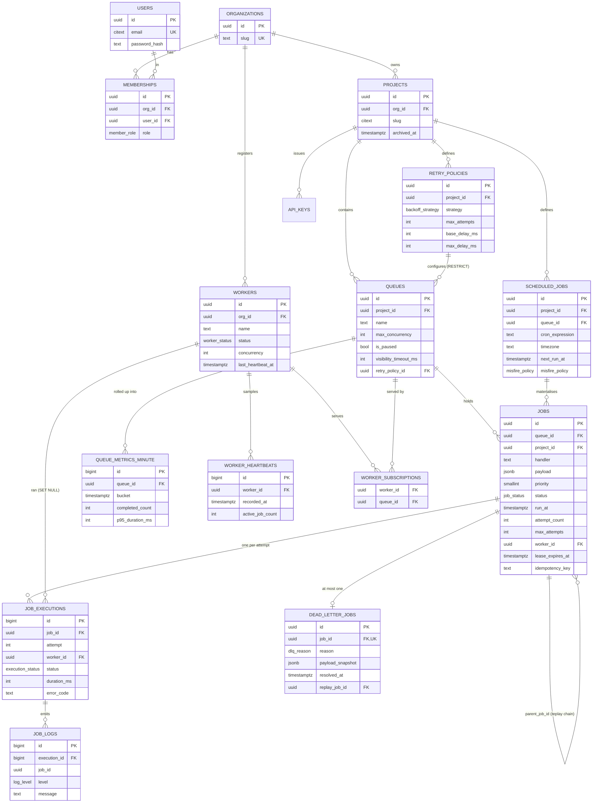

# Database design

PostgreSQL 16. **16 tables · 9 enum types · 36 foreign keys · 14 CHECK
constraints · 8 hand-written partial indexes.**

- Schema source: [`packages/db/prisma/schema.prisma`](../packages/db/prisma/schema.prisma)
- Migrations: [`packages/db/prisma/migrations/`](../packages/db/prisma/migrations/)
- Hot-path SQL: [`packages/db/sql/`](../packages/db/sql/)
- Measured evidence (query plans, index sizes): [VERIFICATION.md](VERIFICATION.md)

---

## ER diagram



---

---

## The two decisions that matter most

**1 · `jobs` holds the logical unit of work; `job_executions` holds one row per
ATTEMPT.**

Attempts fail; jobs die. That split is what makes retry history, per-attempt
timings, per-attempt worker assignment and per-attempt errors *queryable*
instead of squashed into a JSON blob you cannot index, aggregate or paginate.
"It timed out, then got a 503" is diagnostically different from "it failed
twice".

**2 · The claim index is partial, and its column order is the `ORDER BY`.**

```sql
CREATE INDEX idx_jobs_claim
  ON jobs (queue_id, priority DESC, run_at ASC, id ASC)
  WHERE status = 'QUEUED';
```

After a week of running, ~99% of `jobs` rows are terminal. A full index would
carry all of them; this one carries only the ready working set — so claim cost
depends on **queue depth**, not **table size**. Measured at 50,000 rows: an
index scan with **no Sort node**, 12 buffer hits, 0.098 ms.

---

### 0 Conventions

- **PKs:** `uuid` (`gen_random_uuid()`) for entities exposed in URLs and created by clients — non-guessable, safe to generate client-side for idempotent retries. **`bigserial`** for append-only high-volume internal tables (`job_executions`, `job_logs`, `worker_heartbeats`, `queue_metrics_minute`) — 8 bytes instead of 16, which matters when the table has millions of rows and several indexes.
- **Time:** every timestamp is `timestamptz`, stored UTC. Never `timestamp`. Cron display timezone is stored separately as an IANA string.
- **Money/enums:** native Postgres `ENUM` types for statuses — 4 bytes, type-safe at the DB level, and illegal values become impossible rather than merely discouraged.
- **Soft delete:** only on `projects` (`archived_at`). Everything else hard-deletes with explicit cascade rules, because a job graveyard nobody queries is just bloat.
- **Every table** gets `created_at`; mutable tables get `updated_at` maintained by a trigger.

### 1 Enum types

```sql
CREATE TYPE job_status AS ENUM (
  'SCHEDULED',   -- future run_at, not yet eligible
  'QUEUED',      -- eligible now, awaiting a worker
  'CLAIMED',     -- leased by a worker, not yet started
  'RUNNING',     -- handler executing
  'RETRYING',    -- attempt failed, backoff timer running (a specialisation of SCHEDULED)
  'COMPLETED',   -- terminal, success
  'FAILED',      -- terminal, failure, no DLQ record (queue has dlq_enabled = false)
  'DEAD_LETTER', -- terminal, failure, DLQ record exists
  'CANCELLED'    -- terminal, cancelled by a user
);

CREATE TYPE execution_status AS ENUM (
  'RUNNING','SUCCEEDED','FAILED','TIMED_OUT','ABANDONED','CANCELLED'
);
CREATE TYPE backoff_strategy AS ENUM ('FIXED','LINEAR','EXPONENTIAL');
CREATE TYPE worker_status    AS ENUM ('STARTING','ACTIVE','DRAINING','STOPPED','DEAD');
CREATE TYPE log_level        AS ENUM ('DEBUG','INFO','WARN','ERROR');
CREATE TYPE member_role      AS ENUM ('OWNER','ADMIN','MEMBER','VIEWER');
CREATE TYPE dlq_reason       AS ENUM (
  'MAX_ATTEMPTS_EXCEEDED','NON_RETRYABLE_ERROR','TIMEOUT','LEASE_EXPIRED','CANCELLED_BY_SYSTEM'
);
CREATE TYPE misfire_policy   AS ENUM ('SKIP','FIRE_ONCE','BACKFILL');
CREATE TYPE dlq_resolution   AS ENUM ('REPLAYED','DISCARDED');
```

> **Design note — where did "Failed" go?**
> The brief lists `Failed` in the lifecycle. In this model, **attempts fail; jobs die.** A failed attempt is `job_executions.status = 'FAILED'`; the *job* moves to `RETRYING` (transient) or to `DEAD_LETTER` / `FAILED` (terminal). This split is the whole reason `job_executions` exists as a separate table, and it makes "show me the retry history" a single indexed query instead of an audit-log reconstruction. `FAILED` survives as a job status for queues that opt out of the DLQ.

### 2 Table-by-table

#### `organizations` — tenancy root

| Column | Type | Null | Notes |
|---|---|---|---|
| `id` | `uuid` PK | no | `gen_random_uuid()` |
| `name` | `text` | no | |
| `slug` | `citext` | no | **UNIQUE** — used in URLs |
| `created_at` / `updated_at` | `timestamptz` | no | |

**Purpose:** the top of the ownership chain. Every other business row is reachable from exactly one org, which makes tenant isolation a single join away and makes "delete an org" a well-defined cascade.

---

#### `users`

| Column | Type | Null | Notes |
|---|---|---|---|
| `id` | `uuid` PK | no | |
| `email` | `citext` | no | **UNIQUE** — `citext` so `A@x.com` and `a@x.com` cannot both register |
| `password_hash` | `text` | no | argon2id; never selected by default |
| `name` | `text` | no | |
| `is_active` | `boolean` | no | default `true` |
| `last_login_at` | `timestamptz` | yes | |
| `created_at` / `updated_at` | `timestamptz` | no | |

**Normalisation note:** users are *not* owned by an organization. A user can belong to several orgs — hence `memberships`. Putting `org_id` on `users` would be a denormalisation that makes multi-org membership impossible later.

---

#### `memberships` — user ↔ org, with role

| Column | Type | Null | Notes |
|---|---|---|---|
| `id` | `uuid` PK | no | |
| `org_id` | `uuid` FK → `organizations(id)` **ON DELETE CASCADE** | no | |
| `user_id` | `uuid` FK → `users(id)` **ON DELETE CASCADE** | no | |
| `role` | `member_role` | no | default `MEMBER` |
| `created_at` | `timestamptz` | no | |

**Constraints:** `UNIQUE (org_id, user_id)` — one membership per user per org.
**Indexes:** `(user_id)` — every authenticated request resolves "which orgs is this user in".
**Why this table is necessary:** it is the join table for a genuine many-to-many, and it is where RBAC lives if you build that bonus. Without it, RBAC requires a migration.

---

#### `projects`

| Column | Type | Null | Notes |
|---|---|---|---|
| `id` | `uuid` PK | no | |
| `org_id` | `uuid` FK → `organizations(id)` **ON DELETE CASCADE** | no | |
| `name` | `text` | no | |
| `slug` | `citext` | no | |
| `description` | `text` | yes | |
| `created_by` | `uuid` FK → `users(id)` **ON DELETE SET NULL** | yes | keep the project if the creator is deleted |
| `archived_at` | `timestamptz` | yes | soft delete |
| `created_at` / `updated_at` | `timestamptz` | no | |

**Constraints:** `UNIQUE (org_id, slug)` — slugs are unique per tenant, not globally.
**Cascade rationale:** `org → project` cascades because a project has no meaning without its org. `created_by` uses `SET NULL` because provenance is nice-to-have but must not block user deletion.

---

#### `api_keys` — programmatic access

| Column | Type | Null | Notes |
|---|---|---|---|
| `id` | `uuid` PK | no | |
| `project_id` | `uuid` FK → `projects(id)` **ON DELETE CASCADE** | no | |
| `name` | `text` | no | |
| `key_prefix` | `text` | no | first 8 chars, shown in the UI for identification |
| `key_hash` | `text` | no | SHA-256 of the full key; the plaintext is shown once |
| `scopes` | `text[]` | no | e.g. `{jobs:write,jobs:read}` |
| `last_used_at` | `timestamptz` | yes | |
| `expires_at` / `revoked_at` | `timestamptz` | yes | |
| `created_by` | `uuid` FK → `users(id)` SET NULL | yes | |

**Why necessary (not scope creep):** jobs are submitted by *services*, not browsers. A backend enqueuing work cannot hold a 15-minute JWT. Without API keys the whole product is unusable outside the dashboard, and the demo load-generator has no legitimate way to authenticate.
**Indexes:** `UNIQUE (key_hash)`, plus `(project_id)`.

---

#### `retry_policies` — reusable named policies

| Column | Type | Null | Notes |
|---|---|---|---|
| `id` | `uuid` PK | no | |
| `project_id` | `uuid` FK → `projects(id)` **ON DELETE CASCADE** | no | |
| `name` | `text` | no | |
| `strategy` | `backoff_strategy` | no | `FIXED` / `LINEAR` / `EXPONENTIAL` |
| `max_attempts` | `int` | no | `CHECK (max_attempts BETWEEN 1 AND 50)` |
| `base_delay_ms` | `int` | no | `CHECK (base_delay_ms >= 0)` |
| `max_delay_ms` | `int` | no | cap for exponential; `CHECK (max_delay_ms >= base_delay_ms)` |
| `jitter_pct` | `smallint` | no | default `10`; `CHECK (0..100)` |
| `retry_on_error_codes` | `text[]` | yes | `NULL` = retry everything retryable |
| `is_default` | `boolean` | no | default `false` |

**Constraints:** `UNIQUE (project_id, name)`; partial unique `(project_id) WHERE is_default` — at most one default per project, enforced by the database rather than by application vigilance.
**Normalisation decision:** policies are a separate table (3NF) because several queues share one policy and editing it in one place is the point. But see the `jobs` table — the *values* are copied onto each job at creation. That deliberate denormalisation is explained there.

---

#### `queues`

| Column | Type | Null | Notes |
|---|---|---|---|
| `id` | `uuid` PK | no | |
| `project_id` | `uuid` FK → `projects(id)` **ON DELETE CASCADE** | no | |
| `name` | `text` | no | |
| `description` | `text` | yes | |
| `default_priority` | `smallint` | no | default `100`, `CHECK (0..255)` |
| `max_concurrency` | `int` | yes | `NULL` = unlimited; `CHECK (max_concurrency > 0)` |
| `retry_policy_id` | `uuid` FK → `retry_policies(id)` **ON DELETE RESTRICT** | no | |
| `visibility_timeout_ms` | `int` | no | default `60000` — the lease duration |
| `default_job_timeout_ms` | `int` | no | default `30000` |
| `rate_limit_per_sec` | `int` | yes | reserved for the rate-limit bonus |
| `is_paused` | `boolean` | no | default `false` |
| `paused_at` | `timestamptz` | yes | |
| `paused_by` | `uuid` FK → `users(id)` SET NULL | yes | |
| `dlq_enabled` | `boolean` | no | default `true` |
| `retention_days` | `int` | yes | auto-purge terminal jobs older than this |
| `created_at` / `updated_at` | `timestamptz` | no | |

**Constraints:** `UNIQUE (project_id, name)`.
**Cascade rationale:** `ON DELETE RESTRICT` on `retry_policy_id` — deleting a policy that queues depend on must fail loudly rather than silently leave queues in an undefined state.

> **Deliberate omission: there are no counter columns on `queues`.**
> `total_jobs`, `completed_count` etc. look convenient and are a performance trap: every job completion would `UPDATE queues SET completed_count = completed_count + 1`, taking a row lock on **one row per queue**. Under 3 workers × 10 concurrent jobs that single row becomes the serialisation point for the entire queue — you would have built a global mutex by accident. Instead: live counts come from indexed `COUNT(*)` on `jobs` (cached 3s in the API), and historical counts come from `queue_metrics_minute`. **This is one of the strongest DB-design points you can make in the write-up.**

---

#### `jobs` — the central table

See Part 5 for the field-by-field rationale. Schema:

```sql
CREATE TABLE jobs (
  id                 uuid PRIMARY KEY DEFAULT gen_random_uuid(),
  queue_id           uuid NOT NULL REFERENCES queues(id)         ON DELETE CASCADE,
  project_id         uuid NOT NULL REFERENCES projects(id)       ON DELETE CASCADE,
  scheduled_job_id   uuid          REFERENCES scheduled_jobs(id) ON DELETE SET NULL,
  parent_job_id      uuid          REFERENCES jobs(id)           ON DELETE SET NULL,
  batch_id           uuid,

  handler            text     NOT NULL,
  payload            jsonb    NOT NULL DEFAULT '{}'::jsonb,
  idempotency_key    text,

  priority           smallint NOT NULL DEFAULT 100,
  status             job_status NOT NULL DEFAULT 'QUEUED',
  run_at             timestamptz NOT NULL DEFAULT now(),
  scheduled_for      timestamptz,

  attempt_count      int NOT NULL DEFAULT 0,
  max_attempts       int NOT NULL,
  backoff_strategy   backoff_strategy NOT NULL,
  backoff_base_ms    int NOT NULL,
  backoff_max_ms     int NOT NULL,
  backoff_jitter_pct smallint NOT NULL DEFAULT 10,
  timeout_ms         int NOT NULL DEFAULT 30000,

  worker_id          uuid REFERENCES workers(id) ON DELETE SET NULL,
  lease_expires_at   timestamptz,
  claimed_at         timestamptz,
  started_at         timestamptz,
  finished_at        timestamptz,

  last_error_code    text,
  last_error_message text,
  result             jsonb,

  created_by         uuid REFERENCES users(id) ON DELETE SET NULL,
  created_at         timestamptz NOT NULL DEFAULT now(),
  updated_at         timestamptz NOT NULL DEFAULT now(),

  CONSTRAINT chk_priority     CHECK (priority BETWEEN 0 AND 255),
  CONSTRAINT chk_attempts     CHECK (attempt_count >= 0 AND attempt_count <= max_attempts + 1),
  CONSTRAINT chk_lease        CHECK (status NOT IN ('CLAIMED','RUNNING') OR lease_expires_at IS NOT NULL),
  CONSTRAINT chk_worker       CHECK (status NOT IN ('CLAIMED','RUNNING') OR worker_id IS NOT NULL)
);
```

**The two `CHECK`s at the bottom are load-bearing.** They make "a running job with no lease" and "a running job with no worker" unrepresentable. A bug that would otherwise produce a silently stranded job now produces a loud constraint violation in your tests.

**Indexes on `jobs`** (this is the highest-value part of the whole schema):

```sql
-- 1. THE CLAIM INDEX. Every worker hits this many times per second.
CREATE INDEX idx_jobs_claim
  ON jobs (queue_id, priority DESC, run_at ASC, id ASC)
  WHERE status = 'QUEUED';

-- 2. Promotion scan: SCHEDULED/RETRYING jobs whose time has come.
CREATE INDEX idx_jobs_promote
  ON jobs (run_at)
  WHERE status IN ('SCHEDULED','RETRYING');

-- 3. Reaper scan: in-flight jobs whose lease has expired.
CREATE INDEX idx_jobs_lease
  ON jobs (lease_expires_at)
  WHERE status IN ('CLAIMED','RUNNING');

-- 4. Job explorer (the dashboard's main list).
CREATE INDEX idx_jobs_explorer ON jobs (project_id, status, created_at DESC);
CREATE INDEX idx_jobs_queue_created ON jobs (queue_id, created_at DESC);

-- 5. Idempotency: at most one live job per key per queue.
CREATE UNIQUE INDEX uq_jobs_idem
  ON jobs (queue_id, idempotency_key)
  WHERE idempotency_key IS NOT NULL;

-- 6. Cron exactly-once materialisation.
CREATE UNIQUE INDEX uq_jobs_sched_slot
  ON jobs (scheduled_job_id, scheduled_for)
  WHERE scheduled_job_id IS NOT NULL;

-- 7. Batch lookups.
CREATE INDEX idx_jobs_batch ON jobs (batch_id) WHERE batch_id IS NOT NULL;
```

**Why index #1 is shaped exactly that way — the single most important paragraph in this document:**

1. **It is partial (`WHERE status = 'QUEUED'`).** After a week of running, 99% of rows are `COMPLETED`. A full index would carry all of them; this one carries only the tiny working set of ready jobs. The claim query's cost therefore depends on *queue depth*, not on *table size* — the index stays a few pages even at 10 million total jobs. This is the reason the whole "Postgres as a queue" approach scales acceptably.
2. **`queue_id` first** because it is the equality predicate — it selects the sub-tree.
3. **`priority DESC, run_at ASC, id ASC` next, in exactly the `ORDER BY` order**, so Postgres can walk the index in order and stop after `LIMIT n`. Without this, the planner adds a Sort node that must read *every* eligible row before returning the first one — turning an O(n) claim into an O(N log N) claim under load.
4. **`id ASC` as the final tiebreaker** makes the ordering total and deterministic, which makes the concurrency tests reproducible.

Verify it with `EXPLAIN (ANALYZE, BUFFERS)` and paste the plan into your design doc. `Index Scan using idx_jobs_claim` with no Sort node is the result you want, and showing that plan is worth real marks.

---

#### `job_executions` — one row per attempt

| Column | Type | Null | Notes |
|---|---|---|---|
| `id` | `bigserial` PK | no | high volume → bigint |
| `job_id` | `uuid` FK → `jobs(id)` **ON DELETE CASCADE** | no | |
| `attempt` | `int` | no | 1-based |
| `worker_id` | `uuid` FK → `workers(id)` **ON DELETE SET NULL** | yes | keep history when a worker row is purged |
| `status` | `execution_status` | no | |
| `started_at` | `timestamptz` | no | |
| `finished_at` | `timestamptz` | yes | `NULL` while running |
| `duration_ms` | `int` | yes | computed on finish; stored so metrics never recompute it |
| `error_code` | `text` | yes | classified: `TIMEOUT`, `HTTP_5XX`, `VALIDATION`, … |
| `error_message` | `text` | yes | truncated to 4 KB |
| `error_stack` | `text` | yes | truncated to 16 KB |
| `result` | `jsonb` | yes | handler return value |
| `created_at` | `timestamptz` | no | |

**Constraints:** `UNIQUE (job_id, attempt)` — makes a duplicated attempt row impossible, which is a second, independent line of defence behind atomic claiming.
**Indexes:** `(job_id, attempt)` from the unique; `(worker_id, started_at DESC)` for "what has this worker been doing"; `(status, finished_at DESC)` for the metrics rollup scan.
**Why this table is separate from `jobs`:** retry history, per-attempt timings, per-attempt worker assignment, and per-attempt errors all live here. Squashing them into `jobs` would mean either losing history or storing a JSON array — which you then cannot index, aggregate, or paginate. **This split is the clearest single signal of competent data modelling in this assignment.**

---

#### `job_logs` — application log lines emitted by handlers

| Column | Type | Null | Notes |
|---|---|---|---|
| `id` | `bigserial` PK | no | |
| `execution_id` | `bigint` FK → `job_executions(id)` **ON DELETE CASCADE** | no | |
| `job_id` | `uuid` | no | **denormalised** — lets you fetch all logs for a job across attempts without a join |
| `level` | `log_level` | no | |
| `message` | `text` | no | |
| `context` | `jsonb` | yes | structured fields |
| `logged_at` | `timestamptz` | no | handler-side timestamp, not insert time |

**Indexes:** `(execution_id, logged_at)`, `(job_id, logged_at)`.
**This is the highest-volume table in the system.** Three mitigations, all worth documenting even if only the first two are implemented: (1) the worker **buffers** log lines and `COPY`/batch-inserts them outside the job's transaction, so log volume never lengthens a hot transaction; (2) a **retention job** deletes logs older than `retention_days`; (3) at real scale it would be `PARTITION BY RANGE (logged_at)` monthly so deletion is `DROP PARTITION` rather than a mass `DELETE`. Stating (3) as a known next step scores; implementing it here would be over-engineering.

---

#### `workers`

| Column | Type | Null | Notes |
|---|---|---|---|
| `id` | `uuid` PK | no | generated at process start |
| `org_id` | `uuid` FK → `organizations(id)` **ON DELETE CASCADE** | no | |
| `name` | `text` | no | e.g. `worker-2@host` |
| `hostname` / `pid` / `version` | `text` / `int` / `text` | no | provenance for debugging |
| `status` | `worker_status` | no | |
| `concurrency` | `int` | no | this worker's slot count |
| `active_job_count` | `int` | no | default 0; updated with each heartbeat |
| `started_at` | `timestamptz` | no | |
| `last_heartbeat_at` | `timestamptz` | no | **the liveness field** |
| `stopped_at` | `timestamptz` | yes | |
| `metadata` | `jsonb` | yes | |

**Indexes:** `(status, last_heartbeat_at)` — the dead-worker scan.
`last_heartbeat_at` is updated **in place** on this row (not appended) because liveness checks must read one row, not aggregate a history table.

---

#### `worker_subscriptions` — which queues a worker serves

| Column | Type | Notes |
|---|---|---|
| `worker_id` | `uuid` FK → `workers(id)` **ON DELETE CASCADE** | |
| `queue_id` | `uuid` FK → `queues(id)` **ON DELETE CASCADE** | |
| `created_at` | `timestamptz` | |

**PK:** composite `(worker_id, queue_id)`. **Index:** `(queue_id)` for "which workers serve this queue" on the queue detail page.
A `uuid[]` column on `workers` was considered and rejected: the join table makes that dashboard query a plain join, keeps referential integrity when a queue is deleted, and costs one small table.

---

#### `worker_heartbeats` — append-only sample history

| Column | Type | Notes |
|---|---|---|
| `id` | `bigserial` PK | |
| `worker_id` | `uuid` FK → `workers(id)` **ON DELETE CASCADE** | |
| `recorded_at` | `timestamptz` | |
| `active_job_count` | `int` | |
| `jobs_processed_delta` | `int` | since the previous sample — makes throughput a simple `SUM`, not a difference-of-counters |
| `cpu_pct` / `mem_mb` | `real` / `int` | nullable |

**Index:** `(worker_id, recorded_at DESC)`.
**Two-tier heartbeat design, and why:** the liveness ping (every 5s) is an in-place `UPDATE workers`. The *history sample* (every 15s) is an `INSERT` here. If every 5s ping were an insert, 10 workers would generate ~172k rows/day for data nobody reads at that resolution. Separating "current truth" from "sampled history" is a deliberate write-amplification decision — say that in the write-up. Samples are pruned after 24 hours.

---

#### `scheduled_jobs` — recurring (cron) definitions

| Column | Type | Null | Notes |
|---|---|---|---|
| `id` | `uuid` PK | no | |
| `project_id` | `uuid` FK → `projects(id)` **ON DELETE CASCADE** | no | |
| `queue_id` | `uuid` FK → `queues(id)` **ON DELETE CASCADE** | no | |
| `name` | `text` | no | |
| `cron_expression` | `text` | no | validated at write time by `cron-parser` |
| `timezone` | `text` | no | default `'UTC'`, IANA name |
| `handler` / `payload` / `priority` / `max_attempts` / `timeout_ms` / `retry_policy_id` | — | — | **the job template** — copied onto each materialised job |
| `is_enabled` | `boolean` | no | default `true` |
| `misfire_policy` | `misfire_policy` | no | default `SKIP` |
| `start_at` / `end_at` | `timestamptz` | yes | optional validity window |
| `next_run_at` | `timestamptz` | no | **the scheduler's cursor** |
| `last_run_at` | `timestamptz` | yes | |
| `last_job_id` | `uuid` FK → `jobs(id)` **ON DELETE SET NULL** | yes | |
| `created_by` / `created_at` / `updated_at` | — | — | |

**Constraints:** `UNIQUE (project_id, name)`.
**Index:** `CREATE INDEX idx_sched_due ON scheduled_jobs (next_run_at) WHERE is_enabled;` — the scheduler's every-second scan, kept tiny by the partial predicate.

---

#### `dead_letter_jobs`

| Column | Type | Null | Notes |
|---|---|---|---|
| `id` | `uuid` PK | no | |
| `job_id` | `uuid` FK → `jobs(id)` **ON DELETE CASCADE** | no | **UNIQUE** — one DLQ entry per job |
| `queue_id` / `project_id` | `uuid` | no | denormalised so the DLQ page filters without joining `jobs` |
| `reason` | `dlq_reason` | no | |
| `error_code` / `error_message` | `text` | yes | copied from the final execution |
| `total_attempts` | `int` | no | |
| `payload_snapshot` | `jsonb` | no | **a copy**, so a replay is possible even if the original payload is later purged by retention |
| `first_failed_at` / `dead_lettered_at` | `timestamptz` | no | |
| `resolved_at` | `timestamptz` | yes | |
| `resolved_by` | `uuid` FK → `users(id)` SET NULL | yes | |
| `resolution` | `dlq_resolution` | yes | |
| `replay_job_id` | `uuid` FK → `jobs(id)` **ON DELETE SET NULL** | yes | the new job created by a replay |
| `ai_summary` | `text` | yes | populated by the AI-summary bonus |

**Indexes:** `UNIQUE (job_id)`; `(project_id, dead_lettered_at DESC) WHERE resolved_at IS NULL` — the DLQ inbox view, partial so resolved entries do not bloat it.

---

#### `queue_metrics_minute` — pre-aggregated rollups

| Column | Type | Notes |
|---|---|---|
| `id` | `bigserial` PK | |
| `queue_id` | `uuid` FK → `queues(id)` **ON DELETE CASCADE** | |
| `bucket` | `timestamptz` | truncated to the minute |
| `completed_count` / `failed_count` / `dlq_count` | `int` | |
| `avg_duration_ms` / `p95_duration_ms` / `max_duration_ms` | `int` | |
| `total_duration_ms` | `bigint` | lets you re-derive averages when merging buckets into hours |

**Constraints:** `UNIQUE (queue_id, bucket)`.
**Why it exists:** the throughput chart asks "jobs/minute over the last 24 hours." Answering that from `job_executions` means aggregating up to millions of rows on every dashboard load, every 5 seconds, for every user. This table turns it into a 1,440-row indexed scan.
**Crucially, it is written by the scheduler's aggregator loop once per minute** — *not* by the job-completion transaction. Writing it inline would recreate the hot-row contention we just avoided on `queues`. Cost: metrics lag by up to 60s. That is the correct trade, and naming it as a trade is the point.

### 3 Normalisation summary

The schema is **3NF with three deliberate, justified denormalisations**:

| Denormalisation | Why it is correct here |
|---|---|
| `jobs.project_id` (derivable via `queue_id → queues.project_id`) | Every tenant-scoped list query filters by project. Carrying it avoids a join on the hottest read path and lets the explorer index start with `project_id`. The value is immutable, so there is no update anomaly. |
| Retry-policy values copied onto `jobs` (`max_attempts`, `backoff_*`) | **Correctness, not performance.** A job's retry contract is fixed at submission. If a queue's policy were read live, editing it would silently change the behaviour of thousands of in-flight jobs — including jobs already mid-backoff. Snapshotting makes each job's history self-explanatory and reproducible. |
| `job_logs.job_id`, `dead_letter_jobs.queue_id/project_id`, `dlq.payload_snapshot` | Read-path convenience and durability across retention purges. |

Every other relationship is fully normalised, with foreign keys and cascade rules chosen per relationship rather than applied uniformly.

### 4 The five indexes that decide whether this system works

| Index | Serves | Consequence if missing |
|---|---|---|
| `idx_jobs_claim` (partial, composite, ordered) | every worker poll | Sequential scan of the whole `jobs` table per poll. At 3 workers × 2 polls/sec on 1M rows the database is saturated and the demo dies live |
| `idx_jobs_promote` (partial on `run_at`) | scheduler promotion, 1×/sec | Full scan every second |
| `idx_jobs_lease` (partial on `lease_expires_at`) | reaper, 1×/5s | Full scan; dead-worker recovery becomes the slowest thing in the system |
| `uq_jobs_idem` (partial unique) | idempotent creation | Duplicate jobs on client retry — a required failure scenario is unhandled |
| `uq_jobs_sched_slot` (partial unique) | cron materialisation | Duplicate cron firings under scheduler failover |

---

---

## The Job entity, field by field

The schema is in 4.2. Here is *why* each non-obvious field exists. Fields that look obvious but are subtly wrong in most implementations are marked ⚠️.

### Identity and ownership

| Field | Rationale |
|---|---|
| `id : uuid` | Client-generatable, non-enumerable. A client can generate the id *before* POSTing, which makes a retried POST naturally idempotent even without a separate key. |
| `queue_id` | The scheduling domain. Concurrency, priority defaults, pause state, and retry policy all resolve through it. |
| `project_id` ⚠️ | Denormalised. Every list endpoint filters by it; without it the hot read index has to start with a join. Immutable, so no update anomaly. |
| `scheduled_job_id` | Non-null only for cron-materialised jobs. Combined with `scheduled_for` in a unique index, it makes duplicate cron firing impossible. |
| `parent_job_id` | Set when a job is created by replaying a DLQ entry. Gives you a replay chain — "this job is the 3rd replay of that one" — for free, and is the hook a DAG feature would later use. |
| `batch_id` | Groups jobs submitted in one `POST /jobs/batch`. Lets the UI show batch progress without a batches table. |

### What to run

| Field | Rationale |
|---|---|
| `handler : text` ⚠️ | **Not** `type`. It names a registered function in the worker's handler registry (`http_request`, `simulate`, `send_email`). Text rather than an enum, because the handler set is a property of the *worker deployment*, not of the schema — adding a handler must not require a migration. Validated at submission against the registry, and an unknown handler fails fast and non-retryably. |
| `payload : jsonb` | Handler input. `jsonb` (not `json`) so it is stored parsed, comparable, and GIN-indexable if payload search is ever needed. Size-capped at 256 KB by a `CHECK`, because the DB is not a blob store. |
| `timeout_ms` | Per-job wall-clock cap, snapshotted from the queue default. Without it, one hung HTTP call permanently consumes a concurrency slot — and the lease then makes it *worse*, because the worker keeps renewing a lease for work that will never finish. |

### Scheduling

| Field | Rationale |
|---|---|
| `run_at : timestamptz` ⚠️ | **The single scheduling field.** Not `scheduled_at` + `delay_seconds` + `retry_at`. Immediate → `now()`. Delayed → `now() + delay`. Scheduled → the given time. Retrying → `now() + backoff`. Collapsing four concepts into one column means the claim query has exactly one time predicate (`run_at <= now()`) and one index serves all four job types. This is the highest-leverage simplification in the model. |
| `scheduled_for` | The *intended* cron slot, distinct from `run_at` (which may drift if the scheduler lagged). Enables "this run was 40 seconds late" and powers the exactly-once unique index. |
| `priority : smallint` | `0–255`, higher runs sooner. `smallint` because 5 named levels map cleanly into a numeric space that leaves room for the priority-aging feature later. |
| `status : job_status` | The state machine (Part 6). A native enum so illegal values are rejected by the database. |

### Retry contract (snapshotted)

| Field | Rationale |
|---|---|
| `attempt_count` ⚠️ | **Incremented at claim, not at completion.** If it were incremented on completion, a job that crashes the worker process would be reclaimed forever — a poison pill that takes down your fleet one worker at a time. Counting *deliveries* (as SQS does) bounds the blast radius of any crash-inducing job. |
| `max_attempts`, `backoff_strategy`, `backoff_base_ms`, `backoff_max_ms`, `backoff_jitter_pct` | Copied from the retry policy at creation. Explained in 4.3 — the job's contract must not change under it. |
| `retry_policy_id` | Kept as provenance ("which policy produced these numbers"), not read at runtime. |

### Execution state

| Field | Rationale |
|---|---|
| `worker_id` | Required by the brief ("worker assignment"). Also the input to reaper recovery. |
| `lease_expires_at` ⚠️ | The heart of crash recovery. Not "when the job times out" — "when the *claim* stops being valid". A `CHECK` makes it non-null whenever `status IN ('CLAIMED','RUNNING')`. |
| `claimed_at` / `started_at` / `finished_at` | Three distinct instants. `claimed_at → started_at` is **queue-to-start latency**; `started_at → finished_at` is **execution time**; `created_at → started_at` is **end-to-end latency**. Conflating them makes the dashboard's most useful metric impossible to compute. |
| `last_error_code`, `last_error_message` | Denormalised from the newest `job_executions` row so the job list can show a failure reason without an N+1 join or a lateral subquery. |
| `result : jsonb` | Handler return value of the successful attempt. |

### What is deliberately *not* on `jobs`

`retry_history`, `logs`, `executions` as JSON arrays; a `duration` column (derivable, and per-attempt anyway); `is_deleted`; counters of any kind. Each belongs in `job_executions`, `job_logs`, or nowhere.

---
